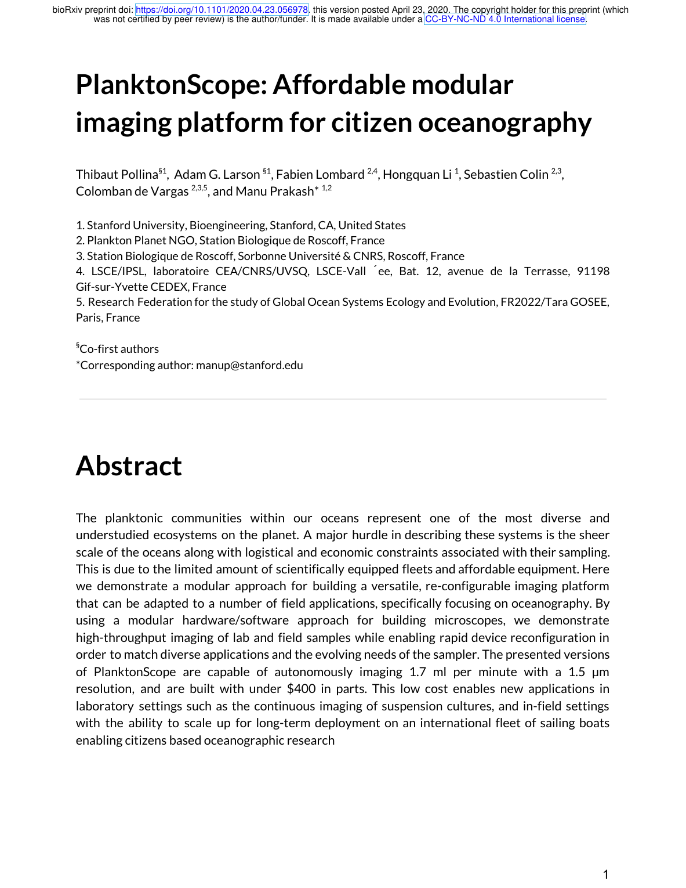
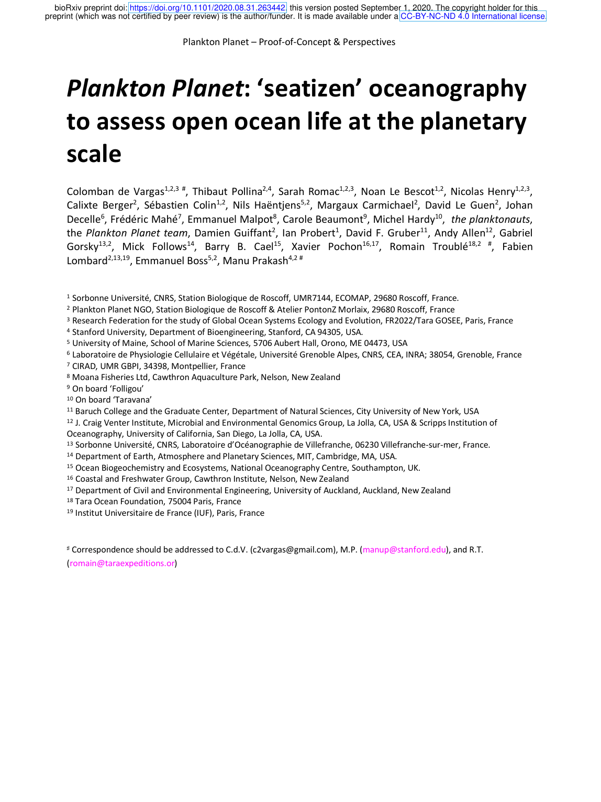

# An open and affordable imaging platform for citizen oceanography

# What is this?
The PlanktoScope is an open-source, affordable imaging platform for citizen oceanography. It's built around a Raspberry Pi, a couple of HATs, some stepper motors and a few centimeters of silicon tubes. Its cost is at about $500 in parts.

The goal of the PlanktoScope is to allow citizen to engage in scientific programs, either at sea or onshore. You can use the PlanktoScope to image the different species of Plankton living in a body of water.

## Get the papers!
The PlanktoScope has been described in a paper available on the [bioRxiv preprint server](https://www.biorxiv.org/content/10.1101/2020.04.23.056978v1). The first results of this program and its outline are also available as a [preprint](https://www.biorxiv.org/content/10.1101/2020.08.31.263442v1).

|||
|--------|--------|

# Key Features
- A list
- of a lot of
- features!

# How do I build one?
You can access the complete documentation on [Read The Docs](https://planktonscope.readthedocs.io/).
