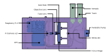

# PlanktoScope: Open and Affordable Quantitative Imaging Platform


## What are Plankton?

_"Drifting endlessly, midway between the sea of air above and the depths of the abyss below, these strange creatures and the marine inflorescence that sustains them are called 'plankton' — the wanderers"_ - **Rachel Carson**

Plankton are tiny organisms that drift in the oceans and play a crucial role in the global ecosystem. They are responsible for fixing 30-50% of the world's carbon dioxide and form the foundation of the global food chain. Despite their importance, studying plankton can be challenging due to the vast area of the oceans and the limited resources of research fleets and specialized equipment. The PlanktoScope is an open-source hardware and software platform that aims to make it easier to study plankton by providing high-throughput quantitative imaging capabilities at a low cost.



## What is a PlanktoScope?

The PlanktoScope is a modular, open-source platform for high-throughput quantitative imaging of plankton samples. Its small size, ease of use, and low cost make it suitable for a variety of applications, including the monitoring of laboratory cultures or natural micro-plankton communities. It can be controlled from any WiFi-enabled device and can be easily reconfigured to meet the changing needs of the user.

[Learn more about how it works](https://www.planktoscope.org/how-it-works)

## Read the Paper

The PlanktoScope has been described in the article ["PlanktoScope: Affordable Modular Quantitative Imaging Platform for Citizen Oceanography"](https://www.frontiersin.org/articles/10.3389/fmars.2022.949428/full), published in Frontiers in Marine Science in July 2022.

DOI: [https://doi.org/10.3389/fmars.2022.949428](https://doi.org/10.3389/fmars.2022.949428)


## Key Features
Here are some key features of the PlanktoScope:
1.  **Low cost**: The PlanktoScope is designed to be affordable, with parts costing under $1000.
2.  **Modular**: The PlanktoScope is modular, meaning it can be easily reconfigured to meet the changing needs of users.
3.  **Open-source**: The PlanktoScope is based on open-source hardware and software, making it accessible to a wide community of engineers, researchers, and citizens.
4.  **Versatility**: The PlanktoScope is versatile, and can be used to study a variety of plankton types, including laboratory cultures and natural micro-plankton communities.
5.  **High-throughput**: The PlanktoScope is capable of high-throughput quantitative imaging, allowing users to analyze large numbers of samples quickly and efficiently.
6.  **WiFi-enabled**: The PlanktoScope can be controlled from any WiFi-enabled device, making it easy to use and deploy in a variety of settings.
7.  **Portable**: The PlanktoScope is small and portable, making it easy to transport and use in the field.
8.  **Ease of use**: The PlanktoScope is designed to be easy to use, with instructions for assembly and use available on the PlanktoScope website.

## How do I get one?
You can access the complete documentation on [Read The Docs](https://planktonscope.readthedocs.io/).
|Get the kit|Assemble your kit|Start your machine|
|--|--|--|
||||

## Getting Involved

There are several ways you can join the development effort and contribute to this project.

### Communication Platform
We use Slack as a communication platform for interested parties. You can request to join by filling out [this form](https://docs.google.com/forms/d/e/1FAIpQLSfcod-avpzWVmWj42_hW1v2mMSHm0DAGXHxVECFig2dnKHxGQ/viewform).

### Reporting Issues
If you have identified a bug in the software or hardware, please open an issue in this repository to report it.

### Contributing to Development
You can also contribute to the development effort by working on open issues. Check out the [issues labeled as good first issues](https://github.com/PlanktoScope/PlanktoScope/labels/good%20first%20issue) and let us know in the comments if you are interested in working on one. We may be able to provide guidance as you get started with the code.


## License Information

This repository contains various types of materials that are covered by different licenses. Please read the following information carefully to determine which license applies to the materials you wish to use.

### Hardware Files
All hardware files and documentation located in the `hardware` directory are released under the [CERN-OHL-S-2.0](https://ohwr.org/cern_ohl_s_v2.txt) license.

### Software Source Code
The source code located in the `flows` and `scripts` directories is released under the [GPL-3.0](https://www.gnu.org/licenses/gpl-3.0.en.html) license.

### Other Materials
All other materials, including documentation and pictures, are released under the [Creative Commons CC-BY-SA 4.0](https://creativecommons.org/licenses/by-sa/4.0/) license.

If you wish to use any of the materials in this repository for a project that cannot be open-sourced, please contact us using Slack so we can discuss potential solutions.

We encourage you to fork this repository and publish any improvements you make. Doing so helps others and allows us to potentially integrate your changes into this repository.

## Citing PlanktoScope
If you use PlanktoScope in your research, please use the following BibTeX entry.

```
@article{Pollina2022PlanktoScope,
  author={Pollina, Thibaut and Larson, Adam G. and Lombard, Fabien and Li, Hongquan and Le Guen, David and Colin, Sébastien and de Vargas, Colomban and Prakash, Manu},
  title={PlanktoScope: Affordable Modular Quantitative Imaging Platform for Citizen Oceanography},
  journal={Frontiers in Marine Science},
  year={2022},
  doi={10.3389/fmars.2022.949428}
}
```
