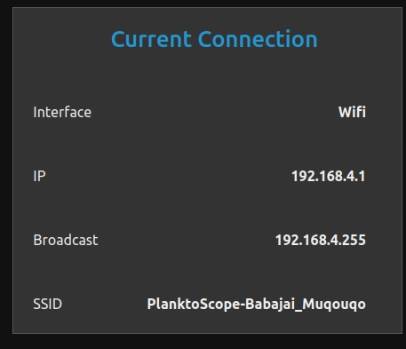
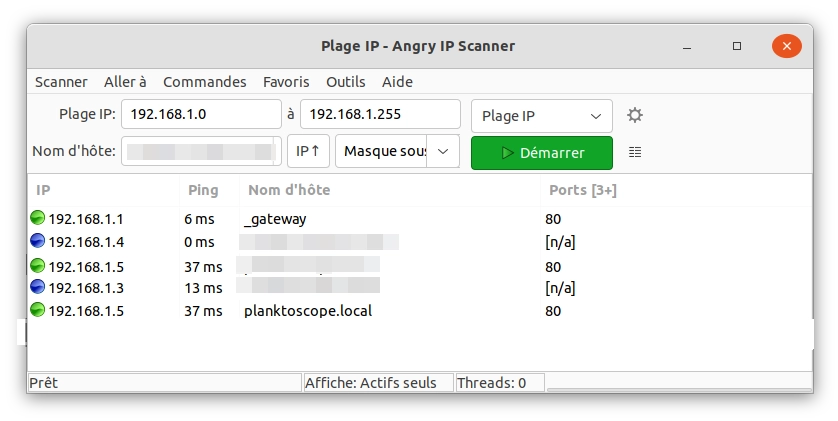
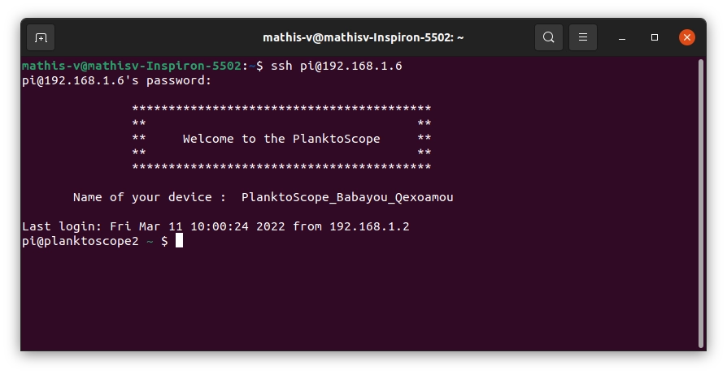
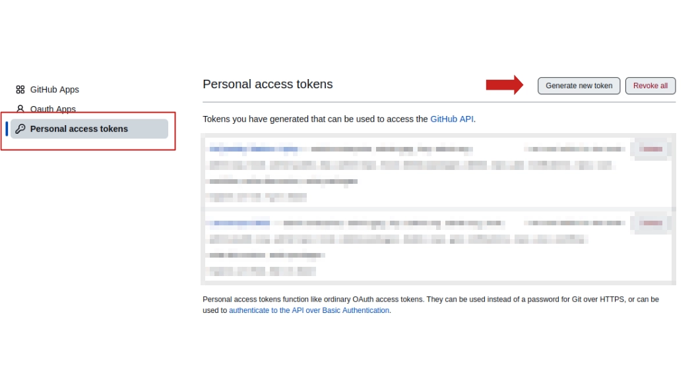
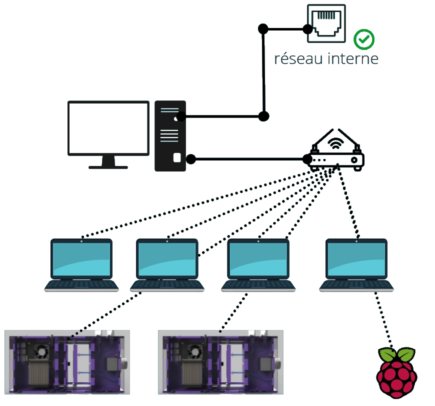
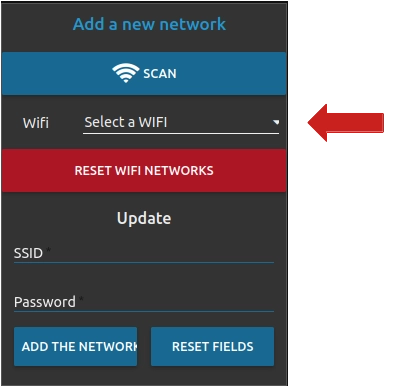
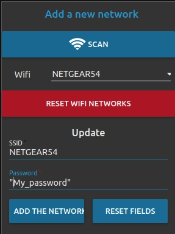
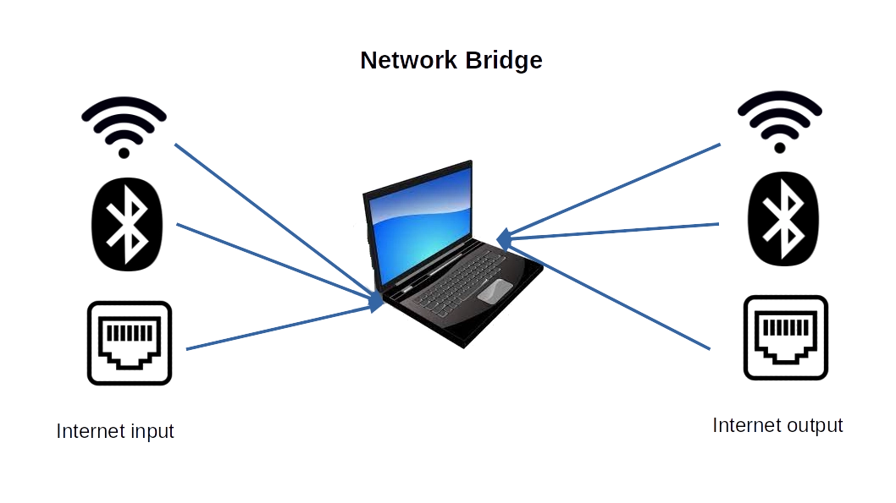
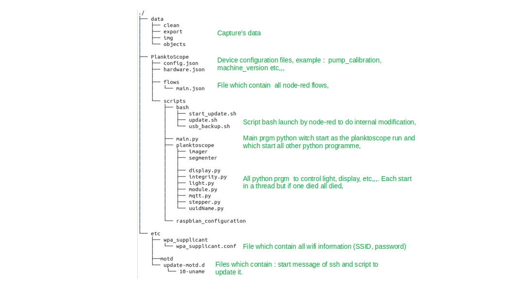
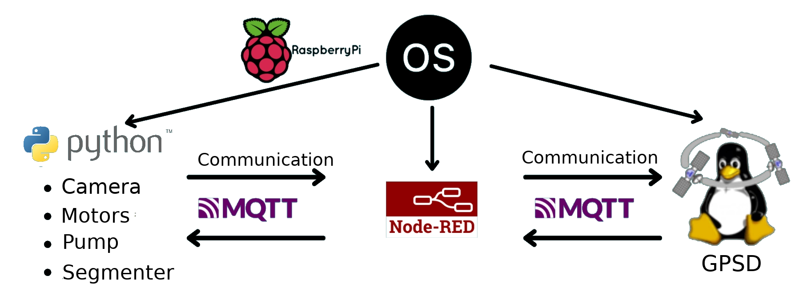

# Make your own development environment

## Start coding

1. Connexion to the PlanktoScope remotely

In goal to acces at all file of your raspberry pi and do modification more advance that the interface Node-Red, you must log in to raspberry-pi by SSH.

To connect you, on Windows or Ubuntu, you must open a terminal. (cmd for windows) and enter the following line. 

```
ssh 'user'@'ip of planktoscope'
```

Replacer 'user' by the user on the system of you raspberry pi. Usually is **pi**.

For 'ip of planktoscope' there are 2 possibilities :

1. Your computer is connect to PlanktoScope wifi's, it's to simple, the ip is always the same **192.168.4.1**. If you are not sure, you can show this information by going to Node-Red interface -> page `Wifi` -> section `Current Connection` in the line ip.



Code to connect now is : 
``` 
ssh pi@192.168.4.1
```

2. Your PlanktoScope is connect to network wifi. For that you must to connect your computer to the same wifi and scan this network to find PlanktoScope ip's.

To do this scan, we advise you to download the software [Angry IP Scanner](https://angryip.org/download/#linux).

Once this software download and install, make a change in the display. Go to `Outils` -> `Préférences` -> `Affichage` ->section `Affiche dans la liste des résultats` -> select `Hôtes actifs`.

Now you can lunch scan by cliking on **Démarer**



At the end, you cloud see, one line with name of host  "planktoscope.local". In this example my PlanktoScope is at the ip **192.168.1.5**


Now you can connect you by ssh at you raspberry pi 



!!! Note
    You can see the following error message " WARNING: REMOTE HOST IDENTIFICATION HAS CHANGED". To resolve this error use this command : (change ip by your value)

    ssh-keygen -R <ip>

!!! Note 
    For more information about file in the raspberry pi, check this section [file organisation](Make_your_modification.md#file-organization).

## Set up your personal repository git

Usualy then you do software development, you use  software for tracking changes in any set of files, this software is **git** and in this section we will explain you how set up your personal repository.

1. Create your account on [GitHub](https://github.com/)
2. Create a repository to clik on **New**, in left menu.
3. Now on your raspberry pi go in folder Planktoscope (using ssh connection)
* add your personal data
```
git config --global user.name "Mathis"                     #to set your name
git config --global user.email "mathis.....@gmail.com"     #to set your email adresse
git config --global credential.helper store                #to save your password
```

* Add a link to your online repository, the link is web adress available from your github account.
```
git remote add <name_of_remote> <link>
```
* Create and go one new branch for you developmennt.
```
git checkout -b <name>
```

Now you are ready to start your modification and send them to your repository.
Howverver the first time that we push your modification the systeme ask you a password. But is not your password you need to create a Token on github. For that go to GitHub.

* On GitHub go to **Settings**


* On left menu click on **Developer Settings** -> then click on **Personal access tokens** -> and **Generate new token**.



* On new page complet information like name, time befor expiration, select all case and click on **Generate token**. Now copy your token.

!!! Warning
        You can see your token just 1 time, if you forget then you need to new generate one.

Now send your token to send your data.

```
git push <name_of_remote> <name_of_branch>
```

The first time the system ask you, your username and password fill these section by you GitHub username and your token.

## Set up local network to develop several

To be able to develop remotely, with several and with internet connection, we have to conect eatch PlanktoScope to a local network with internet connection.  


This solution allow us make developer easyer.

### Connect PlanktoScope to wifi

To connect your PlanktoScope to network wifi, you must to be connect at the PlanktoScope wifi. 

* Acces to wifi setting to going on Node red interface -> `Wifi`
* In section `Add a new network`, select your wifi ssid in ligne wifi. If the ssid not appear, click on **SCAN**.



* Next step, fill the field **"Password"** with the password of your ssid. To finish click on **"ADD THE NETWORK"**.



!!! Note
        The new configuration can take some time (Around 5 min max)
        
### Sending internet connection with you computer

Like organisation netword above, one computer absorbing internet connection and difuse them to wifi router.

This solution is very good if you don't have wifi connection on your place or if the ips are hidden in your wifi network.



To do this :

* On ubuntu : [Tuto ubuntu](https://askubuntu.com/questions/359856/share-wireless-internet-connection-through-ethernet)
  
* On Windows : [Tuto windows](https://www.tomshardware.com/how-to/share-internet-connection-windows-ethernet-wi-fi)


## File Organization



## Code Organisation


