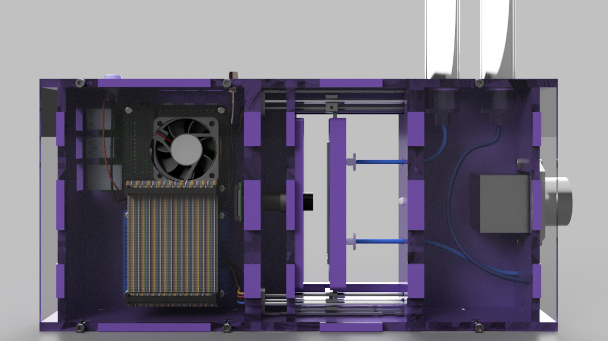

# Welcome to the PlanktoScope build and use documentation

You can find here more information about how to build your own PlanktoScope.

## Setup

 - [How to setup your PlanktoScope the easy way](easy_install)
 - [How to setup your PlanktoScope the hard way (also known as the Expert's path)](expert_setup)

## Usage
 - [Information about collection devices](collection_devices)

## Contribute
 - [Find out how to contribute to this documentation and help edit it](edit_this_doc)
 - [Contribute to the code, here is the getting started](edit_the_code)

## Under the hood:
 - [Software architecte](software_architecture)
 - [MQTT Messages](mqtt_messages)