# User Interface Guide : Beginner Mode

You will find here the PlanktoScope's user guide applied to the Lac0scope project for the beginner mode.

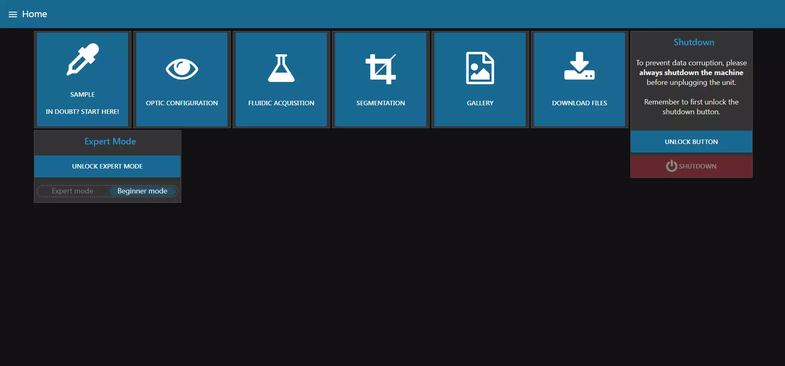

As previously mentioned, when you turn on your PlanktoScope, beginner mode is selected. This mode will simplify the display in order to acquire and export images.

From here, you can quickly access any of the available tabs. The buttons are the most used functionnalities of the machine in this mode. 

Four others tabs are accessible only through the hamburger menu on the top left of the screen (the three horizontal lines) but you shouldn't need to access it in beginner mode:

* System Monitoring
* Wifi
* Administration
* Hardware Config

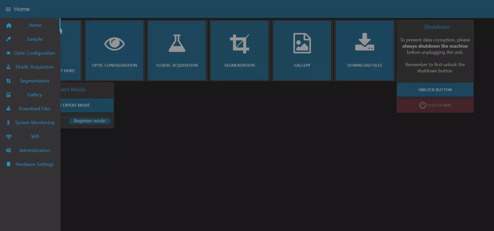

!!! tip
    This list is also available from any other tab and allows you to quickly navigate between tabs.

## Machine shutdown

From this page, you can also shutdown the machine when you are done.

!!! warning
    It's **very very very important** to **always** shutdown the machine and wait a minute for it to completely shutdown before unplugging the power supply!

    **You risk data corruption is you savagely shutdown your machine!**

To shutdown the machine, first unlock the shutdown button by clicking on "UNLOCK BUTTON".

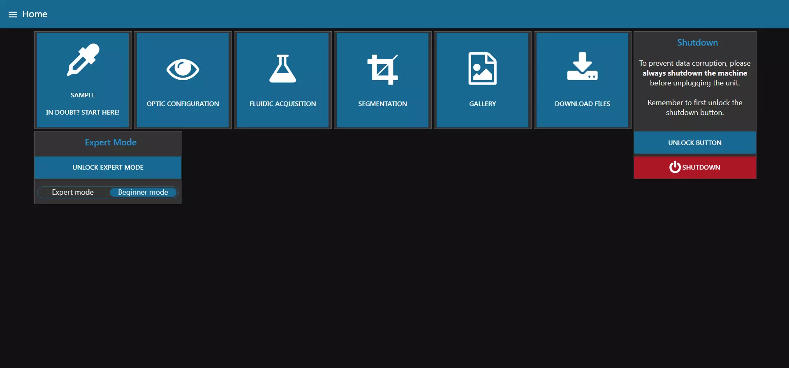

You can then click on "SHUTDOWN". The machine will ask for a final confirmation and will then shut itself down.

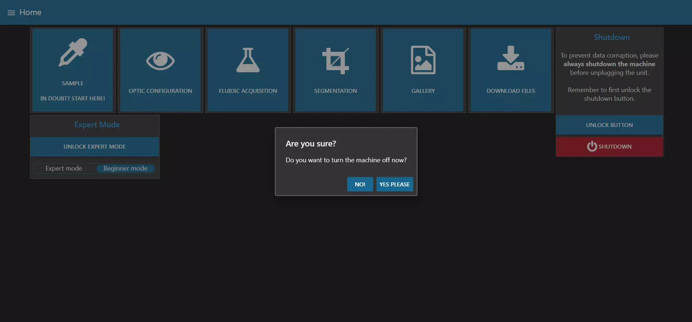

## Sample Tab

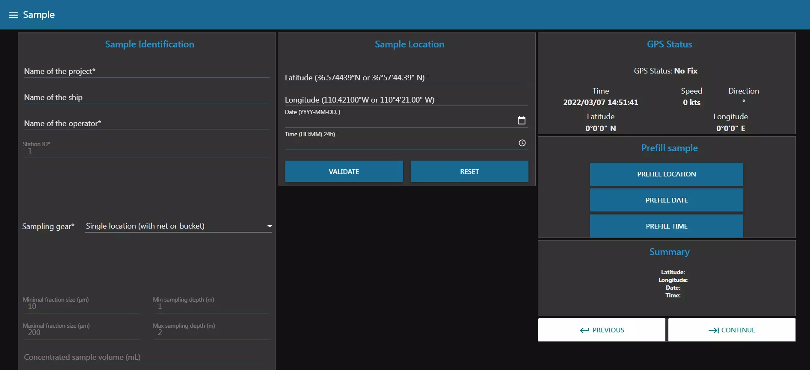
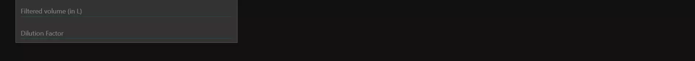

In this page, you can enter all the information regarding the current sample you want to image. This includes the project name, the operator, but also the type of collection device you used.

Depending on the device you choose, the page will change to reflect the needed information.

In the previous image we can see for example that the selected sampling gear is "Single location (with net or bucket)". This choice requires you to fill in the "Sample location" block (latitude, longitude, date and time) and for this you can either fill them in by hand or fill them in with the "Prefill sample" block which will use the GPS data to fill in the "Sample location" block.

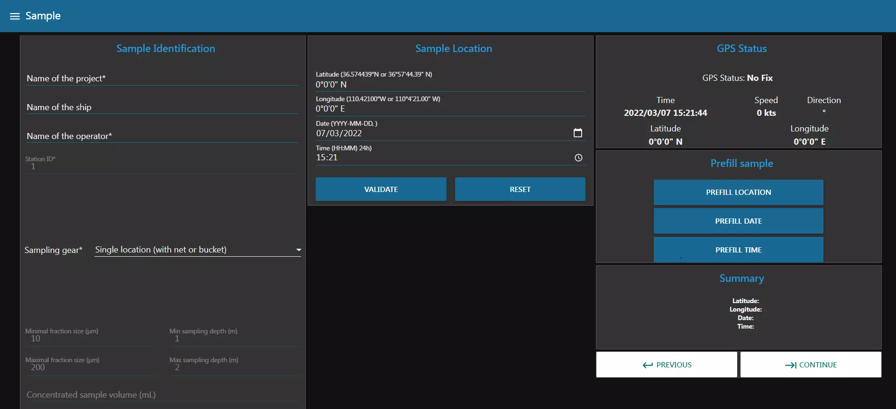

There is also a mechanism of validation of the submitted data. Please be careful to use the format given in example for each input field.

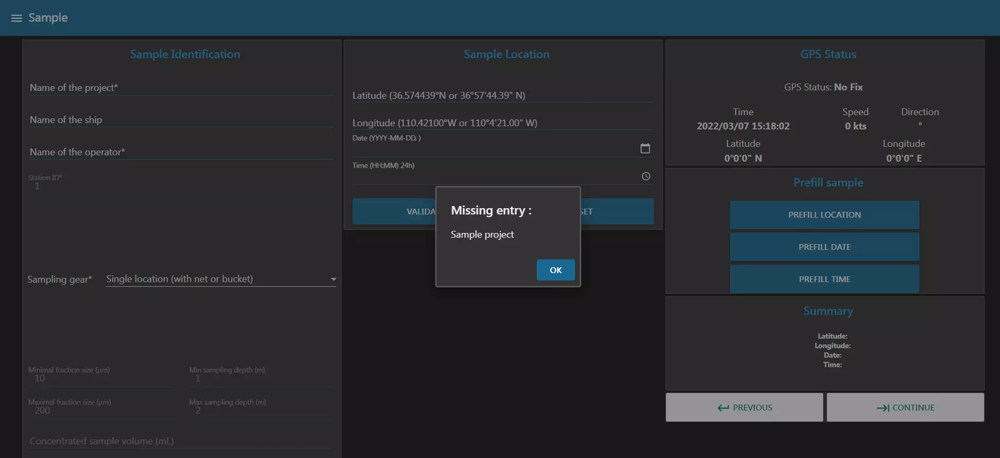

Once all the fields are completed, you can go to the next tab by clicking the -> arrow. This will make sure all the inserted data is valid.

## Optic Configuration

This page allows you to control the optical setup of the acquisition.

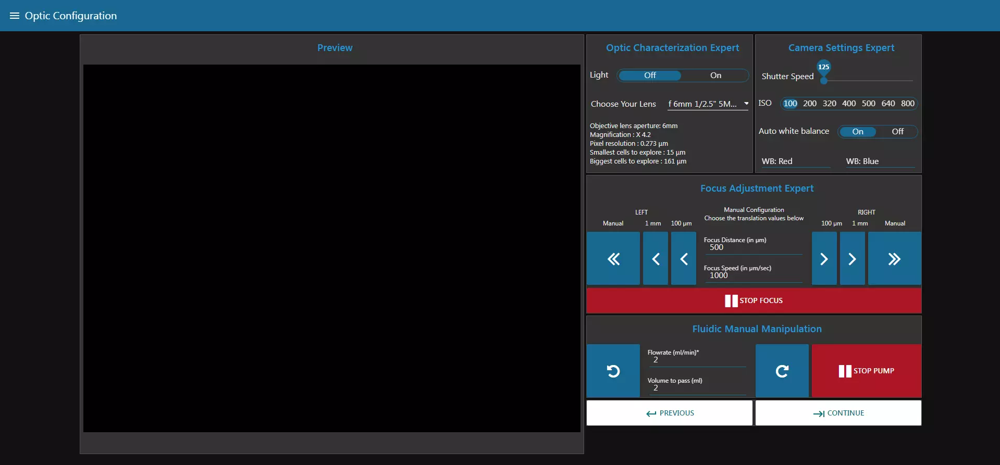

In the Optic Characterization block, you can control to turn the light on or not. You also have to choose the optics used in the machine.

!!! warning
    The selected lens is set as default but it can be changed as you wish.

The Camera Settings block allows you to change  the ISO number and the shutter speed. 

The Focus Adjustment block allows you to control the focus stage. With the different buttons, you can choose to move the stage by different values to the right or to the left in order to make the focus.

The Fluidic Manual Manipulation allows you to control the pump. You can change both the flowrate and the volume pumped. If you click on the rotating arrow, it will start the pump for the given volume at the chosen flowrate.

As with all the tabs, once you are satisfied with your focus and your image settings, you can click on "Continue".

## Fluidic Acquisition

Finally, this is where the magic happens! You will be able to chose the final parameters of your capture.

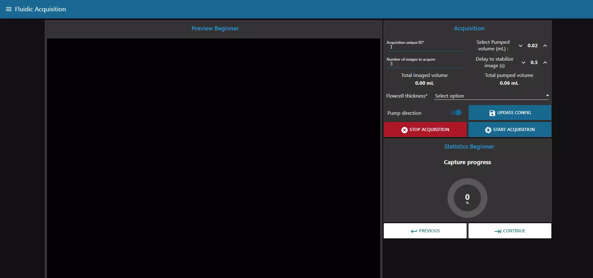

First of all, change the Fraction Size of your sample. You can then choose a unique ID for your acquisition, the number of pictures you want to take, the pumped volume (in between images), the delay to stabilize the image and the Flowcell thickness. All those settings will influence the Total imaged volume (the total volume captured during the acquisition) and the Total pumped volume.

!!! warning
    Make sure the Total pumped volume is lower than the volume of your sample.

## Segmentation
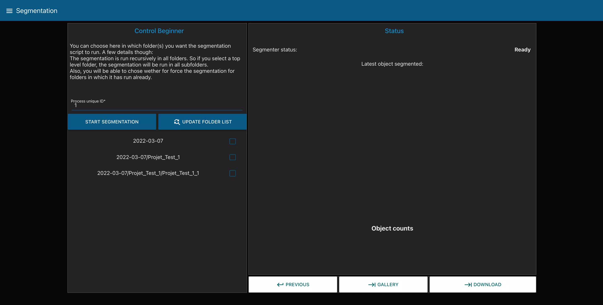

This page allows you to segment your images, i.e. to cut the different photos taken during the acquisition into objects. To do this you can select the folder containing the images to be segmented and launch the segmentation with the corresponding buttons.

We can also see at the bottom right of the page two buttons that send us to the pages "GALLERY" allowing us to visualize our images/objects and "DOWNLOAD" allowing us to recover our images/objects on a USB key.

## Gallery
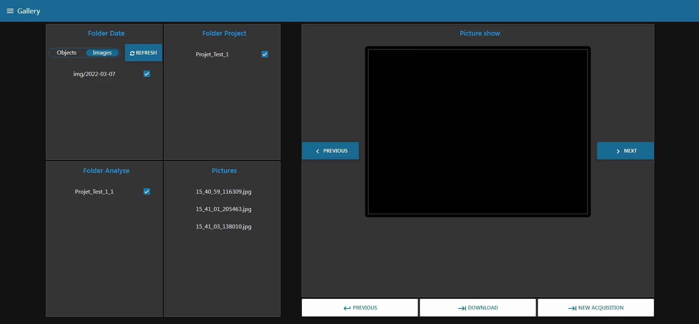

This page allows us, as we said before, to visualize our images or our objects. To display an image we start by choosing if we want to see full images or only objects. Then, we go through the different folders and select the image we want to see in the last block "Pictures". The i is displayed in the right block and we have two buttons to browse through the images.

We also see at the bottom right two buttons that send us to the pages "DOWNLOAD" allowing us to recover our images/objects on a USB key and "NEW ACQUISITION" which allows us to start again at the first step to start an acquisition. 

## Download Files

This page allows us to download directly the files present on the Raspberry Pi on a USB key.

!!! info
    Use one of the center USB ports on the machine, since those are USB3.0. They can be recognized by the blue insert in the middle of the connector. Those ports are faster.

After you connected your drive, click on "Detect Drive" to make it appear in the list. Once you have selected your USB drive you have different options:

- All" : this choice will allow you to make a complete backup of your images and objects.
- Images" : this choice will allow you to download your complete images, in the same way as on the "Gallery" page you can browse the different folders in order to download only the one you want.
- Objects" : this choice will allow you to download your objects from your images, in the same way as on the "Gallery" page you can browse the different folders in order to download only the one you want.

Once you have made your choice you can check that you are going to download the right file and start the download by clicking on the "BACKUP TO USB" button. Then wait until a completion message is displayed.

You can also delete the files you have selected with the "DELETE FILES" button.
