# Calibration

## What do we calibrate?

The PlanktoScope is a measuring device. This device is intended to capture plankton'picture with metadata like time, localisation, size of plankton and other information about measure. 

In order to achieve this goal the PlanktoScope has a hydrolic part with a pump pushing the sample and makes it pass in a channel. To finish the capture part with a cam and a lens wich takes a picture of a part of the channel.

The component wich needed a calibration are the pump and the whole capture device.

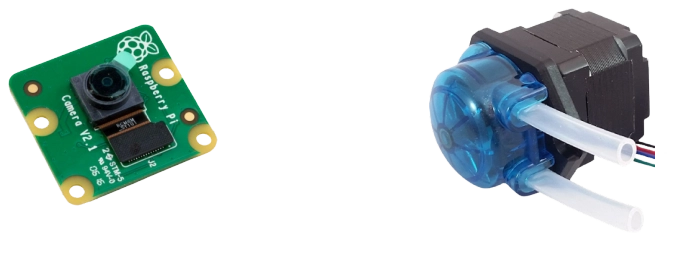

## Why do we have to calibrate them?

The right question to ask is **why the planktoscope need calibration ?**

The Planktoscope is a measuring device and like all measuring device it needs calibration to certify the results it poduces. 

Moreover, the calibration can't be common to all devices. In fact these values change according to the pump or lens used. 

For the lens calibration if we use the same lens as us the factor of calibration can stay the same.

But for the pump, a new calibration is needed for each pump because the value depends of the motors and the tension applied in the pump.


An other very interesting question is **What are these values for?**

1. For the pump, knowing the volume moved allow us to set up the pump to pass exactly the volume watched by the camera to analyse the entire volume without overlay or spaces.
   
2. For the lens, knowing the ratio between micrometer and pixel allow us to know the exact size of each object and the new parameters for identification.


## How to calibrate them?

### Pump calibration

Bellow this section we can see a shematic of hydrolic part. Please prepare your PlanktoScope like on this shematic, thinking of filling the Tank1.


To start, this is a summary of the information to note down :

* Initial step by milliliter, we will call it  `Old_step`. You can found it in Node-red interface -> page `Harware Settings` -> `Pump: steps per ml`. In this example the value is **428**.

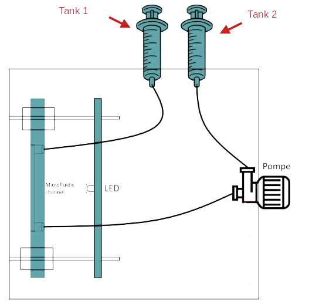

* The value of the volume to pass, we will call it `Volume_target`. To process to the calibration we choose **10 ml** for the `volume to pass (ml)` and **2 ml/min** for the `Flowrate (ml/min)`. As in the following example. In page Optic Configuration -> block Fluidic Manual Manipulation) and

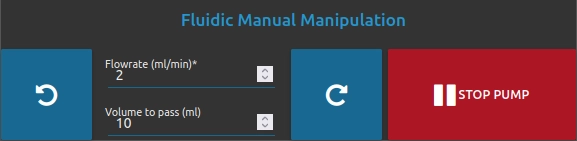
  
!!! Note 
    You can show and setup pump parameters by going to Node-red interface -> page `Optic Configuration` -> block `Fluidic Manual Manipulation`.

* The last value, is obtained to make calibration, we will call it `Volume_pumped`. This value is a subtraction between the initial level of liquid and level after having operated the pump (with parameter described above).

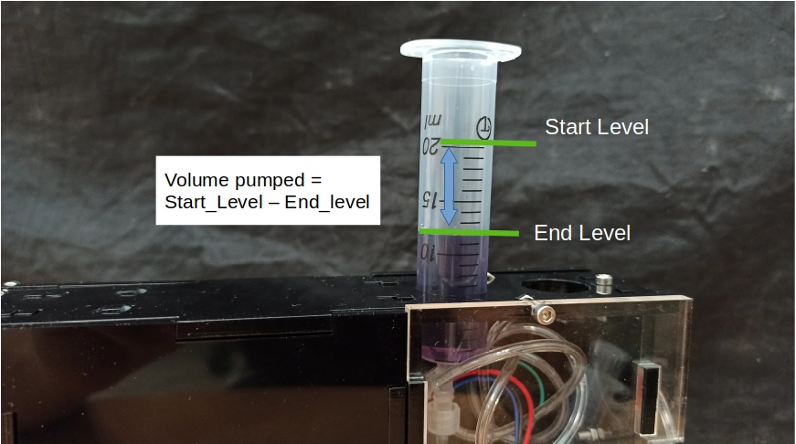

!!! tips
    Use a container with a greater precision


* Now that everything is ready, to start the calibration you need to return to the parameters of the pump (Node-red interface -> page `Optic Configuration` -> block `Fluidic Manual Manipulation`) and turn on the pump in good direction (with button rotate right or left )

* Wait for the pump to finish. At the end wrote the value `Volume_pumped` by looking at **Tank1**.


* Now you can calculate the new value of pump calibration with the following formula : 

        pump_step = Volume_target * Old_step / Volume_pumped

* Now you need to setup this value to your PlanktoScope. For that you need to switch in expert mode. Go to Node-red interface -> page `Home` -> block `Expert Mode`, Click to button `UNLOCK EXPERT MODE` then answer **yes** to the pop-up and swtich to `Expert mode`

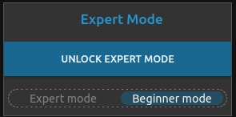

* Now go to the page `Harware Settings`, select **Custom Version** in section `Machine version` and put your value of calibration in section `Pump: steps per ml`. 

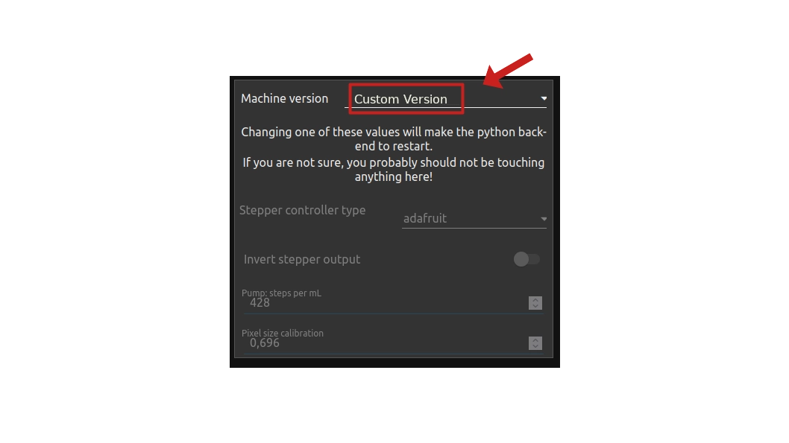

!!! warning
    If your are in **Custom Version** and you change this parameter, all your custom parameters will be erased (for example you select *Projet Lac0scope 0 (Babamu Xapoiteo)*).

### Lens Calibration 

Before you start : To do the calibration you must have a Micrometer calibration slide. You can buy it [here](https://www.gtvision.co.uk/MultiScale-Micrometer-Glass-Slide-for-Microscope-Calibration-1mm/100-10mm/100-10mm/200-Divis)

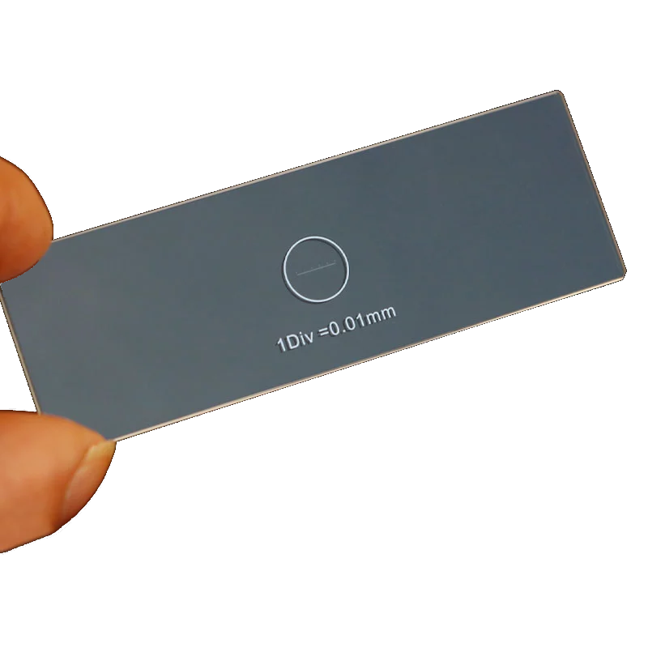

This calibration value change according to the magnification of the lens used.

For you information we have already value for the magnification lens describe bellow : 

- 16 mm 5MPx 1/(2.5) IR (zoom x1.6)
- 6 mm 5MPx 1/(2.5) IR (zoom x4.2)
- 3.6 mm 5MPx 1/(2.5) IR (zoom x8)
- 1.71 mm 5MPx 1/(2.5) IR (zoom x14)


#### Process

!!! Note
    Don't forget to fill the page sample, with your project name (ex: Calibration len), operator name and choose `test`

* First step, you need to put micrometric silde in front of channel, like the picture bellow.

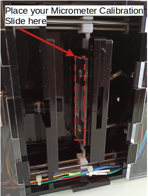

* Choose one of your magnification lens and set it up. Now go to Node-red interface -> page `Optic Configuration` and use right and left button to set up the focus. The objective is to obtain a clear picture.

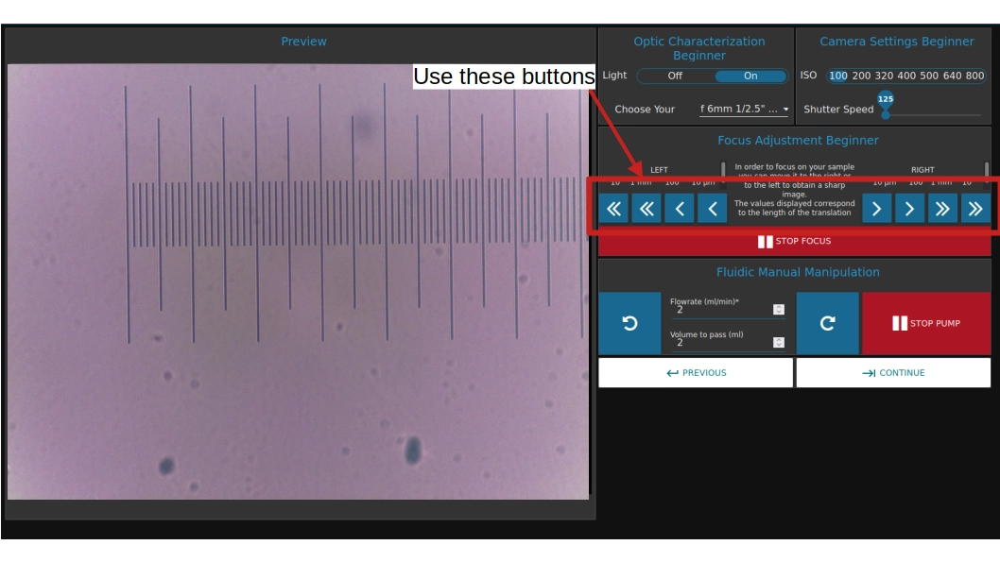

* Now you are going to take a picture. In order to do this go to Node-red interface -> page `Fludic Acquisition`. In the section `Number of images to acquire` set '1'. And to finish clik on `START ACQUISITION`.

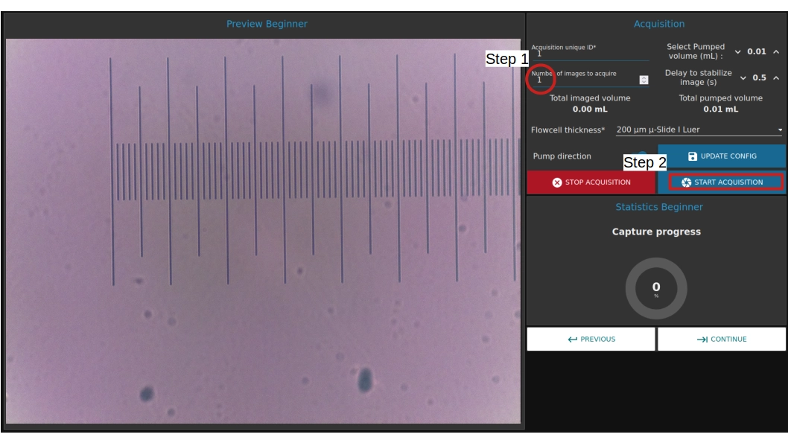

* Repete these step above for each magnification lens. Please note that you need to change the `Acquisition unique id` between each picture.

Now you have, in the PlanktoScope, all of your picture for the calibration. To do the calibration you will download these pictures and put them on your computer.

To do this follow these steps :
* Insert a usb key in the PlanktoScope.
* Go to the `Download` page (Node-red interface -> `home` -> page `Download`).
* In section `USB selection` select your device (USB key), if it does not appear clik on **DETECT DRIVE** and select **Images**.
* Now select the folder to start by date selection then project selection.
* To finish click to **BACKUP TO USB**. Please wait that the machine say that copy is done before removing your device.

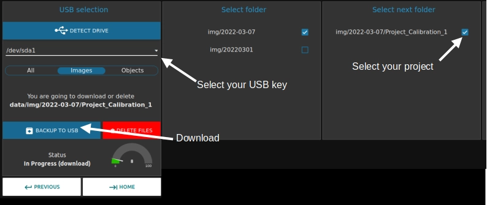

#### Take the measures

The last step of lens calibrations protocol is to do measure on picture. For that we advised you to download the software "imageJ" ([Link](https://imagej.nih.gov/ij/download.html) for windows). Or if you are on ubuntu please following lines of code bellow.

```
sudo apt update
sudo apt install imagej
```

The goal is to measure number of pixel and to link it to the real distance (thank to micrometric calibration slide). After a small calculation you obtain value of calibration in micrometer by pixel.

* Start by opening the software imageJ
* Open the picture (before taken and place into usbkey) by doing `file` -> `open` and seach your picture.
* Select the line (named **Straight**) and draw a line between 2 points on the micrometric slide on the picture.  Remember to stay parallel to the slide.

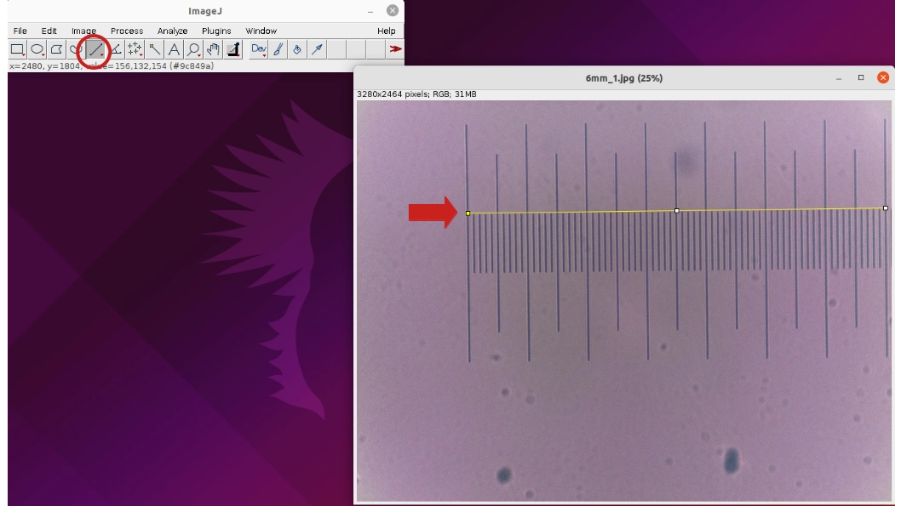

* Make the measure, go to `Analyze` -> `Measure`. A new windows will open and you can see the **length** of your line in pixel. In example this **length** is 2560pixel.

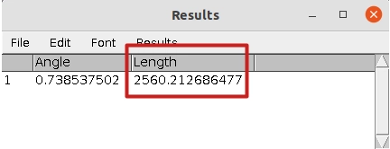

	* Thank to this value and the measuring scale of the calibration slide. In this example we have 7 larges stroke which corresponds to 700µm (7*100µm).

```
Calibration_value = Real_lenght / Number_of_pixel = 700 / 2560 = 0.273 µm/px
```

	* Repete these step above for eatch picture.

Example of my calibration : 
        
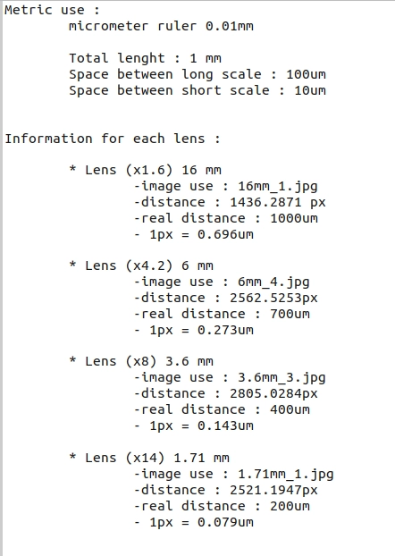

