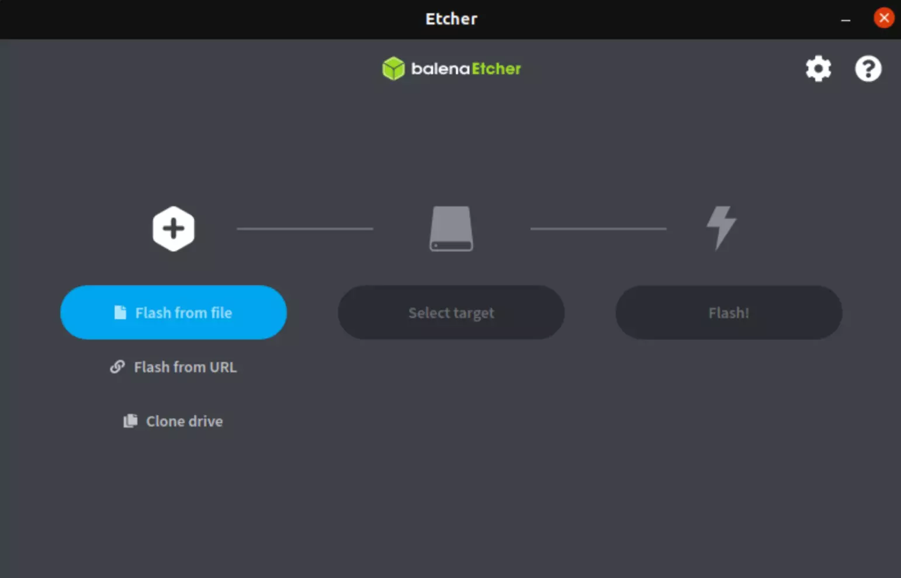
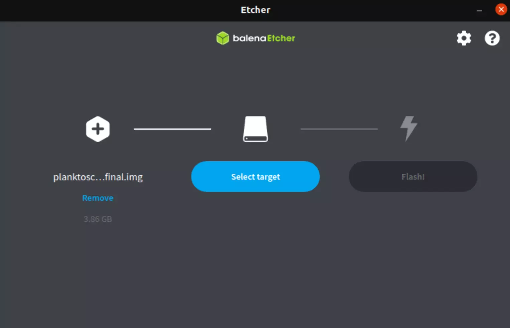
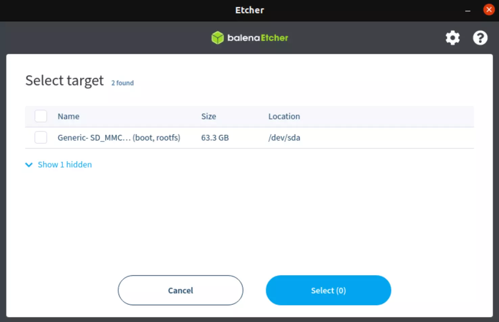
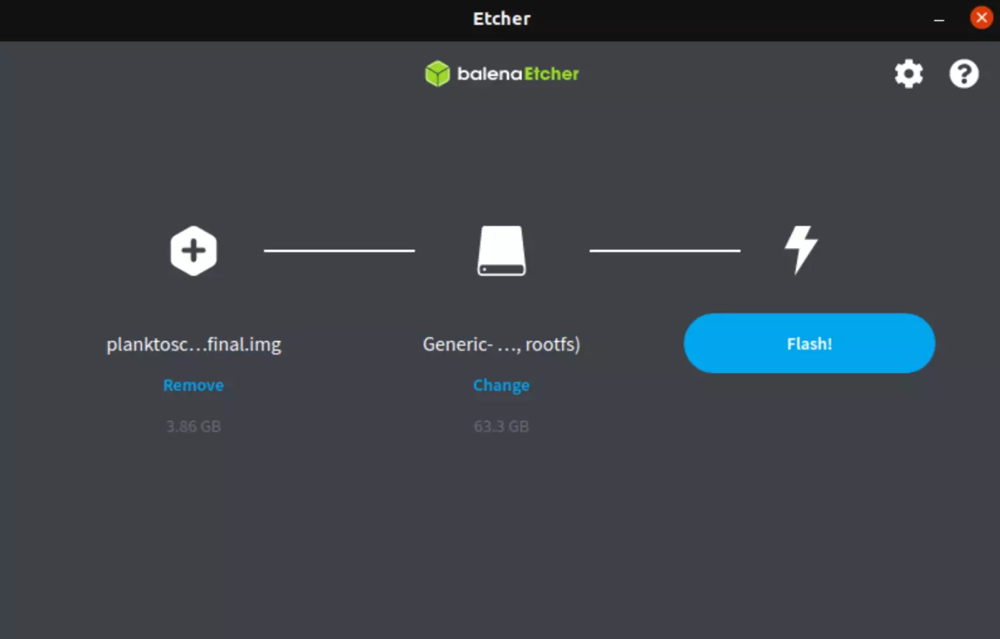

# PlanktoScope Simple Setup Guide

## Download the image

To setup you have 2 choices.

   * Install classic version of PlanktoScope folow this link [PlanktoScope-v2.3](https://s3.bazile.io/planktoscope/images/planktoscope-v2.3-adafruit-final.img.gz) 
  
   * Install custom version base on PlanktoScope-v2.3 but specify the project Lacoscope, please download the image : [PlanktoScope-v2.3-IESE_2022](https://espaces-collaboratifs.grenet.fr/share/proxy/alfresco-noauth/api/internal/shared/node/4svh5bflSqCEroWzgv5ecQ/content/PlanktoScope_V2.3-project_LacoScope.img.gz?c=force&noCache=1647424199666&a=true) 

## Prepare your SD card

1. To start choose an SD card without data on it (All data will be remove during flash).
2. Connect the SD card to your computer
3. Download and install a software to flash OS images onto the SD cards. For example you can use [BalenaEtcher](https://www.balena.io/etcher/)

Now we can flash the SD card with the sofware that you choose. For this follow these steps :

1. Open your soft (for the rest of this demonstration we can use BalenaEtcher).

2. In the first step select `flash from file` and choose the image (previously downloaded).

3. Select your device by clicking on `Select target` and choose the good SD card.

!!! warning
    Please choose the right SD card! For this you can check the name and/or the size.

4. To clik on `Flash!` and wait few minute (take a break ☕+🥐)

!!! Tip
    You need to unmount your device before removing it.

## Install  the PlanktoScope

Currently you have an SD card with a software for the PlanktoScope. Now insert the SD card into the PlanktoScope and connect it to the electrical grid.

When the light under the fan hat is blue, this mean that the installation went smoothly and the Planktoscope is ready ✅.

!!! Tips 
    If you want more information about the meaning of led colors please read this section: [here](debug.md#others-informations)
!!! Warning
    Once the SD card with the software is inserted within the Raspberry Pi, make sure that all the electronic parts are mounted with all the necessary connections made (Pi camera, motors, GPS, fan, pump)

## Pump value setup

If you use one of our Planktoscope (project Lacoscope number 0,1,2 or 3) you can directly select your machine version. This step allows you to pass the pump calibration.

Here are the steps to follow :

1. On Node-red interface (http://planktoscope.local:1880/ui) go to the page `Hardware Settings`
2. In the section `Machine version` select your PlanktoScope (project Lacoscope number)

Otherwise you need to calibrate your PlanktoScope please got to calibration section : [Calibration](calibration.md#pump-calibration)

## Start Playing !!!

Now you can start to play with your new Planktoscope. For that we need to connect your computer to PlanktoScope's Wifi.

- Wifi Ssid start by `PlanktoScope-Baba*****-******`  
(example PlanktoScope-Babajai_Muqouqo)

- Wifi Password is `copepode`

!!! Tip
    The name of ssid is display on the screen above the fan hat.

When you are connected to the PlanktoScope's Wifi, you just need to follow this link [http://planktoscope.local:1880/ui](http://planktoscope.local:1880/ui)  to access the control panel.

If you have not yet assembled your PlanktoScope, go to the [Assembly Guide](assembly_guide.md).
