# User Interface Guide Expert Mode

You will find here the PlanktoScope user guide applied to the Lac0scope project for the expert mode.

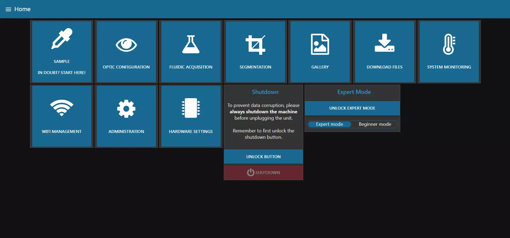

As explained before, you can choose your operating mode, by default the beginner mode is selected but you can change it as you wish. In this guide you will find all the pages of the expert mode that are not accessible in beginner mode.

From here, you can quickly access any of the available tabs. These are the same as those accessible in the hamburger menu at the top left of the screen. 

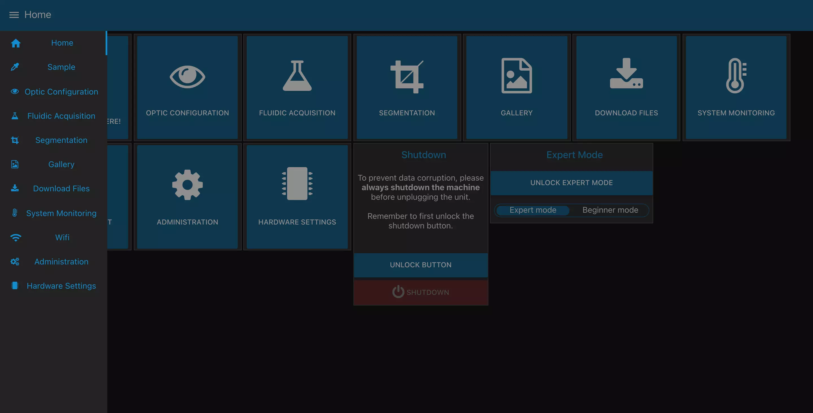

!!! tip
    This list is also available from any other tab and allows you to quickly navigate between tabs.

## Machine shutdown

From this page, you can also shutdown the machine when you are done.

!!! warning
    It's **very very very important** to **always** shutdown the machine and wait a minute for it to completely shutdown before unplugging the power supply!

    **You risk data corruption if you savagely shutdown your machine!**

To shutdown the machine, first unlock the shutdown button by clicking on "UNLOCK BUTTON".

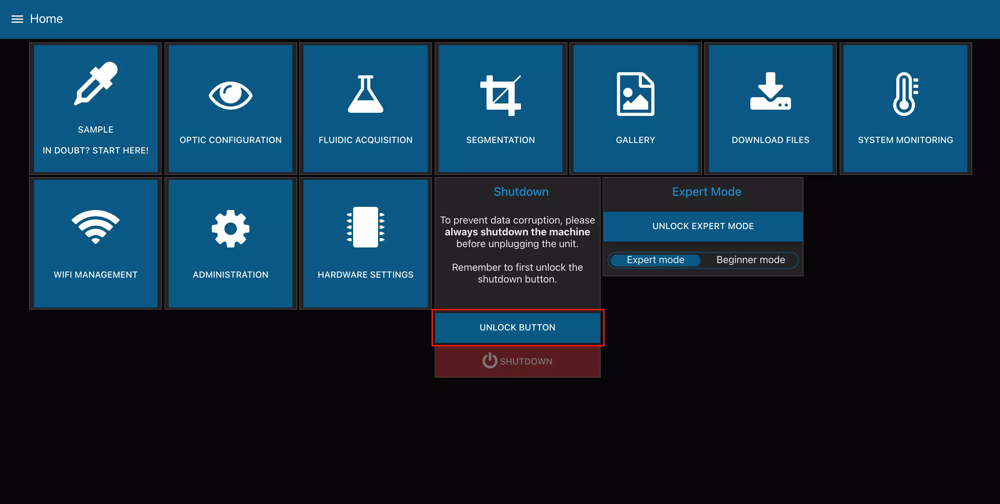

You can then click on "SHUTDOWN". The machine will ask for a final confirmation and will then shut itself down.

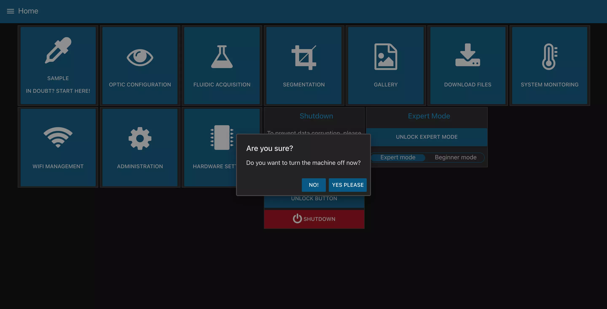

## Sample Tab

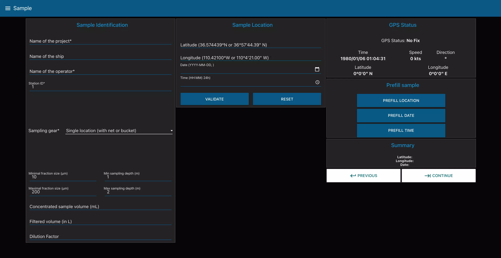

In this page, you can enter all the information regarding the current sample you want to image. This includes the project name, the operator, but also the type of collection device you used.

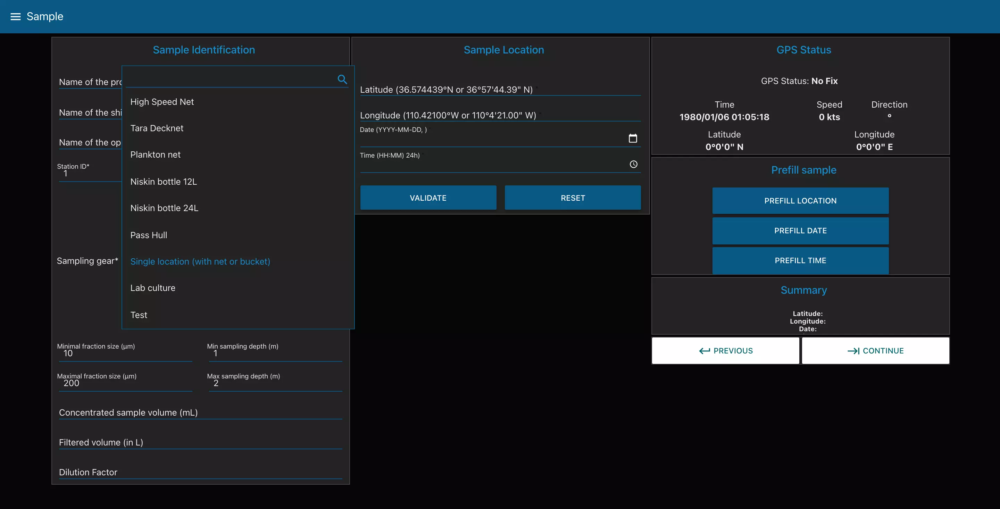

Depending on the device you choose, the page will change to reflect the needed information.

In the previous image we can see for example that the selected sampling gear is "Single location (with net or bucket)". This choice requires you to fill in the "Sample location" block (latitude, longitude, date and time) and for this you can either fill them in by hand or fill them in with the "Prefill sample" block which will use the GPS data to fill in the "Sample location" block.

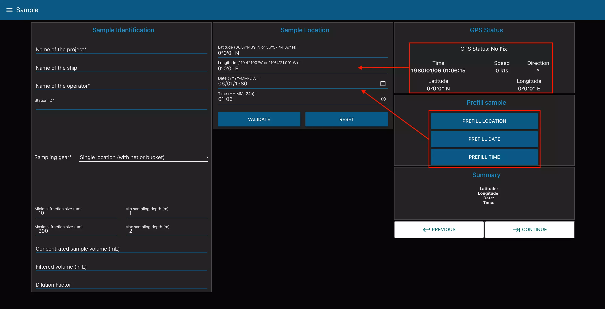

There is also a mechanism of validation of the submitted data. Please be careful to use the format given in example for each input field.

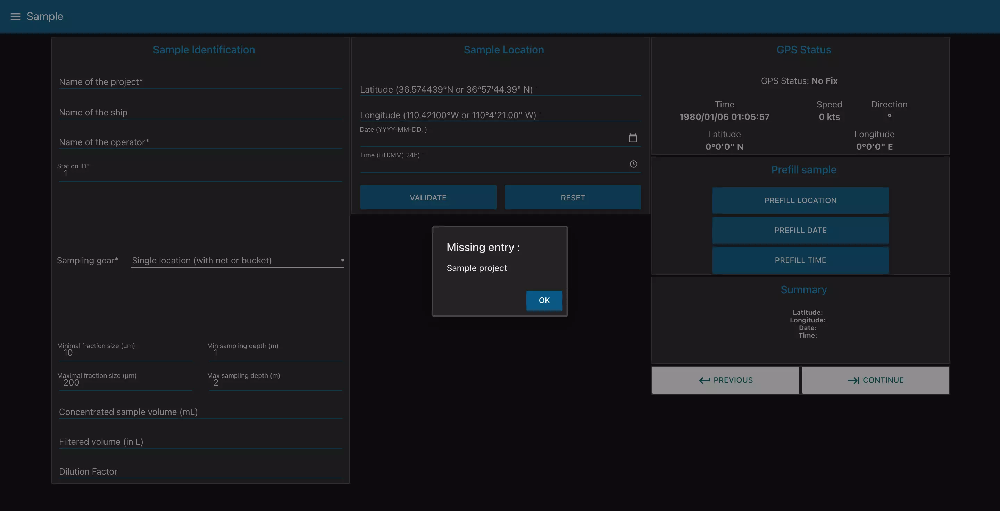

Once all the fields are completed, you can go to the next tab by clicking the -> arrow. This will make sure all the inserted data is valid.

## Optic Configuration

This page allows you to control the optical setup of the acquisition.

In the Optic Characterization block, you can control to turn the light on or not. You also have to choose the optics in use in the machine.

!!! warning
    The selected lens is set as default but it can be changed as you wish.

The Camera Settings block allows you to change the ISO number, the shutter speed and the Auto White Balance.

The Focus Adjustment block allows you to control the focus stage. With the different buttons, you can choose to move the stage by different values to the right or to the left in order to make the focus. You can also enter a value in the middle of the block and start the translation to the right or left with the "Manual" buttons.

The Fluidic Manual Manipulation allows you to control the pump. You can change both the flowrate and the volume pumped. If you click on the rotating arrow, it will start the pump for the given volume at the chosen flowrate.

As with all the tabs, once you are satisfied with your focus and your image settings, you can click on "Continue".

## Fluidic Acquisition

Finally, this is where the magic happens! You will be able to chose the final parameters of your capture.

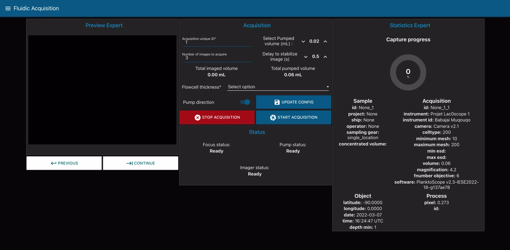

First of all, change the Fraction Size of your sample. You can then choose a unique ID for your acquisition, the number of pictures you want to take, the pumped volume (in between images), the delay to stabilize the image and the Flowcell thickness. All those settings will influence the Total imaged volume (the total volume captured during the acquisition) and the Total pumped volume.

!!! warning
    Make sure the Total pumped volume is lower than the volume of your sample.

## Segmentation

This page allows you to segment your images, i.e. to cut the different photos took during the acquisition into objects. To do this you can select the folder containing the images to be segmented and launch the segmentation with the corresponding buttons.

We can also see at the bottom right of the page two buttons that send us to the pages "GALLERY" allowing us to visualize our images/objects and "DOWNLOAD" allowing us to recover our images/objects on a USB key.

## Gallery

This page allows us, as we said before, to visualize our images or our objects. To display an image we start by choosing if we want to see complete images or only objects. Then, we go through the different folders and select the image we want to see in the last block "Pictures". The image is displayed in the block on the right and we have two buttons to browse the different images.

We also see at the bottom right two buttons that send us to the pages "DOWNLOAD" allowing us to recover our images/objects on a USB key and "NEW ACQUISITION" which allows us to start again at the first step to start an acquisition. 

## Download Files

This page allows us to download directly the files present on the Raspberry Pi on a USB key.

!!! info
    Use one of the center USB ports on the machine, since those are USB3.0. They can be recognized by the blue insert in the middle of the connector. Those ports are faster.

After you connected your drive, click on "Detect Drive" to make it appear in the list. Once you have selected your USB drive you have different options:

- All" : this choice will allow you to make a complete backup of your images and objects.
- Images" : this choice will allow you to download your complete images, in the same way as on the "Gallery" page you can browse the different folders in order to download only the one you want.
- Objects" : this choice will allow you to download your objects from your images, in the same way as on the "Gallery" page you can browse the different folders in order to download only the one you want.

Once you have made your choice you can check that you are going to download the right file and start the download by clicking on the "BACKUP TO USB" button. Then wait until a completion message is displayed.

You can also delete the files you have selected with the "DELETE FILES" button.

## System Monitoring

This tab allows you to monitor the physical characteristics of the machine and follow the processor load, CPU temperature, memory use and disk usage.

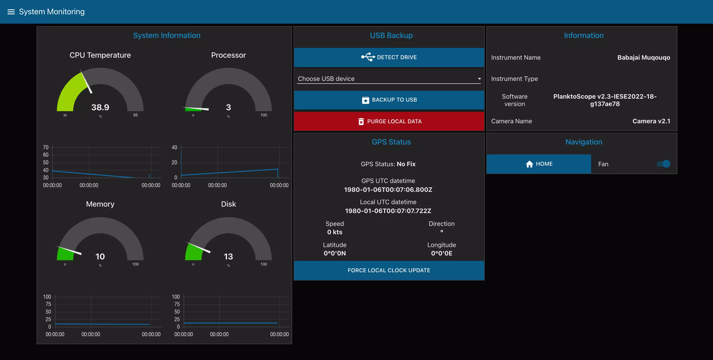

You also can find information about the software version you are using, the machine name and its camera.

### USB Backup of the data

Using the USB Backup block, you can backup the data from the machine to a connected USB device.

!!! Info
	Use one of the center USB ports on the machine, since those are USB3.0. They can be recognized by the blue insert in the middle of the connector. Those ports are faster.

After you connected your drive, click on “Detect Drive” to make it appear in the list. You can then choose “Backup to USB” to launch the copy. Wait until a completion message is displayed.

Before purging the local data, make sure your data has been backed up at least twice!

!!! Warning
	It’s very warmly recommended to use the 3-2-1 backup strategy. 3 copies on 2 devices with at least 1 offsite. For this machine, this means creating two copies on two different USB drives of the data before purging it from the device. Also, you should backup your device after each acquisition.

## Wifi

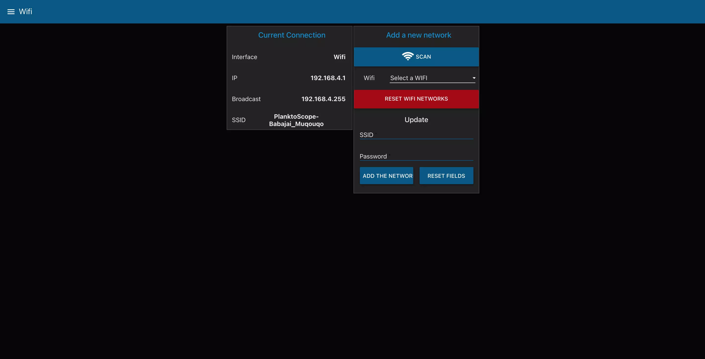

This page will give you the information about the network on wich the PlanktoScope is connected to. It will also allows you to connect your machine to a new WiFi network.

Start by doing a network scan by clicking on the `Scan` button. The list will be populated with detected networks after a few seconds. You can then choose one of them, enter its password and click on `Add the network` to connect to it. The wifi network of the PlanktoScope will disappear after a few seconds, so **you will need to connect back to the same network you just put the machine on**.

Finally, if you are not located in France, please update the Country code in the field below. This will ensure the PlanktoScope complies with local Wifi regulations (such as maximum emitted power, duty cycle and such).

Clicking on the button `Reset wifi networks` will erase ALL networks saved previously by the machine. If you do this, it will disconnect immediately from any network it’s connected to, and will put up its own network.

!!! Info
	For now, only WPA/WPA2 Personnal security system is supported. If you need another security system supported, get in touch with us.

!!! Warning
	Please be mindful about the security policies of your organisation before connecting your device to a network (either through Wifi or with an Ethernet cable). A lot of research institutions don’t allow devices not controlled by them to be connected to their network without first going on an approved list with a least a basic security checkup.

## Administration

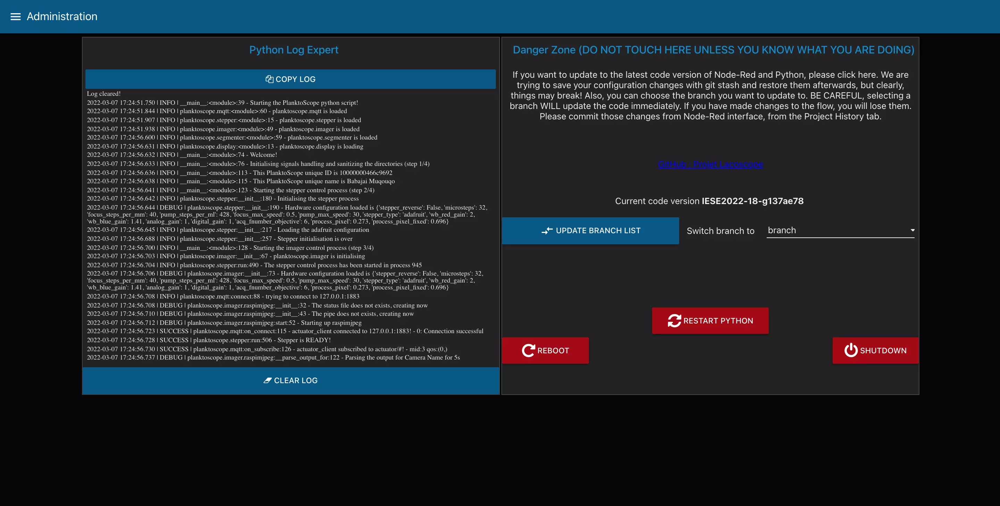

On this page you can find the logs generated by the python script and also the [Danger Zone](https://www.youtube.com/watch?v=siwpn14IE7E).

You should only modify here if you know what you are doing. The update process can be started from here. Also you can restart the python script if something become unresponsive (like the pump or the focus stage). You can also restart the machine or shut it down from this page.

## Hardware Configuration

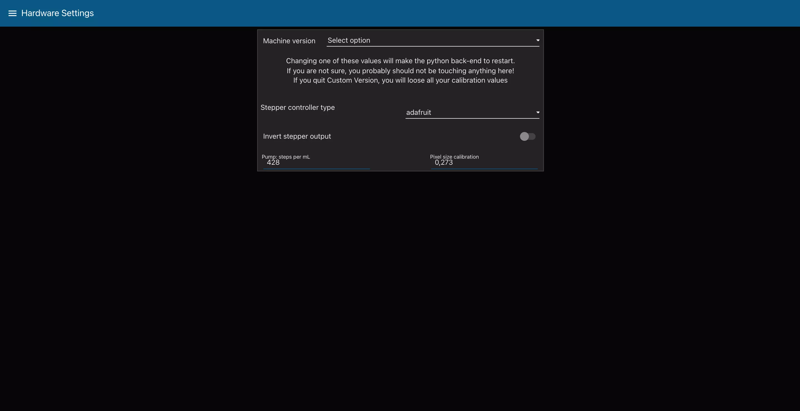

You can change the hardware settings of your machine here. If you use a Waveshare hat for the steppers, instead of the adafruit one, if you want to invert the stepper output (switch the stepper 1 with the stepper 2 for example) and the Steps per ml settings of the pump.

