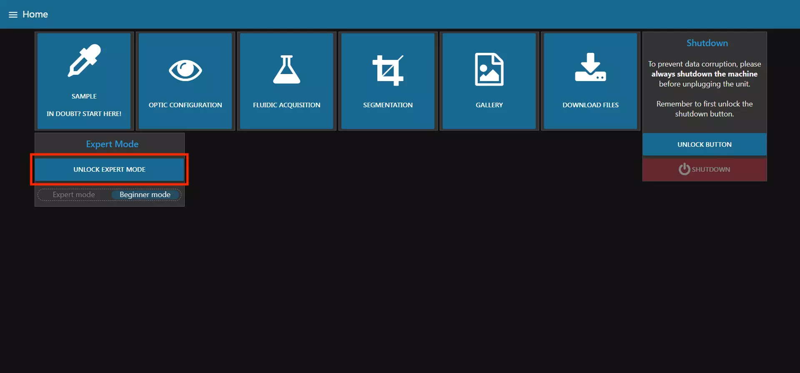
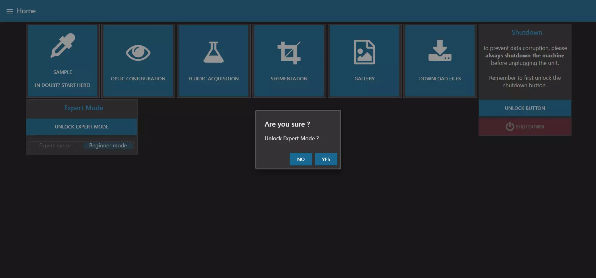
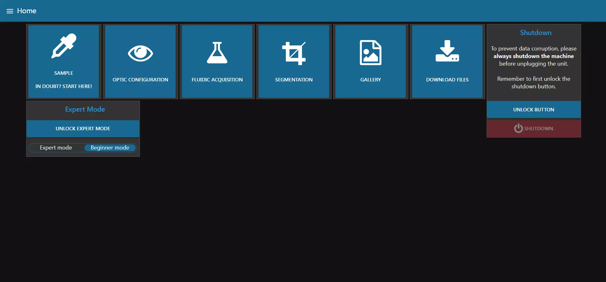

# Operating Mode

With our version of the Planktoscope applied to the Lacoscope, the user interface has been totally modified and is now easier to understand and use. This guide will help you get familiar with it.

 

As you can see above, when you first connect with your planktoscope at [http://planktoscope.local:1880/ui](http://planktoscope.local:1880/ui), you will reach this page.

On this home page, you can see a button that allows you to change the mode of use, either expert or beginner. This button allows you to choose whether you want to simplify the display and remove superfluous information in order to carry out an acquisition and export of images (beginner mode) or whether you want to go into detail and display all the parameters. 

By default, beginner mode is selected and expert mode is blocked.
 
To switch from one mode to the other, press "UNLOCK EXPERT MODE".

 

A window will appear and you will have to confirm your choice.

The button to choose the display mode will no longer be grayed out and you can choose your display mode.

After having chosen your mode of use, you can find the different guides : 

-  [User Interface Guide Beginner Mode](beginner_mode.md)
-  [User Interface Guide Expert Mode](expert_mode.md)

If you have mounted your PlanktoScope yourself, you will also need to calibrate your camera and pump in the following section: [Calibration](calibration.md).
