# User interface guide

Starting with the [release of v2.2](https://github.com/PlanktoScope/PlanktoScope/releases/tag/v2.2), a new user interface brings a whole new user interface. This guide will help you get familiar with it.

## Home

As you can see above, when you first connect with your planktoscope at [http://planktoscope.local:1880/ui](http://planktoscope.local:1880/ui), you will reach this page.

From here, you can quickly access any of the available tabs. The buttons are only the most used functionnalities of the machine. Three others tabs are accessible only through the hamburger menu on the top left of the screen (the three horizontal lines):

- Wifi
- Administration
- Hardware Config

!!! tip
This list is also available from any other tab and allows you to quickly navigate between tabs.

## Machine shutdown

From this page, you can also shutdown the machine when you are done.

!!! warning
It's **very very very important** to **always** shutdown the machine and wait a minute for it to completely shutdown before unplugging the power supply!
**You risk data corruption is you savagely shutdown your machine!**

To shutdown the machine, first unlock the shutdown button by clicking on "Unlock Button".

You can then click on "Shutdown". The machine will ask for a final confirmation and will then shut itself down.

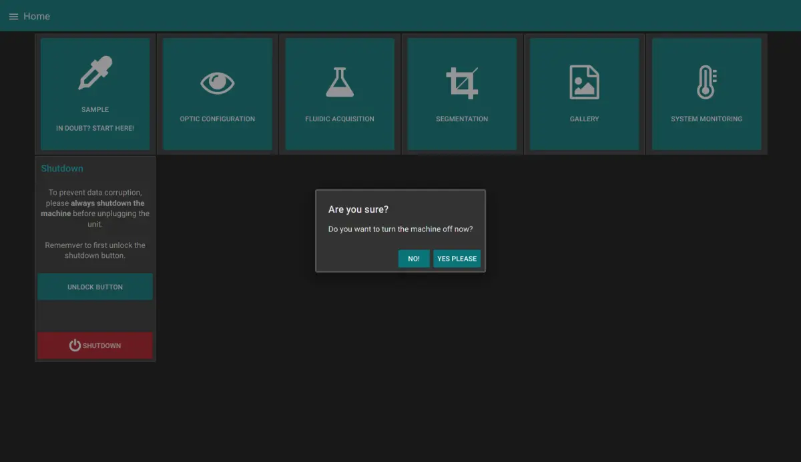

## Sample Tab

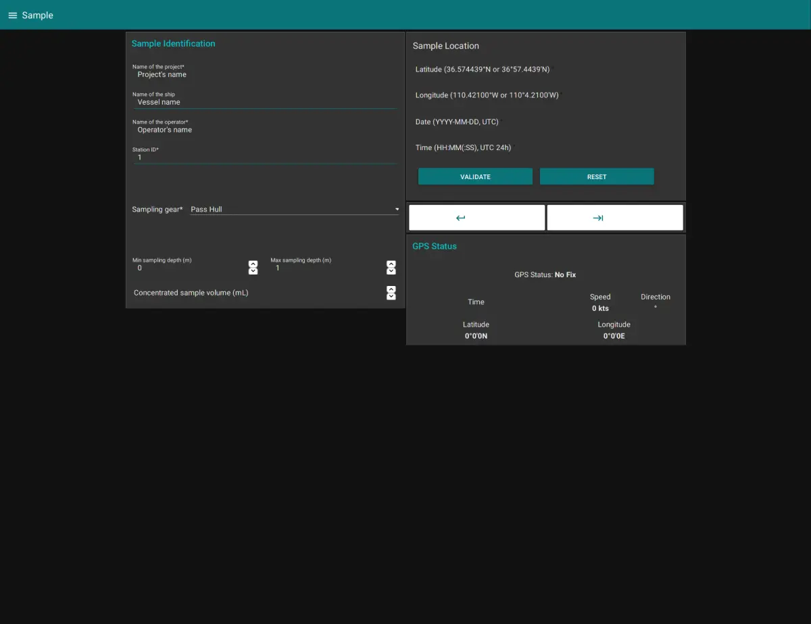

In this page, you can enter all the information regarding the current sample you want to image. This includes the project name, the operator, but also the type of collection device you used.

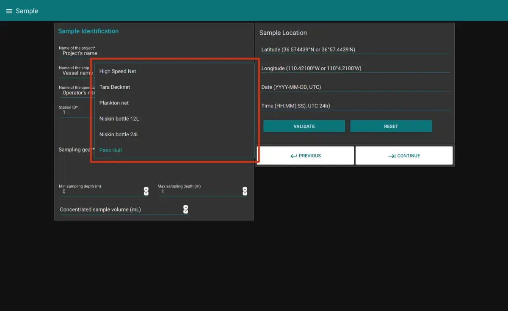

Depending on the device you choose, the page will change to reflect the needed information.

There is a mechanism of validation of the submitted data. Please be careful to use the format given in example for each input field.

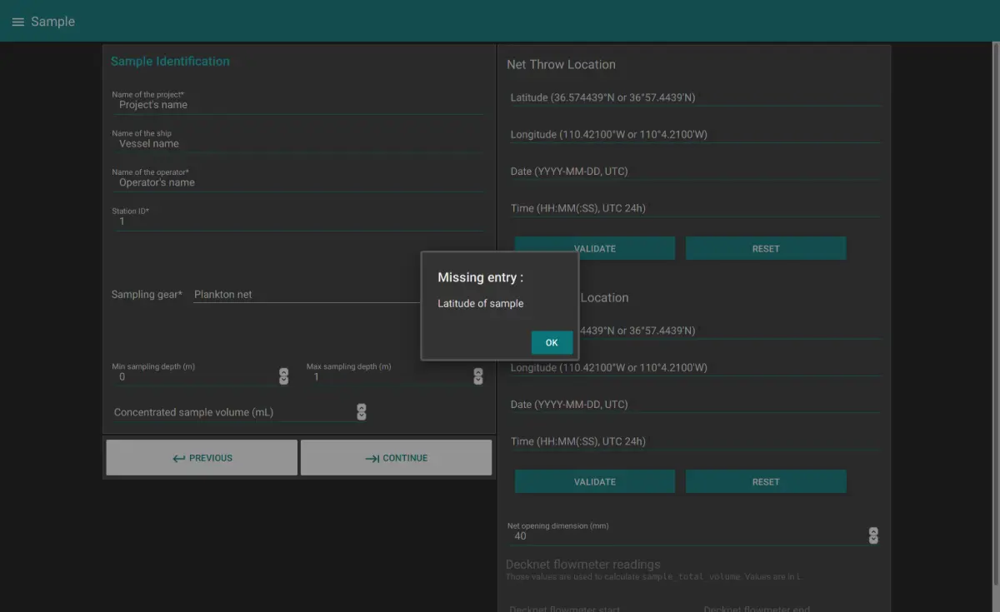

The GPS status block will give you the current information on the GPS fix and location, your direction and speed. This can be used to grab the location when in the field.

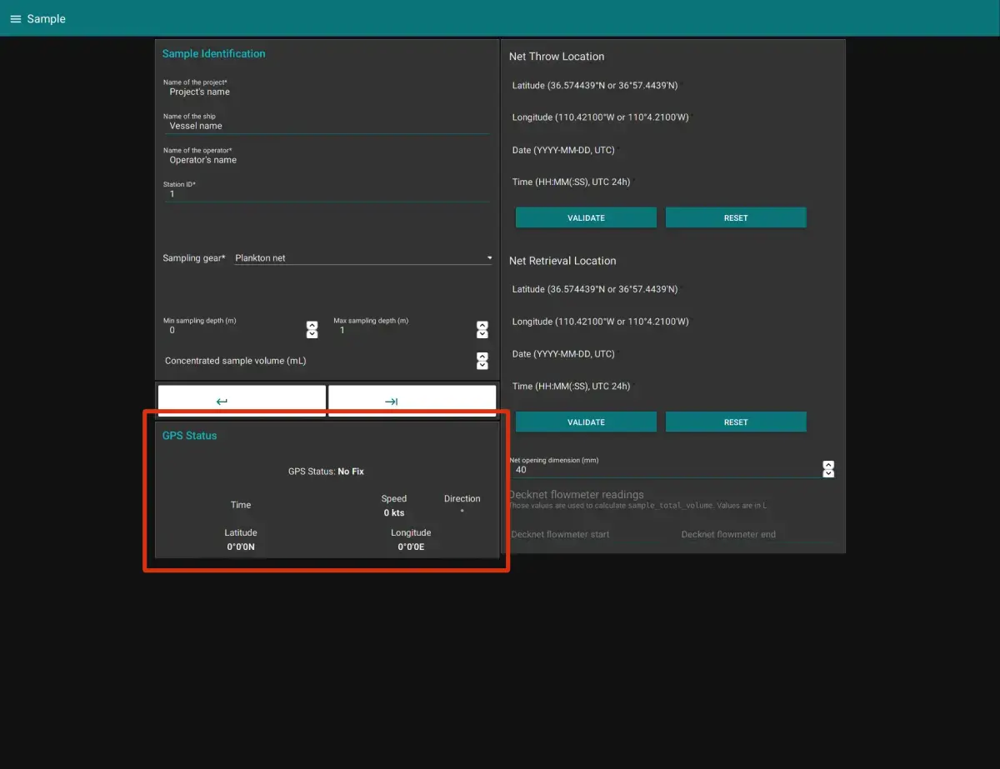

Once all the fields are completed, you can go to the next tab by clicking the -> arrow. This will make sure all the inserted data is valid.

## Optic Configuration

This page allows you to control the optical setup of the acquisition.

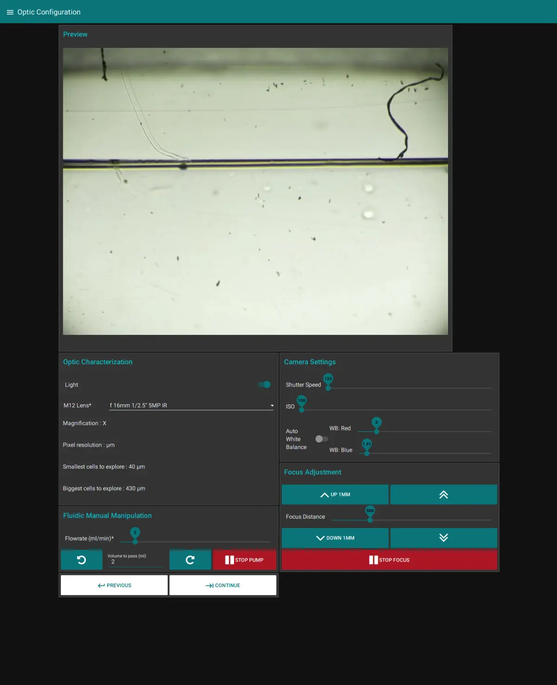

In the Optic Characterization block, you can control to turn the light on or not. You also have to choose the optics in use in the machine.

!!! warning
For now, the characteristics shown here are not true values (except if you use the 25mm/16mm lens couple).

The Camera Settings block allows you to change the shutter speed, the ISO number and the camera white balance settings. You can set it to automatic, but it's better if you control it by hand to make sure the setting doesn't change when the acquisition is started.

The Fluidic Manual Manipulation allows you to control the pump. You can change both the flowrate and the volume pumped. If you click on the rotating arrow, it will start the pump for the given volume at the chosen flowrate.

The Focus Adjustment block allows you to control the focus stage. With the leftmost buttons, you can choose to move the stage quickly by one mm, either up or down. The rightmost buttons move the stage by the specified distance in the slider under.

As with all the tabs, once you are satisfied with your focus and your image settings, you can click on "Continue".

## Fluidic Acquisition

Finally, this is where the magic happens! You will be able to chose the final parameters of your capture.

First of all, change the Fraction Size of your sample. You can then choose a unique ID for your acquisition, the number of pictures you want to take, the pumped volume (in between images), the delay to stabilize the image and the Flowcell thickness. All those settings will influence the Total imaged volume (the total volume captured during the acquisition) and the Total pumped volume.

!!! warning
Make sure the Total pumped volume is lower than the volume of your sample.

## Gallery

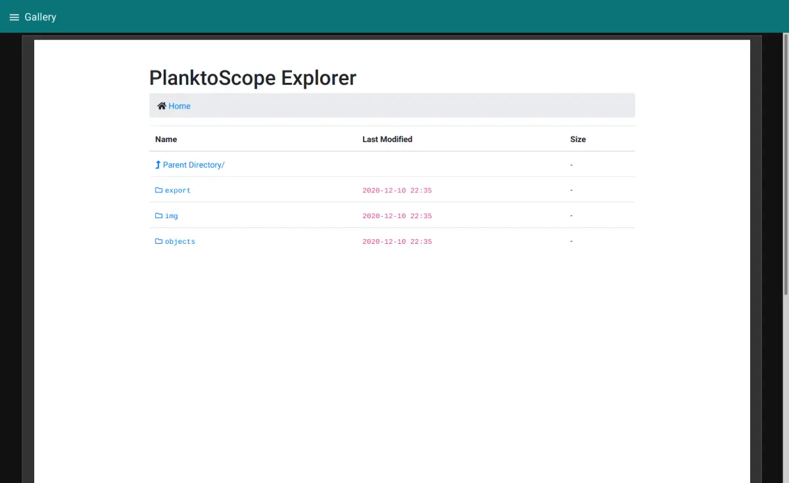

This simple page will allow you to navigate the local directory of the machine and visualize the captured data.

## System Monitoring

This tab allows you to monitor the physical characteristics of the machine and follow the processor load, CPU temperature, memory use and disk usage.

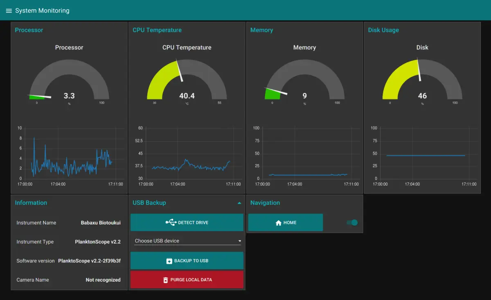

You also can find information about the software version you are using, the machine name and its camera.

### USB Backup of the data

Using the USB Backup block, you can backup the data from the machine to a connected USB device.

!!! info
Use one of the center USB ports on the machine, since those are USB3.0. They can be recognized by the blue insert in the middle of the connector. Those ports are faster.

After you connected your drive, click on "Detect Drive" to make it appear in the list. You can then choose "Backup to USB" to launch the copy. Wait until a completion message is displayed.

Before purging the local data, make sure your data has been backed up at least twice!

!!! warning
It's very warmly recommended to use the 3-2-1 backup strategy. 3 copies on 2 devices with at least 1 offsite.
For this machine, this means creating two copies on two different USB drives of the data before purging it from the device.
Also, you should backup your device after each acquisition.

## Wifi

This page will give you information about the network the PlanktoScope is connected to. It will also allows you to connect your machine to a new WiFi network.

Start by doing a network scan by clicking on the `Scan` button. The list will be populated with detected networks after a few seconds. You can then choose one of them, enter its password and click on `Add the network` to connect to it. The wifi network of the PlanktoScope will disappear after a few seconds, so **you will need to connect back to the same network you just put the machine on**.

Finally, if you are not located in France, please update the Country code in the field below. This will ensure the PlanktoScope complies with local Wifi regulations (such as maximum emitted power, duty cycle and such).

Clicking on the button `Reset wifi networks` will erase ALL networks saved previously by the machine. If you do this, it will disconnect immediately from any network it's connected to, and will put up its own network.

!!! info
For now, only WPA/WPA2 Personnal security system is supported. If you need another security system supported, get in touch with us.

!!! warning
Please be mindful about the security policies of your organisation before connecting your device to a network (either through Wifi or with an Ethernet cable). A lot of research institutions don't allow devices not controlled by them to be connected to their network without first going on an approved list with a least a basic security checkup.

## Administration

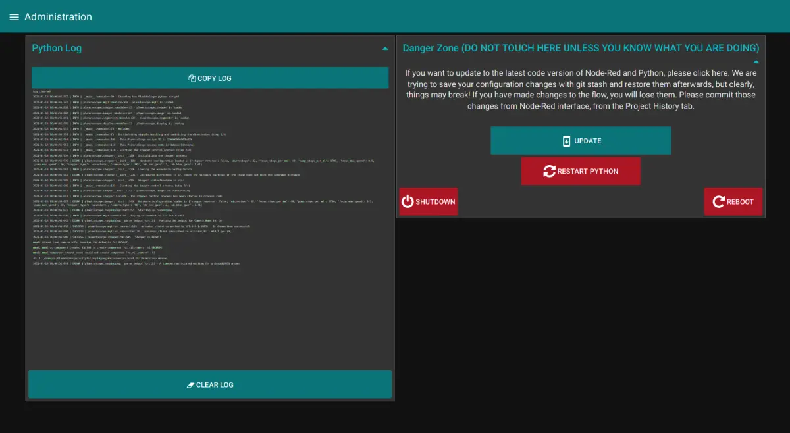

On this page you can find the logs generated by the python script and also the [Danger Zone](https://www.youtube.com/watch?v=siwpn14IE7E).

You should only touch here if you know what you are doing. The update process can be started from here. Also you can restart the python script if something becomes unresponsive (like the pump or the focus stage). You can also restart the machine or shut it down from this page.

### Update process

After clicking on the button to launch the update, the script will first check that there is an available update.

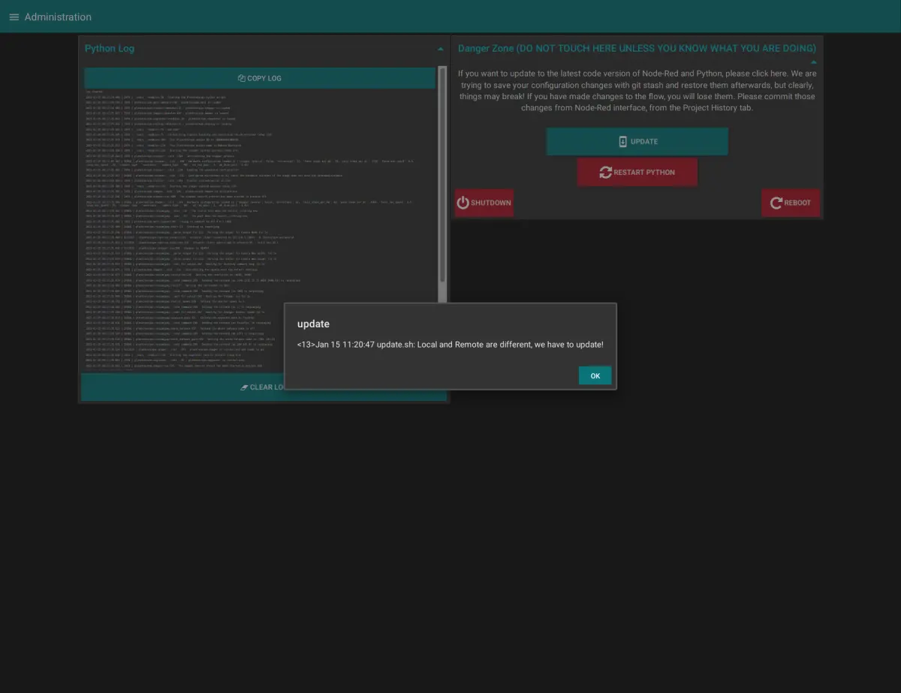

The script will then kill node-red, update its code and restart it.
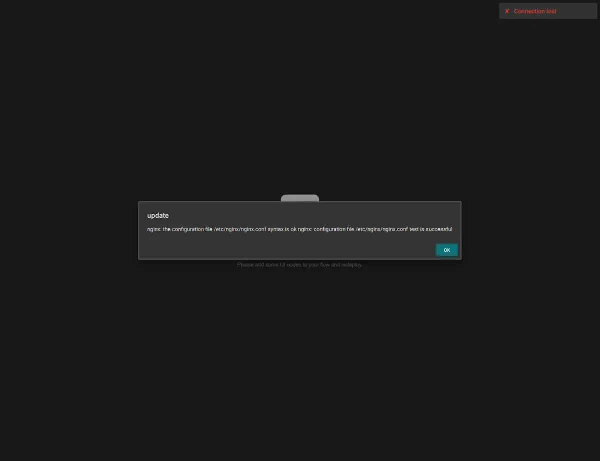

The python script will also restart the python script.
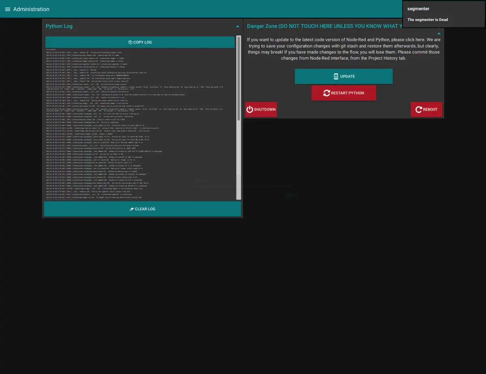

Once the message displayed top right show "The segmenter is ready", you're good to go on the latest version!
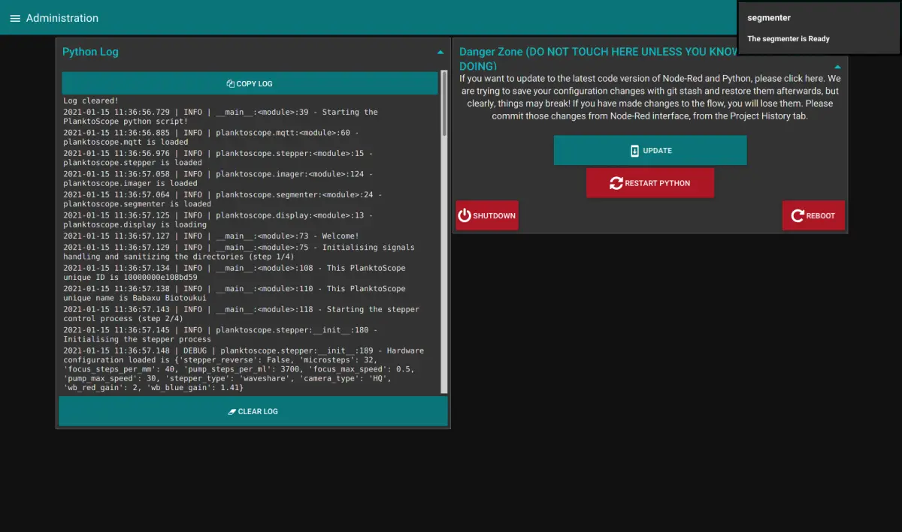

## Hardware Configuration

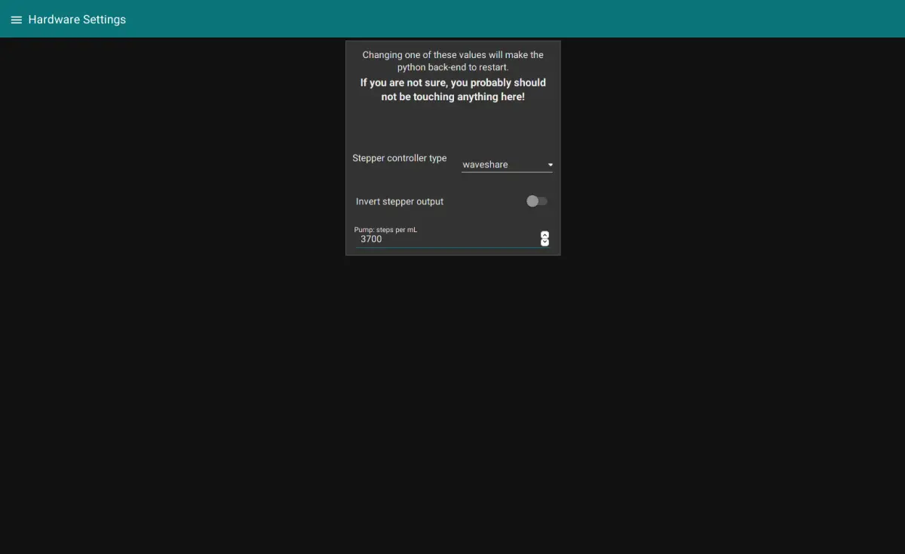

You can change the hardware settings of your machine here. If you use a Waveshare hat for the steppers, instead of the adafruit one, if you want to invert the stepper output (switch the stepper 1 with the stepper 2 for example) and the Steps per ml settings of the pump.
