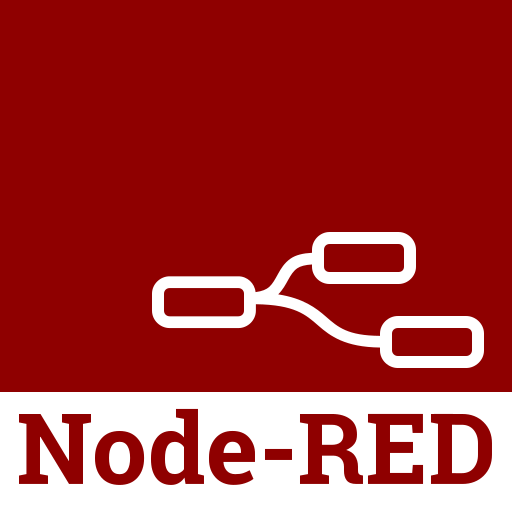

# Software Development

We are using the [Github Flow approach](https://docs.github.com/en/free-pro-team@latest/github/collaborating-with-issues-and-pull-requests) for our development efforts.

If you want to join us, have a look at the [currently opened issues](https://github.com/PlanktonPlanet/PlanktoScope/issues) and pick one where you feel like you can have an impact. Let us know you want to work it in the comments and get started.

For working on Node-Red, we recommend to install it directly on your development machine to allow for faster cycles of testing (and ease of use). But feel free to setup a Pi Zero as a portable and compact development environment! (One of us is using one configured as usb gadget to do so!)

## Node-Red

[Node-Red](https://nodered.org/) is our main process. We use [the flow](https://nodered.org/docs/developing-flows/flow-structure) to manage our user interface through a dashboard instance.

{ align=right width="100" }

As a software engineer, you may need to set up a Node-RED development environment on a Debian operating system. Node-RED is an open-source programming tool for wiring together hardware devices, APIs, and online services in new and interesting ways. It provides a visual, drag-and-drop interface for building applications, and can be used to develop a wide range of IoT, automation, and data processing projects.

To set up a Node-RED development environment on a Debian operating system, you will need to follow these steps:

1. Install Node.js: Node-RED requires Node.js to be installed on your system. You can install Node.js using the package manager by running the following command: `sudo apt-get install nodejs`
2. Install npm (Node Package Manager): npm is a package manager for Node.js that is used to install and manage Node-RED and its dependencies. You can install npm by running the following command: `sudo apt-get install npm`
3. Install Node-RED: Once Node.js and npm are installed, you can install Node-RED by running the following command: `sudo npm install -g --unsafe-perm node-red`
4. Start the Node-RED server: You can start the Node-RED server by running the following command: `node-red`
5. Access the Node-RED editor: You can access the Node-RED editor by opening a web browser and going to the URL <http://localhost:1880>.

By following these steps, you will be able to set up a Node-RED development environment on your Debian operating system and start building applications with the visual, drag-and-drop interface.

## Python

{ width="200" }

The python code is separated in four main processes, each with a specific set of responsibilities:

- The main process controls all the others, starts everything up and cleans up on shutdown
- The stepper process manages the stepper movements.
- The imager process controls the camera and the streaming server via a state machine.
- The segmenter process manages the segmentation and its outputs.

Those processes all communicates together using MQTT and json messages. Each message is adressed to one topic. The high level topic controls which process receives the message. The details of each topic is at the end of this commit message. You can learn more about the [MQTT Messages here](../../reference/software/interfaces/mqtt.md).

The code is architectured around 6 modules and about 10 classes. I encourage you to have a look at the files, they're pretty straightforward to understand.
