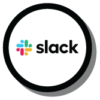
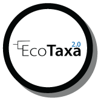

# The PlanktoScope Community

PlanktoScope is a completely open platform. The core of the PlanktoScope project is a basis in an evolving network of designers and users collaborating to increase the impact and availability of the tools. Building a community of users will enable PlanktoScope to grow with capabilities not yet imagined.

For around $800, and with parts freely available in most parts of the globe, any person with the desire to engage can begin building a PlanktoScope. This website contains the information needed to assemble, test, and begin collecting data on your PlanktoScope.

## Engage on GitHub

Feel free to visit the **[GitHub](https://github.com/PlanktoScope/PlanktoScope)** and engage if you want.

GitHub is a web-based platform that is widely used in the PlanktoScope Community for version control and collaboration. It allows members to easily share, track, and manage code and other project files. The platform is built around the Git version control system, which allows multiple contributors to work on the same codebase simultaneously while keeping a record of every change made.

In the PlanktoScope Community, members can use GitHub to collaborate on the development of the Planktoscope project. They created a central repository where they can share and track the code, documentation, and other project files.

## Chat on Slack

The community is using **[Slack](https://planktoscope.slack.com)** to communicate.

Slack is a communication and collaboration tool that is widely used in the PlanktoScope Community. It allows members to communicate and work together in real-time, providing a central hub for all conversations related to Planktoscope project. The platform offers features such as direct messaging, group channels, video conferencing, and file sharing, making it easy for members to stay informed and on the same page.

The PlanktoScope community has created a dedicated Slack workspace for the community members to share their findings, ask for help, and discuss project-related topics.

## Classify on EcoTaxa

To join **[EcoTaxa](https://ecotaxa.obs-vlfr.fr/register)**, you just need to create an account.

EcoTaxa is a web-based platform that enables researchers, educators, and citizen scientists to identify, classify and share images of microorganisms. The platform is designed to support biodiversity research and education by providing a user-friendly interface for browsing and analyzing images of microorganisms, as well as a collaborative environment for sharing images and data. EcoTaxa allows users to upload their own images, and the platform's machine learning algorithms can automatically identify and classify the organisms in the images.

The platform also offers a variety of tools for analyzing and visualizing data, including image annotation, statistical analysis, and data export. Additionally, EcoTaxa has a community feature where researchers can share their findings, and have a discussion on the data, and contribute to the knowledge base. Overall, EcoTaxa is a valuable resource for anyone interested in microorganism biodiversity research and education.
