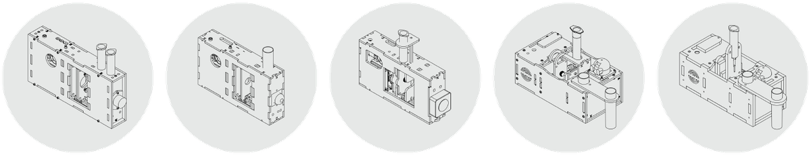

# Hardware Development

## PlanktoScope Case

{ align=right width="200"}

As a hardware engineer working on the PlanktoScope Case, you will be using Autodesk Fusion 360 for the development of the case design. Fusion 360 is a comprehensive computer-aided design (CAD) software that allows you to create and analyze complex 3D models, perform simulations and stress tests, and collaborate with team members in real-time.

To get started with the project, you will need to install a development environment on your computer. Here are the steps to follow:

* Download and install [Fusion 360 from the Autodesk website](https://www.autodesk.com/products/fusion-360/overview).
* Create a free Autodesk account and log in to Fusion 360.
* Join the PlanktoScope Case team in Fusion 360. This will give you access to all of the project files and allow you to collaborate with other team members.
* Familiarize yourself with the Fusion 360 interface and tools. There are many resources available online, including tutorials and user guides, to help you get up to speed.
* Start designing and testing your case components in Fusion 360. You can use the software to create 3D models, run simulations and stress tests, and collaborate with other team members in real-time.

By following these steps, you will be able to successfully install a development environment and participate in the PlanktoScope Case using Autodesk Fusion 360.

## PlanktoScope Hat

{ align=right width="200"}

As a hardware engineer working on the PlanktoScope Hat, you will be using [Autodesk Eagle](https://www.autodesk.de/products/eagle) to design and develop the electronic components of the hat. Autodesk Eagle is a powerful and widely used software platform for designing and laying out printed circuit boards (PCBs).

To participate in the project, you will need to install a development environment on your computer that includes Autodesk Eagle and any other necessary tools and libraries. Here are the steps you can follow to set up your development environment:

* Download and install Autodesk Eagle from the [official website]((https://www.autodesk.de/products/eagle)). Make sure to select the appropriate version for your operating system (Windows, Mac, or Linux).
* Follow the instructions provided by Autodesk to complete the installation process. This may involve entering a license key or activating the software through your Autodesk account.
* Once Autodesk Eagle is installed, you may need to install additional libraries or tools depending on the specific requirements of the PlanktoScope Hat. These may include libraries for communicating with specific hardware components, or tools for debugging and testing your designs.
* Once you have installed all the necessary tools and libraries, you should be ready to start working on the PlanktoScope Hat using Autodesk Eagle. You can begin by opening the project files and familiarizing yourself with the existing design, or by creating new designs as needed.

By following these steps, you can set up a development environment that allows you to contribute to the PlanktoScope Hat using Autodesk Eagle.
