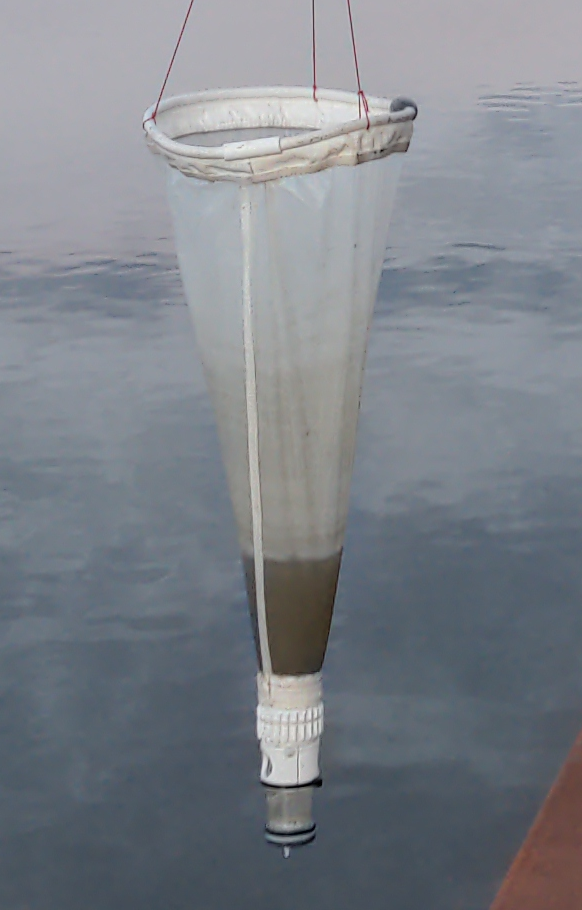

# Plankton Net

A plankton net is a scientific tool used to collect plankton samples from aquatic environments. Plankton are small, drifting organisms that play a vital role in marine ecosystems. They include a diverse range of species, including bacteria, algae, protozoa, and small animals such as crustaceans and mollusks. Plankton nets are designed to capture these tiny organisms as they drift through the water column.

Plankton nets typically consist of a fine mesh net attached to a long, narrow handle. The net is usually cone- or cylinder-shaped, with a small opening at the base and a wider opening at the top. The net is lowered into the water and dragged through the water column, collecting plankton as it goes. The collected plankton is then collected in a sample bottle or container for further study.

Plankton nets can be used in a variety of aquatic environments, including oceans, lakes, and rivers. They are commonly used in scientific research to study the diversity and abundance of plankton in different ecosystems, as well as their role in the food web and the broader ecosystem. Plankton nets are also used in environmental monitoring programs to track changes in plankton populations over time.

The simplest device you can use is a plankton net. It should be made of a fine mesh, down to 20 micron. It can be towed behind a boat at low speed (less than 2 knots) or towed by hand in a river or a lake.

Plankton nets can be made easily with a good sewind machine and some hardware.
