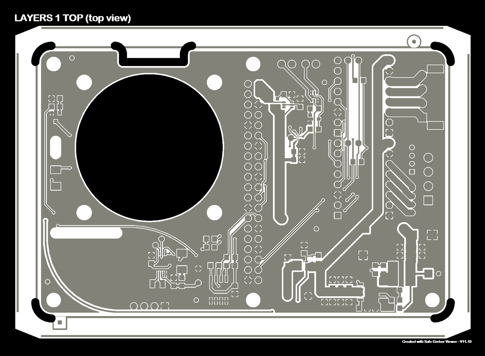

# Manufacturing Guide

## PlanktoScope Case

[CNC (computer numerical control) milling machines](https://en.wikipedia.org/wiki/Numerical_control) are used to fabricate parts with precise dimensions and shapes. The configuration of the feed rate and diameter plays a crucial role in the machining process and can significantly affect the quality and efficiency of the production of a workpiece.

### Manufacturing files

| Files                                                         | Description                              |
| ------------------------------------------------------------- | ---------------------------------------- |
| [PlanktoScope-Case.dxf](/hardware/case/PlanktoScope-Case.dxf) | PlanktoScope Case export for CNC Milling |

### Tools

| Tool                | Specification                                                |
| ------------------- | ------------------------------------------------------------ |
| CNC Milling machine | minimum traverse path at a minimum size of 600 mm to 1000 mm |
| End Mill            | Ø 6mm                                                        |
| End Mill            | Ø 3mm                                                        |
| End Mill            | Ø 2mm                                                        |
| End Mill            | Ø 1mm                                                        |

### Material

#### Wood

[Valchromat](https://www.investwood.pt/de/valchromat/) is a wood-based composite material made from recycled wood fibers and colored with natural dyes. It is known for its durability, resistance to moisture and decay, and ability to be machined and finished in a similar way to solid wood. Here are some of the key characteristics of valchromat:

- Durability: Valchromat is a highly durable material that is resistant to moisture, decay, and termites, making it ideal for use in outdoor or high-moisture environments.

- Strength: Valchromat has a high mechanical strength, making it suitable for use in structural applications such as flooring, furniture, and doors.

- Machinability: Valchromat can be machined using traditional woodworking tools, such as saws, routers, and drill bits. It can also be finished using sanding, staining, and painting techniques.

- Sustainability: Valchromat is made from recycled wood fibers, which makes it a more sustainable option compared to traditional wood products. It is also produced using an eco-friendly manufacturing process that generates zero emissions.

- Versatility: Valchromat is available in a variety of colors, including shades of red, yellow, green, blue, and black, making it suitable for a wide range of applications and design projects.

- When compared to conventional MDF wood, valchromat has a number of advantages. It is more durable and resistant to moisture and decay, making it a better choice for use in outdoor or high-moisture environments. Valchromat is also more sustainable, as it is made from recycled wood fibers.

- Valchromat can be processed using a CNC router in a similar way to MDF wood. However, it is important to consider the specific characteristics of valchromat when setting up the CNC router, such as the appropriate cutting speed and feed rate.

For the specific use case of the PlanktoScope Case, valchromat was used with a **thickness of 8mm**. This thickness may be suitable for a variety of applications, depending on the specific requirements and design of the project.

In summary, valchromat is a durable, strong, and versatile wood-based composite material that can be machined and finished in a similar way to solid wood. It is available in a variety of colors and is a more sustainable alternative to traditional wood products. When processed using a CNC router, it is important to consider the specific characteristics of valchromat in order to achieve the desired results.

#### Finishing

[Rubio Monocoat Plus](https://www.rubiomonocoat.com/) is a wood finishing product that is designed to provide a durable, natural-looking finish to wood surfaces. It is made from plant-based oils and pigments, which give it a unique, transparent finish that enhances the natural beauty of the wood.

One of the key features of Rubio Monocoat Plus is its versatility and ease of use. It can be applied to a wide range of wood species, including hardwoods and softwoods, and can be used on both indoor and outdoor surfaces. It is also easy to apply, with a simple one-coat application process that allows users to achieve a professional-grade finish in a matter of hours.

Rubio Monocoat Plus is also environmentally friendly, with a low VOC (volatile organic compound) content and a biodegradable formula. This makes it a popular choice for those who are looking for a sustainable and eco-friendly wood finishing solution.

We use Rubio Monocoat Plus as a finishing product for Valchromat.

### CNC workflow

Here is a step-by-step guide on how to configure the feed rate and the diameter of the end mill of a CNC milling machine for the production of a workpiece, using the specified tools and configuration:

1. Select the appropriate end mill: The end mill should be selected based on the material and shape of the workpiece, as well as the desired level of precision. For this specific production, the following end mills will be used:

   - 6mm end mill for straight flats
   - 2mm end mill for inner contours
   - 1mm end mill for small holes

2. Determine the feed rate: The feed rate is the speed at which the end mill moves along the surface of the workpiece and is usually measured in millimeters per minute (mm/m). The appropriate feed rate will depend on the diameter of the end mill and the material and thickness of the workpiece. For this specific production, the following feed rates will be used:

   - 1500mm/min for 1-2mm end mills
   - 2500mm/min for 3mm end mills
   - 3500mm/min for 6mm end mills

3. Load the end mill: Once the appropriate end mill has been selected, it can be loaded onto the spindle of the CNC milling machine.

4. Set the workpiece: The workpiece should be securely clamped onto the table of the CNC milling machine.

5. Set the machine parameters: The feed rate and end mill diameter should be entered into the machine's control panel or included in the machining program.

6. Begin machining: The machining process should be carried out in the following sequence:

   - Mill the screw holes with a 2mm end mill and then with a 3mm end mill
   - Mill the corners with a 2mm end mill
   - Mill everything else with a 3mm end mill

By following these steps, you can properly configure the feed rate and the diameter of the end mill of a CNC milling machine for the production of a workpiece. It is important to follow the manufacturer's recommendations and guidelines for the specific CNC milling machine being used, as well as to use proper safety measures while operating the machine.

### Finnish of the case parts

#### Requirements for case parts

##### Case tools

- Hammer
- Air Compressor
- Rubber gloves
- Paper carpet pad
- Clean piece of cotton fabric
- Support material for drying the parts

##### Case part parts

- all case parts
- Rubio Monocoat Oil Plus 2C
- Rubio Monocoat Accelerator Component B
- Magnets
- Square nuts

#### Clean

#### Stir

#### Apply

#### Dry

#### Inserting the screws

#### Inserting the magnets

#### Package Housing part

## PlanktoScope Hat

Welcome to the PCB production manual for the PlanktoScope Hat!

A [PCB (printed circuit board)](https://en.wikipedia.org/wiki/Printed_circuit_board) is a crucial component of many electronic devices, providing a platform for connecting and mounting electronic components. The PCB production process involves several steps, including designing the PCB layout, fabricating the PCB, and assembling the electronic components onto the PCB.

The raw materials used in PCB production include copper sheets, fiberglass sheets, and various chemicals for etching and plating. These materials are used to create the circuitry patterns on the PCB.

There are two main types of electronic components that can be mounted onto a PCB: [thru-hole components](https://en.wikipedia.org/wiki/Through-hole_technology) and [surface mount components](https://en.wikipedia.org/wiki/Surface-mount_technology). Thru-hole components have leads that are inserted through holes in the PCB and soldered to the other side, while surface mount components are soldered directly onto the surface of the PCB. The choice between thru-hole and surface mount components depends on the specific requirements of the device being produced.

!!! note

    Please note that this document describes a two-part production of the PCB. To reduce costs, the through hole components are assembled manually as described here. Depending on your budget and the services offered by the manufacturing company, this can also be ordered in the production of the PCB.

### Manufacturing files

| Files                                                                                                                                           | Description                                     |
| ----------------------------------------------------------------------------------------------------------------------------------------------- | ----------------------------------------------- |
| [Planktoscope-Hat-bom.csv](https://github.com/PlanktoScope/PlanktoScope/blob/hardware/hat/Planktoscope-Hat-bom.csv)                             | The list of used SMD components                 |
| [Planktoscope-Hat gerber files](https://github.com/PlanktoScope/PlanktoScope/blob/documentation/branch/din_spec_3105_1/hardware/hat/assembly)   | The exported CAD and CAM data of the PCB design |
| [Planktoscope-Hat assembly files](https://github.com/PlanktoScope/PlanktoScope/blob/documentation/branch/din_spec_3105_1/hardware/hat/assembly) | The SMD assembly instructions                   |

### PCB manufacturing process

#### Placing an order

To order a PCB board including assembly, follow these steps:

- Select a manufacturing company based on your local availability, budget, delivery dates, and services such as assembly.

!!! note

    If you need assistance with selecting a company, contact us. We can provide you with a list of companies we have worked with in the past.

- Create a customer account if you do not already have one. Ensure to specify the correct tax, contact, and delivery information.

!!! warning

    It is especially crucial to provide correct contact information, including a phone number if possible. Most manufacturing companies provide excellent customer service and will be happy to assist you during the order process.

- Create a project and select the quantity of PCB boards you need for production.
- Configure the order based on the values specified in this document.
- Upload the bill of material (BOM) and validate the component availability.

!!! warning

    It is crucial that you use the exact IC's like the RTC and EEPROM we specified. If a component is "end of life" (EOL), do not hesitate to contact us so we can help you find an alternative solution. For all other components, you are welcome to choose alternatives providet by the manufacturing company.

!!! info

    The component costs will now be calculated, and the price should be displayed.

- Upload the gerber files provided as a zip file in the repository under the following link.
- Upload the assembly instructions provided as a zip file in the repository under the following link.
- Check that there are no missing references in your order configuration.
- Place the order based on your delivery requirements.
- Select a payment method and complete the order process.

#### Configuration

The following configuration parameters can be used for the production of the PCB.

!!! info

    Please note that the naming may vary depanding on the manufacturing company you used and are only intended to provide you with support. You can, of course, adjust the parameters as you see fit.

##### Board dimensions

65 mm x 100 mm

##### Circuit specifications

| Property                               | Value      |
| -------------------------------------- | ---------- |
| Material                               | FR4        |
| Thickness                              | 1.6 mm     |
| Finish                                 | Chem. gold |
| Number of layers                       | 2          |
| Specific stackup                       | sans       |
| SMD sides                              | top        |
| Finished external copper thickness (µ) | 35 µm      |
| Internal copper thickness (µ)          | without    |
| IPC Class                              | Class 2    |

##### Solder mask

| Property      | Value     |
| ------------- | --------- |
| Solder mask   | TOP + BOT |
| Mask colour   | green     |
| Peelable mask | without   |

##### Marking

| Property         | Value     |
| ---------------- | --------- |
| Silkscreen (ink) | TOP + BOT |
| Ink colour       | white     |
| ROHS marking     | without   |
| UL marking       | without   |
| Date marking     | without   |

##### Specific options

| Property                   | Value     |
| -------------------------- | --------- |
| Space between tracks       | > 0.15 mm |
| Min. drill hole size       | > 0.20 mm |
| Blind via                  | with out  |
| Cross blind                | no        |
| Burried via                | na        |
| Impedance control          | no        |
| Edge plating               | no        |
| Press-fit                  | no        |
| Carbon                     | without   |
| Via Fill                   | without   |
| Beveled edge               | without   |
| Contersunk holes           | without   |
| Contersunk holes (qty/PCB) | without   |
| Metallographic section     | without   |
| Gold fingers (thickness)   | without   |
| Gold fingers (qty/PCB)     | without   |

#### Quality assurance

To ensure the quality of the produced PCB, request data validation from the customer support team. They can provide you with image files like the following to visually verify the manufacturing files you provide.

!!! warning

    This step must be requested directly after completing the order process and confirmed promptly. Otherwise, the delivery date will be postponed or the order may be put on hold completely.

##### Top

##### Bottom

##### Copper layer 1

##### Copper layer 2

##### Mechanical

##### Component placement

### Assembly of the Thru-Hole components

#### Thru-Hole Requirements

##### Thru-Hole tools

- [professional Soldering iron](https://en.wikipedia.org/wiki/Soldering_station)
- [solder](https://en.wikipedia.org/wiki/Solder) with flux
- [Helping hand](<https://en.wikipedia.org/wiki/Helping_hand_(tool)>) or [Breadboard](https://en.wikipedia.org/wiki/Breadboard)

##### Thru-Hole parts

| Files                                                                              | Description                     |
| ---------------------------------------------------------------------------------- | ------------------------------- |
| [Planktoscope-Hat-throughhole.csv](/hardware/hat/Planktoscope-Hat-throughhole.csv) | The list of used SMD components |

!!! warning

    When you solder this for the first time, take special care not to damage the board.

!!! info

    To learn how to solder we recommend you the awesome [Comic "Soldering is easy" by Mitch Altmal, Andie Nordgren and Jeff Keyzer](https://mightyohm.com/soldercomic/)

#### Soldering of the stepper motor driver

Unpack the motor driver and the connector strips and take the breadboard aside.

---

Plug the connectors with the appropriate distance to the breadboard.

!!! Info

    The breadboard supports you during soldering to ensure the spacing and angle of the connectors, alternatively you can also use a third hand.

---

Now position the motor driver on the connector strips of the beadboard.

!!! Warning

    Make sure that the larger chip labeled trimatik is positioned on the bottom of the board and the four smaller chips are positioned on the top of the board as shown in the picture.

---

Now solder all pins of the connector strip.

!!! Info

    Soldering is sometimes like eating with chopsticks 🥢. It takes a bit of practice, but with time you learn how to hold the workpiece in place with one free finger and apply the solder with another, and then use the other hand to move the soldering iron to the workpiece and solder it.

!!! Tip

    You can also solder one pin on one side and then the opposite one to fix your workpiece, this ensures that nothing accidentally moves.

---

#### Soldering of the motor driver sockets

Now take the PlanktoScope Hat board and the female connector of the stepper motor driver and position them as shown in the picture.

---

Now put the previously soldered motor driver on the socket connector to fix it for the soldering process. Turn the board as shown in the picture and place it carefully.

---

Now solder all pins of the connector strip.

!!! Info

    Soldering is sometimes like eating with chopsticks 🥢. It takes a bit of practice, but with time you learn how to hold the workpiece in place with one free finger and apply the solder with another, and then use the other hand to move the soldering iron to the workpiece and solder it.

!!! Tip

    You can also solder one pin on one side and then the opposite one to fix your workpiece, this ensures that nothing accidentally moves.

---

Repeat the procedure with the second motor driver. The end result should look like this.

---

#### Soldering the connection sockets

Now solder the motor driver sockets, inserting the connector into the holes as shown.

---

Turn the board over and hold the loose connector while soldering it. Repeat the procedure with the second motor connector.

!!! Info

    Soldering is sometimes like eating with chopsticks 🥢. It takes a bit of practice, but with time you learn how to hold the workpiece in place with one free finger and apply the solder with another, and then use the other hand to move the soldering iron to the workpiece and solder it.

---

Repeat the procedure with the power connector. The end result should look like this.

---

Repeat the procedure with the led connector. The end result should look like this.

---

#### Soldering the Raspberry Pi connector

Now solder the Raspberry Pi header connector with all 20 pins.

!!! Warning

    Be extremely careful when soldering the connections, make sure you don't accidentally bridge several contacts because you used too much solder or have cold solder joints because you had too little solder or too little heat.

---

#### Install and solder the cooling fan

<!--  -->

Install the fan with the four screws and nuts.

!!! Warning

    Pay attention to the running direction with the arrow marking on the side of the fan. The fan should blow on the cooler of the Raspberry Pi.

---

<!--  -->

Cut off the excess cable of the fan and leave about 6 cm.

---

Feed the fan cable through the hole provided, check if you can reach the contacts on the board without any problems and trim it further if necessary and enisolate the ends.

---

Solder the fan cables according to the marking and color codes ⚫ GND, 🔴 VCC, 🟡 RPM, 🔵 PWM.

!!! note

    If your fan doesn't have a 🔵 PWM connector, then that's not a problem, you can just leave it out.

---

#### Solder the display connector

Insert the pin headers into the holes provided, hold them in place, carefully turn the board over and solder the connector.

!!! note

    If you do not use an OLED display, you do not need to solder the connector.

---

#### Solder the configuration option jumpers

<!--  -->

Insert the pin headers into the holes provided, hold them in place, carefully turn the board over and solder the connector.

!!! note

    If you do not use an OLED display, you do not need to solder the connector.

---

#### You have finished soldering the components

The assembly of the thru-hole components for the planktoscope hat is now complete. The end result should look like this.

---

## PlanktoScope Hard case

### Hard case Requirements

#### Hard case tools

- double sided adhesive tape

#### Hard case parts

- Hard case

### Foam preparation

Cut the foam block at the outer edge by gently tearing it apart with your fingers.

!!! Warning

    Be careful the foam tears easily and can not be repaired.

!!! Tip

    You can try in the middle of the foam block to see how the material can be cut through before you peel off with the edge.

---

Now lay a layer of two-sided adhesive tape on the upper inside edge of the case, with which we can later attach the show fabric.

---

Now insert the foam edge in to the case and glue it to the outer wall.

!!! Note

    Before you fix the foam, position it completely and check that it is placed flush with the edge of the case.

---

## Kit composition

<!--  -->

Now divide all the components for a kit and pack it in the hard case.

---
