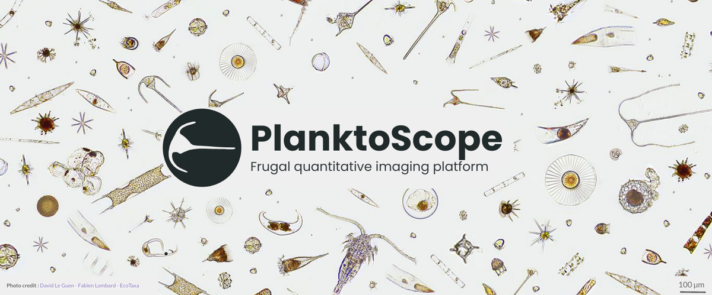

# PlanktoScope Documentation

Welcome to the documentation for the PlanktoScope project! Here are some quick links to help you navigate the documentation depending on what you what you want to do:

1. ["I want to get a PlanktoScope!"](setup/index.md)
2. ["I want to learn how to operate a PlanktoScope!"](operation/index.md)
3. ["I want to fix something which isn't working on my PlanktoScope!"](troubleshooting/index.md)
4. ["I want to get involved in the PlanktoScope community!"](community/index.md)
5. ["I want to study the design of the PlanktoScope!"](reference/index.md)

## What is PlanktoScope?

*Plankton* are living things which drift with the water currents in our world's oceans, rivers, and lakes. Lots of plankton are very small - so small that we need tools called *microscopes* in order for us to see them. One type of plankton is *phytoplankton*, which are plant-like plankton which take a huge amount of carbon dioxide from the air and become the food for all other life in the water - like the grasses of the sea. Because of this, plankton are very important to the health of our planet.

But there’s still a lot we don’t know about what’s happening with groups of plankton and how they’re changing: most tools would be too hard and expensive for us to use to get much detail about how every group of plankton is changing across an entire ocean. If we can make tools which give detailed information and which everyone can use - everywhere, all the time - then we can learn more about how the oceans will change because of things people and companies are doing.

The PlanktoScope is a low-cost microscope which can detailed photos of tiny plankton from lots of water, so that we can count the different kinds of plankton in the water.

## What is the PlanktoScope project?

The PlanktoScope project is a [community](community/index.md) project to develop the PlanktoScope as a tool and to help people use it for a variety of purposes around the world.

## Who are PlanktoScopes for?

We want the PlanktoScope to be a tool which is easy to use for anyone who's interested in the tiny things which live in our oceans, and for anyone who cares about the health of our oceans - not just scientists, but also sailors, marine farmers, makers, fishing communities, and students. However, we still need to make many improvements to the PlanktoScope in order to reach this goal. Most of the people who currently enjoy using PlanktoScopes have some experience with using microscopes, a tolerance for handling software problems, and a sense of adventure for trying out new technologies which are still in development.

We also want PlanktoScopes to be easy to use for people around the world. Currently, the PlanktoScope software's user interface and documentation are all in English; we will need software and translation help to support other languages. The PlanktoScope community mainly works in English, though we also have active community members whose primary languages are French and Japanese.

We are excited about the possibility of using PlanktoScopes for measuring things besides plankton - for example, counting and identifying microplastics, or monitoring suspended cell cultures, or even detecting parasites in certain diseases. However, we have not yet developed or assessed the PlanktoScope as a tool which people could use for these other purposes.

If you want to help to improve the PlanktoScope, to build a PlanktoScope community in a non-English language, or to explore new uses for PlanktoScopes, please [get involved](community/index.md) in our global community!
