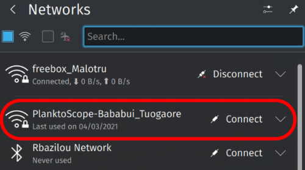

# Operation

Congratulations! You have a PlanktoScope, now is the time to test it and learn how to use it!

## How to connect to and control the machine

On powering up, your PlanktoScope will create its own isolated WiFi network. It should appear on the list of available wifi networks about two minutes after the first startup.

As you can see, its name will be similar to `PlanktoScope-Baba*****_*****`. This name is unique to your machine and is linked to the serial number of the Raspberry CPU. You can connect to this network now.

Once connected, you will not have acces to the Internet, only to the PlanktoScope interface. You can access the page at [http://planktoscope.local:1880/ui](http://planktoscope.local:1880/ui) from your favorite web browser.

!!! tip
You are able to configure your machine to connect to another network if you want in the [Wifi settings page](user-interface.md#wifi). If you do this, your machine will be accessible to anybody connected to this network. Please keep in mind your organisation security policies before doing this.

From there, you can have a look at the [UI guide](user-interface.md) to get a handle on how it works.

## How to image plankton

Before doing an acquisition, you will need to collect targets. There are several ways to do this, and you probably already have a source nearby (in a culture if you are working in a lab).

However, if you have access to a body of water (even a tiny lake or river is enough), you can build yourself a plankton net to collect a sample. Once the sample is collected, either pump it with a syringe that you connect to the machine, or dip one of the silicone tube inside the sample tube you have.

You can then do an acquisition run. **This is the best way to learn about the machine and this process!**

!!! warning
After doing an acquisition, the machine should be cleaned, especially in the fluidic part. One good way to do this is to first flush the machine with clear water (distilled if possible). You can then push through a 5-10% bleach solution, or some alcohol.

If needed you can also clean the outside of the objective lens with a soft cloth. You can do the same on the flow cell if there are traces of finger on it too.

For quantitative imaging of water samples, refer to the following protocols published by members of the PlanktoScope community:

- "[Planktoscope protocol for plankton imaging V.2](https://www.protocols.io/view/planktoscope-protocol-for-plankton-imaging-bp2l6bq3zgqe/v2)" for software v2.3+ and hardware v2.5. A [PDF copy](protocol-v2.pdf) of this protocol is also available for offline use.
- "[Planktoscope protocol for plankton imaging V.1](https://www.protocols.io/view/planktoscope-protocol-for-plankton-imaging-bp2l6bq3zgqe/v2https://www.protocols.io/view/planktoscope-protocol-for-plankton-imaging-bp2l6bq3zgqe/v1?version_warning=no)" for software v2.3 and hardware v2.1-2.3. A [PDF copy](protocol-v1.pdf) of this protocol is also available for offline use.
