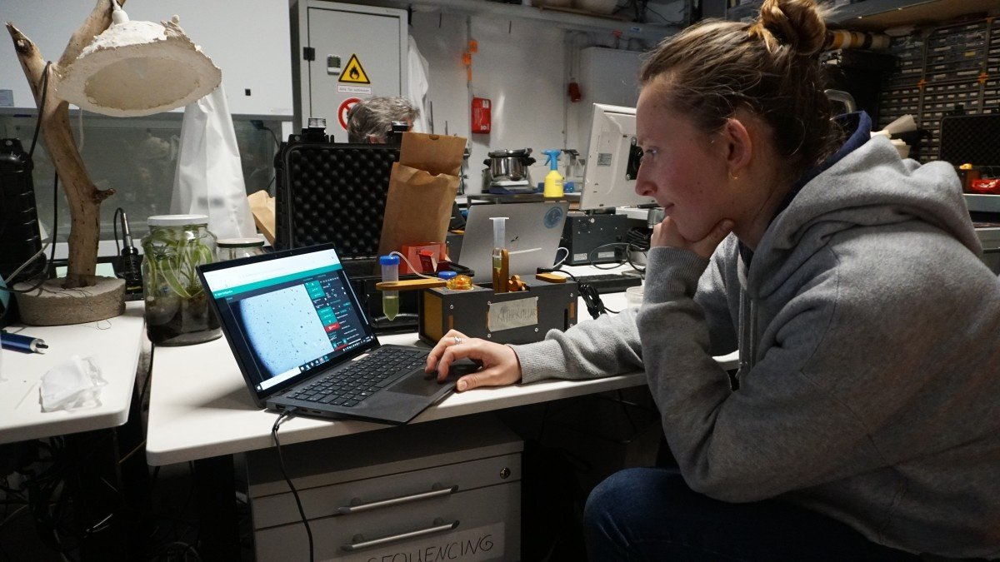
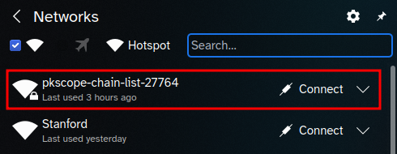
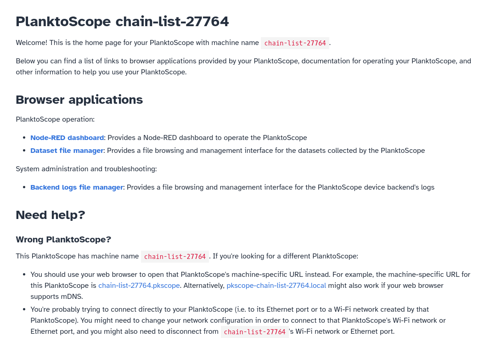

# Operation

This page provides basic instructions for operating your PlanktoScope.

## Connect directly to your PlanktoScope

In order to operate your PlanktoScope, you will need to connect to your PlanktoScope from a separate device (a computer, tablet, or phone) with a web browser. If this is your first time setting up or connecting to your PlanktoScope, you will need to set up a direct network connection between your computer and your PlanktoScope.

### Connect with an Ethernet cable

You can connect your PlanktoScope to a router with an Ethernet cable. It will be accessible via its network ip address or `http://pkscope-{machine-name}`.

### Connect with the PlanktoScope's Wi-Fi hotspot

Your PlanktoScope will create its own isolated Wi-Fi network (like a Wi-Fi hotspot, but without internet access). The Wi-Fi hotspot created by your PlanktoScope should appear on your computer's list of available Wi-Fi networks a few minutes after you turn on power to your PlanktoScope.

As you can see, the name of your PlanktoScope's Wi-Fi hotspot will be of the format `pkscope-{machine-name}`; `{machine-name}` has the format `{random word}-{random word}-{random number}`; in the above screenshot, the highlighted Wi-Fi hotspot is from a PlanktoScope with machine name `chain-list-27764`. Your PlanktoScope's machine name corresponds exactly to the serial number of the Raspberry Pi computer in your PlanktoScope. You should connect your computer to the Wi-Fi hotspot specific to your PlanktoScope.

!!! tip

    You may want to write down the PlanktoScope's machine name in a note (or on your PlanktoScope) for future reference; this will be especially important if you might have multiple PlanktoScopes in the future.

The password is `copepode`.

### Access your PlanktoScope's software

Once you connect your computer (or phone/tablet/etc.) to your PlanktoScope, you will need to access your PlanktoScope's software from a web browser on your computer.

If you know the machine name of your PlanktoScope (which you can determine from the name of your PlanktoScope's Wi-Fi hotspot, as described above), you can try using your web browser to open a URL of format `http://pkscope-{machine-name}.local`, where `{machine-name}` should be substituted with your PlanktoScope's machine name. If you don't know your PlanktoScope's machine name, you can try using your web browser to open <http://planktoscope.local> or <http://pkscope.local>. All three of these URLs should work unless you're on a computer or web browser without mDNS support; notably, older versions of Android did not support mDNS, and web browsers installed on Linux computers via Flatpak [do not yet support mDNS](https://github.com/flatpak/xdg-desktop-portal/discussions/1365).
!!! warning

    <http://planktoscope.local> and <http://pkscope.local> may behave in weird ways if your computer is directly connected to multiple PlanktoScopes or if it's connected to a Wi-Fi router or Ethernet router (or to a VPN or other LAN) which has multiple PlanktoScopes connected to it. In such a situation, those URLs may cause you to access the software for a different PlanktoScope connected to your computer than the one you had intended to access. You should instead use the machine-specific URL of format `http://pkscope-{machine-name}.local`.

If those URLs don't work for you and you're connecting your computer directly to your PlanktoScope (i.e. via your PlanktoScope's Wi-Fi hotspot, or via an Ethernet cable from your computer to your PlanktoScope's Ethernet port), then you can try opening the following URLs in your web browser instead (try opening them in the following order, and just use the first one which works):

- a URL of format `http://{machine-name}.pkscope`, where `{machine-name}` should be substituted with your PlanktoScope's machine name (this should work unless your web browser is configured to use a Private DNS provider)
- <http://home.pkscope> (this should work unless your web browser is configured to use a Private DNS provider)
- <http://192.168.4.1> (this should always work on computers connected to the PlanktoScope's Wi-Fi hotspot, unless your computer is also connected to some other device meant to be accessed with that URL)

One of the above URLs should work, and your web browser should show a landing page with a list of links, as well as its machine-specific URL with format `http://pkscope-{machine-name}.local`; in this screenshot of the landing page accessed via the URL <http://home.pkscope>, the PlanktoScope's machine name is `clear-request-6329`:

!!! tip

    If you access the landing page using any URL not of the format `http://pkscope-{machine-name}.local`, then the landing page will suggest its own machine-specific URL for you to try opening; you can see that in the above screenshot, which shows a yellow information box with the URL for the PlanktoScope used to make that screenshot. You should try opening the corresponding URL on the landing page for your PlanktoScope to see if it works in your web browser.

Next, you should click on the "Node-RED dashboard" link; this will open a new tab with the primary interface for operating your PlanktoScope. Once you have opened the Node-RED dashboard, you should proceed to our [User interface guide](user-interface.md) to understand how to use it.

## Acquire data on plankton samples

Before doing an acquisition, you will need to collect targets. There are several ways to do this, and you probably already have a source nearby (in a culture if you are working in a lab).

However, if you have access to a body of water (even a tiny lake or river is enough), you can build yourself a plankton net to collect a sample. Once the sample is collected, either pump it with a syringe that you connect to the machine, or dip one of the silicone tube inside the sample tube you have.

You can then do an acquisition run. **This is the best way to learn about the machine and this process!**

!!! warning

    After doing an acquisition, the machine should be cleaned, especially in the fluidic part. One good way to do this is to first flush the machine with clear water (distilled if possible). You can then push through a 5-10% bleach solution, or some alcohol.

If needed you can also clean the outside of the objective lens with a soft cloth. You can do the same on the flow cell if there are traces of finger on it too.

For quantitative imaging of water samples, refer to the following protocols published by members of the PlanktoScope community:

- "[Planktoscope protocol for plankton imaging](https://www.protocols.io/view/planktoscope-protocol-for-plankton-imaging-bp2l6bq3zgqe)". A [PDF copy](protocol-v4.pdf) of version 4 of this protocol is also available for offline use.

## Manage your PlanktoScope's embedded computer

Your PlanktoScope has a Raspberry Pi computer embedded inside it which runs the PlanktoScope's software. You may need to perform various system administration/operations tasks on it, such as:

- [Resetting or upgrading/downgrading the software on it](./software-upgrades.md), such as for resetting your PlanktoScope's settings back to its factory defaults, testing out new software updates, or switching back to an older software version after testing out a newer version.
- [Cloning its SD card](./clone-sd.md) to back up its settings and data, or to replicate its exact settings and data across multiple PlanktoScopes
