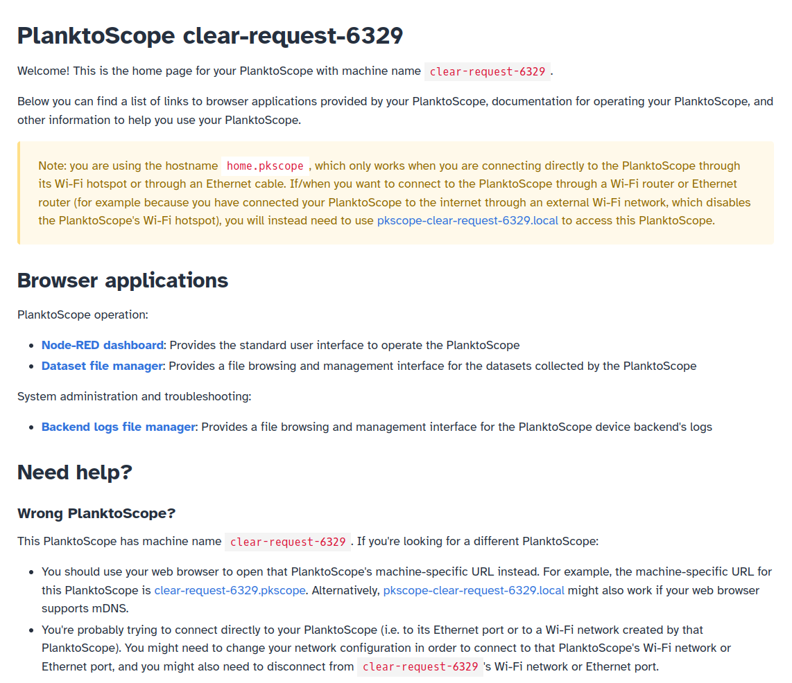

# Operation

This page provides basic instructions for operating your PlanktoScope.

## Connect directly to your PlanktoScope

In order to operate your PlanktoScope, you will need to connect to your PlanktoScope from a separate device (a computer, tablet, or phone) with a web browser. If this is your first time setting up or connecting to your PlanktoScope, you will need to set up a direct network connection between your computer and your PlanktoScope.

### Connect with an Ethernet cable

You can connect your computer to the PlanktoScope by plugging an Ethernet cable between your computer and your PlanktoScope's Raspberry Pi.

### Connect with the PlanktoScope's Wi-Fi hotspot

Unless you have already [configured your PlanktoScope to connect to an existing Wi-Fi network](./networking.md#connect-your-planktoscope-to-an-existing-wi-fi-network) or [disabled your PlanktoScope's Wi-Fi hotspot functionality](./networking.md#disable-the-wi-fi-hotspot), your PlanktoScope will create its own isolated Wi-Fi network (like a Wi-Fi hotspot, but without internet access). The Wi-Fi hotspot created by your PlanktoScope should appear on your computer's list of available Wi-Fi networks a few minutes after you turn on power to your PlanktoScope.

As you can see, the name of your PlanktoScope's Wi-Fi hotspot will be of the format `pkscope-{machine-name}`, where (unless you have [customized your PlanktoScope's naming system](./networking.md#change-your-planktoscopes-name)) `{machine-name}` has the format `{random word}-{random word}-{random number}`; in the above screenshot, the highlighted Wi-Fi hotspot is from a PlanktoScope with machine name `chain-list-27764`. By default, your PlanktoScope's machine name corresponds exactly to the serial number of the Raspberry Pi computer in your PlanktoScope. You should connect your computer to the Wi-Fi hotspot specific to your PlanktoScope.

!!! tip

    You should write down the PlanktoScope's machine name in a note (or on your PlanktoScope) for future reference; this will be especially important if you might have multiple PlanktoScopes in the future or if you might need to access the PlanktoScope via an indirect connection (e.g. from a device connected to the same network router as the PlanktoScope).

Unless you have [changed the password](./networking.md#change-the-wi-fi-hotspots-password) of your PlanktoScope's Wi-Fi hotspot, the password should be `copepode`.

### Access your PlanktoScope's software

Once you connect your computer (or phone/tablet/etc.) to your PlanktoScope, you will need to access your PlanktoScope's software from a web browser on your computer.

If you know the machine name of your PlanktoScope (which you can determine from the name of your PlanktoScope's Wi-Fi hotspot, as described above), you can try using your web browser to open a URL of format `http://pkscope-{machine-name}.local`, where `{machine-name}` should be substituted with your PlanktoScope's machine name. This URL should work unless you're on a device or web browser without mDNS support; notably, older versions of Android did not support mDNS, and web browsers installed on Linux computers via Flatpak [do not yet support mDNS](https://github.com/flatpak/xdg-desktop-portal/discussions/1365).

If you are connecting your computer directly to your PlanktoScope (i.e. via your PlanktoScope's Wi-Fi hotspot, or via an Ethernet cable from your computer to your PlanktoScope's Ethernet port) but you don't know (or you don't want to type out) your PlanktoScope's machine name, then you can try opening the following URLs in your web browser instead (try opening them in the following order, and just use the first one which works):

- [http://planktoscope.local](http://planktoscope.local) (this should work unless you're on a device or web browser without mDNS support)
- [http://pkscope.local](http://pkscope.local) (this should work unless you're on a device or web browser without mDNS support)
- [http://home.pkscope](http://home.pkscope) (this should work unless your web browser is configured to use a Private DNS provider)
- [http://192.168.4.1](http://192.168.4.1) (this should always work on devices connected directly to the PlanktoScope, especially for devices connected directly to the PlanktoScope's Wi-Fi hotspot)
- [http://192.168.5.1](http://192.168.5.1) (this should always work on devices connected directly to the PlanktoScope, especially for devices connected directly to the PlanktoScope's Ethernet port)

!!! warning
    
    The five URLs listed directly above **will not work** if you're trying to connect to your PlanktoScope indirectly, e.g. via a [Wi-Fi router providing internet access to the PlanktoScope](./networking.md#connect-your-planktoscope-to-an-existing-wi-fi-network). In that case, you will instead need to use a URL with your PlanktoScope's machine name which has format `http://pkscope-{machine-name}.local`. If you might want to do that in the future, then you should write down the machine name of your PlanktoScope as declared on your PlanktoScope's landing page!

!!! warning

    The five URLs listed directly above may behave in weird ways if your computer is directly connected to multiple PlanktoScopes. In such a situation, those URLs may cause you to access the software for a different PlanktoScope connected to your computer than the one you had intended to access. You should instead use a machine-specific URL, either of format `http://pkscope-{machine-name}.local` (which will only work if your device and web browser support mDNS), or otherwise of format `http://{machine-name}.pkscope` (which will only work if your computer is connected directly to the PlanktoScope).

!!! warning

    You may encounter older documents which ask you to connect to <http://planktoscope.local:1880/ui>, which is the URL to use for software version 2.3 and older versions. That link does not work on software versions newer than v2.3; instead, you should use the links listed above.

One of the above URLs should work, and your web browser should show a landing page with a list of links, as well as its machine-specific URL with format `http://pkscope-{machine-name}.local`; in this screenshot of the landing page accessed via the URL <http://home.pkscope>, the PlanktoScope's machine name is `clear-request-6329`:

!!! tip

    If you access the landing page using any URL not of the format `http://pkscope-{machine-name}.local`, then the landing page will suggest its own machine-specific URL for you to try opening; you can see that in the above screenshot, which shows a yellow information box with the URL for the PlanktoScope used to make that screenshot. You should try opening your PlanktoScope's machine-specific URL to see if it works in your web browser, and you may want to bookmark it for future reference for the reasons discussed in the warnings listed earlier in this section of the documentation.

You should click on the "Node-RED dashboard" link; this will open a new tab with the primary interface for operating your PlanktoScope. Once you have opened the Node-RED dashboard, you should proceed to our [User interface guide](user-interface.md) to understand how to use it.

## Acquire data on plankton samples

Before doing an acquisition, you will need to collect targets. There are several ways to do this, and you probably already have a source nearby (in a culture if you are working in a lab).

However, if you have access to a body of water (even a tiny lake or river is enough), you can build yourself a plankton net to collect a sample. Once the sample is collected, either pump it with a syringe that you connect to the machine, or dip one of the silicone tube inside the sample tube you have.

You can then do an acquisition run. **This is the best way to learn about the machine and this process!**

!!! warning

    After doing an acquisition, the machine should be cleaned, especially in the fluidic part. One good way to do this is to first flush the machine with clear water (distilled if possible). You can then push through a 5-10% bleach solution, or some alcohol.

If needed you can also clean the outside of the objective lens with a soft cloth. You can do the same on the flow cell if there are traces of finger on it too.

For quantitative imaging of water samples, refer to the following protocols published by members of the PlanktoScope community:

- "[Planktoscope protocol for plankton imaging](https://www.protocols.io/view/planktoscope-protocol-for-plankton-imaging-bp2l6bq3zgqe)". A [PDF copy](protocol-v4.pdf) of a draft of version 4 of this protocol is also available for offline use.

## Manage your PlanktoScope's embedded computer

Your PlanktoScope has a Raspberry Pi computer embedded inside it which runs the PlanktoScope's software. You may need to perform various system administration/operations tasks on it, such as:

- [Resetting or upgrading/downgrading the software on it](./software-upgrades.md), such as for resetting your PlanktoScope's settings back to its factory defaults, testing out new software updates, or switching back to an older software version after testing out a newer version.
- [Changing its network configuration](./networking.md), such as for connecting your PlanktoScope to the internet, maintaining internet access on a computer connected simultaneously to both your PlanktoScope (e.g. by Ethernet) and an external network (e.g. by Wi-Fi), making your PlanktoScope more secure, or customizing your PlanktoScope's machine name.
- [Cloning its SD card](./clone-sd.md) to back up its settings and data, or to replicate its exact settings and data across multiple PlanktoScopes
