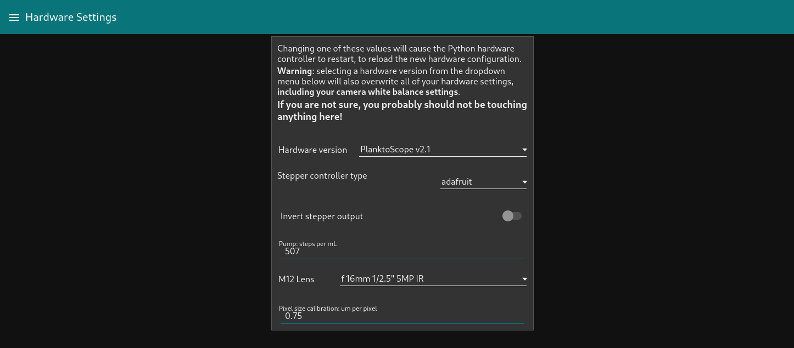

# User interface guide

This guide will help you understand how to use the Node-RED dashboard, which is the primary user interface for operating the PlanktoScope.

## Home

When you open the "Node-RED dashboard link" from the [PlanktoScope's landing page](index.md#access-your-planktoscopes-software), you will reach a page like what is shown in the screenshot above.

From here, you can quickly access any of the available tabs. The buttons are only the most used functionalities of the machine. Three others tabs are accessible only through the hamburger menu on the top left of the screen (the three horizontal lines):

- Wifi
- Administration
- Hardware Config

!!! tip
    This list is also available from any other tab and allows you to quickly navigate between tabs.

## Machine shutdown

From this page, you can also shutdown the machine when you are done.

!!! warning
    It's **very very very important** to **always** shutdown the machine and wait a minute for it to completely shutdown before unplugging the power supply!
    **You risk data corruption if you turn off power without shutting down the machine through the software!**

To shutdown the machine, first unlock the shutdown button by clicking on "Unlock Button".

You can then click on "Shutdown". The machine will ask for a final confirmation and will then shut itself down.

## Sample Tab

In this page, you can enter all the information regarding the current sample you want to image. This includes the project name, the operator, but also the type of collection device you used.

Depending on the device you choose, the page will change to reflect the needed information.

There is a mechanism of validation of the submitted data. Please be careful to use the format given in example for each input field.

The GPS status block will give you the current information on the GPS fix and location, your direction and speed. This can be used to grab the location when in the field.

Once all the fields are completed, you can go to the next tab by clicking the -> arrow. This will make sure all the inserted data is valid.

## Optic Configuration

This page allows you to control the optical setup of the acquisition.

In the Optic Characterization block, you can control to turn the light on or not. You also have to choose the optics in use in the machine.

!!! warning

    Only the "Light" setting in the Optic Characterization panel works; everything else in that panel does not work and instead will be removed in a future version of the PlanktoScope software.

!!! warning
    For now, the characteristics shown here are not true values (except if you use the 25mm/16mm lens couple).

The Camera Settings block allows you to change the shutter speed, the ISO number and the camera white balance settings. You can set it to automatic, but it's better if you control it by hand to make sure the setting doesn't change when the acquisition is started.

The Fluidic Manual Manipulation allows you to control the pump. You can change both the flowrate and the volume pumped. If you click on the rotating arrow, it will start the pump for the given volume at the chosen flowrate.

The Focus Adjustment block allows you to control the focus stage. With the leftmost buttons, you can choose to move the stage quickly by one mm, either up or down. The rightmost buttons move the stage by the specified distance in the slider under.

As with all the tabs, once you are satisfied with your focus and your image settings, you can click on "Continue".

## Fluidic Acquisition

Finally, this is where the magic happens! You will be able to chose the final parameters of your capture.

First of all, change the Fraction Size of your sample. You can then choose a unique ID for your acquisition, the number of pictures you want to take, the pumped volume (in between images), the delay to stabilize the image and the Flowcell thickness. All those settings will influence the Total imaged volume (the total volume captured during the acquisition) and the Total pumped volume.

!!! warning
    Make sure the Total pumped volume is lower than the volume of your sample.

## Gallery

This simple page will allow you to preview and download the captured data.

## System Monitoring

This tab allows you to view more detailed information about your PlanktoScope. The Metrics panel has graphs for monitoring the CPU temperature, memory usage, and SD card usage of your PlanktoScope's embedded Raspberry Pi computer, as well as an expandable (collapsed-by-default) panel with more detailed information about CPU usage, system load, network traffic volumes, and disk read/write volumes.

The Information panel shows your PlanktoScope's machine name, its hardware version, its PlanktoScope's software version, its camera model, the system time on the PlanktoScope, and the system time on the device running your web browser.

Note: if your PlanktoScope's system time is different from your web browser's time by more than 1 minute, the Metrics graphs will be replaced with a prompt for you to change your PlanktoScope's system time to match your web browser's time:

You will need to change the PlanktoScope's system time (for example by pressing the button displayed in the prompt) in order for the Metrics panel to work, and in order for your PlanktoScope to record accurate timestamps with its image acquisition datasets. The system time will be accurate until your PlanktoScope shuts down; the next time you turn on your PlanktoScope, you will need to change the PlanktoScope's system time again. This is a known problem, and we will improve the usability of this situation in future versions of the PlanktoScope software.

!!! warning

    The USB Backup panel doesn't always work; it will be removed in a future version of the PlanktoScope software; you should instead download files using the [Gallery tab](#gallery).

!!! warning

    The GPS Status panel will be removed in a future version of the PlanktoScope software.

!!! warning

    The Navigation panel, including its fan toggle (which doesn't work correctly) will be removed in a future version of the PlanktoScope software.

## Wifi

!!! warning

    This page will be removed in a future version of the PlanktoScope software, because it doesn't always work. You should instead refer to the network operations guide's section for [connecting your PlanktoScope to the Internet](./networking.md#connect-your-planktoscope-to-the-internet).

This page will give you information about the network the PlanktoScope is connected to. It will also allows you to connect your machine to a new WiFi network.

Start by doing a network scan by clicking on the `Scan` button. The list will be populated with detected networks after a few seconds. You can then choose one of them, enter its password and click on `Add the network` to connect to it. The wifi network of the PlanktoScope will disappear after a few seconds, so **you will need to connect back to the same network you just put the machine on**.

Finally, if you are not located in the US, please update the Country code in the field below. This will ensure the PlanktoScope complies with local Wifi regulations (such as maximum emitted power, duty cycle and such).

Clicking on the button `Reset wifi networks` will erase ALL networks saved previously by the machine. If you do this, it will disconnect immediately from any network it's connected to, and will put up its own network.

!!! info
    For now, only WPA/WPA2 Personal security is supported; Wi-Fi networks without passwords are not supported.

!!! warning
    Please be mindful about the security policies of your organisation before connecting your device to a network (either through Wifi or with an Ethernet cable). A lot of research institutions don't allow devices not controlled by them to be connected to their network without first going on an approved list with a least a basic security checkup.

## Administration

On this page you can find links to view the logs generated by the Python backend, and buttons to restart the Python backend's hardware controller or segmenter, as well as buttons to restart or shut down your PlanktoScope's Raspberry Pi computer.

## Hardware Settings

You should not touch anything here unless you have received specific instructions to do so, e.g. as part of our [post-installation configuration guide](../setup/software/config.md), or as part of a guide for calibrating your PlanktoScope.
