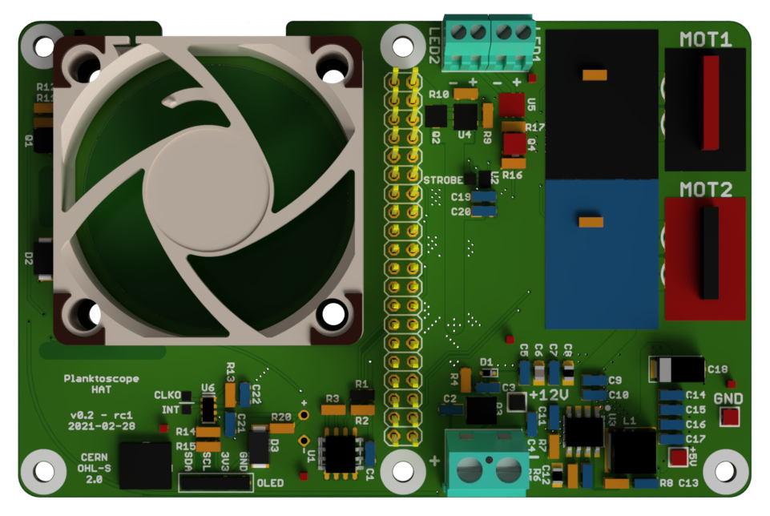

# PlanktoScope Hat Hardware

## Buses and GPIO pinout

### I2C1 Bus

#### RTC RV-3028-C7

Address 0x52
Configured through a kernel driver.

#### OLED Display

Address 0x3c

#### LED control: LM36011

Address 0x64
Control through specific software, current range from 0 to 376mA in normal mode, up to 1.5A in flash mode.

### SPI0 Bus

#### Motor Controller 0: TMC5160

Chip Enable: SPI0_CE0
Motor Enable: GPIO23

Diagnostic output:
GPIO16 for Error output
GPIO20 for Stall output

#### Motor Controller 1: TMC5160

Chip Enable: SPI0_CE1
Motor Enable: GPIO5

Diagnostic output:
GPIO16 for Error output
GPIO20 for Stall output

### GPIO

#### Fan control

PWM1 control through GPIO13

#### LED Output selection

GPIO18: high for LED1, low for LED2

#### LED Strobe

GPIO22 for pulse

### I2C0 Bus

#### EEPROM M24C32

Address 0x50
For HAT information only.
