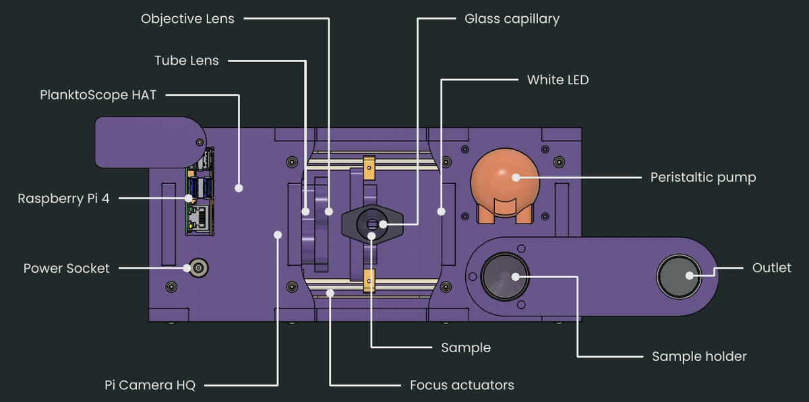

# Product Specifications

Product specifications for the PlanktoScope hardware are listed below for each hardwaare version. For more information on each hardware version, refer to the [hardware changelog](./changelog.md).

## v2.6

Overview:

- Weight: 3.5 kg
- Enclosure:

    - Dimensions: 27.5 cm (length) x 12.5 cm (width) x 10.5 cm (height)
    - Material: bamboo plywood
    - Fabrication process: CNC milling

### Functionalities

- Automated image acquisition, with a motorized pump and an embedded computer
- Precise focus adjustment, with motorized linear actuators
- Continuous mixing of input sample to prevent sedimentation of heavier particles, with a USB-powered bubbler
- On-board image processing, with the embedded computer
- Local Wi-Fi network hotspot for local operation from a connected phone, tablet or laptop, with the embedded computer
- Internet connectivity via Wi-Fi or Ethernet for remote operation, with the embedded computer

### Subsystems

Optics:

- Imaging characteristics:

    - Optical magnification: 1.33
    - Field of view: 3062 µm x 2295 µm
    - Optical pixel size: 0.75 µm
    - Depth of field: 95 µm

- Internal camera: [Raspberry Pi High Quality Camera](https://www.raspberrypi.com/products/raspberry-pi-high-quality-camera/)

    - Sensor: Sony IMX477R
    - Resolution: 12.3 Megapixels (4056 x 3040 pixels)

- Lenses:

    - Objective lens: 12 mm focal length, M12
    - Tube lens: 25 mm focal length, M12
    - Lens mount: M12x0.5

- Illumination: [white LED](https://www.adafruit.com/product/754)

Fluidics:

- Flow cell: capillary with rectangular cross-section

    - Thickness: 300 µm
    - Material: glass

- Internal tubing:

    - Material: Tygon S3 (contains no BPA or phthalates)
    - Dimensions: 1.6 mm (1/16") inner diameter, 3.2 mm (1/8") outer diameter
    - Connectors: Luer lock

- Peristaltic pump
- Sample intake capacity: 20 mL

Other internal electronics:

- Embedded computer: [Raspberry Pi 4 Model B](https://www.raspberrypi.com/products/raspberry-pi-4-model-b/specifications/)

    - Processor: Broadcom BCM2711, Quad core Cortex-A72 (ARM v8) 64-bit SoC @ 1.8 GHz
    - Memory: 4 GB RAM
    - Storage: 128 GB capacity (micro-SD card, UHS speed class 3)

- Control board: [PlanktoScope HAT](./hat.md) v1.2

External interfaces & connectivity:

- Expansion: 2 USB 3.0 ports, 2 USB 2.0 ports
- Wired networking: Gigabit Ethernet
- Wireless networking: 2.4 GHz and 5.0 GHz 802.11ac Wi-Fi
- Power input: 12 V DC, up to 4 A of current draw (5.1 x 2.2 mm DC barrel jack, center positive)
- Latching push-button switch to toggle power

External AC-to-DC power adapter:

- Input: 100-240 V AC, 50-60 Hz (IEC 60320 C8 socket)
- Output: 12 V DC, up to 4 A of current output (5.1 x 2.2 mm DC barrel jack, center positive)
- Dimensions: 126 mm (length) x 52 mm (width) x 35.5 mm (height)
- Weight: 0.25 kg

### System performance

Image acquisition throughput:

- Volume of sample measured: 2.1 µL per acquired image
- Volume of sample pumped: ~15 µL per acquired image
- Maximum image acquisition rate: ~60 images/min

Samples:

- Object size range:

    - Minimum for taxonomy: ~20 µm diameter for round objects
    - Maximum: ~200 µm diameter for round objects (larger objects will clog the flow cell)

## v2.5

Overview:

- Enclosure:

    - Dimensions: 27.5 cm (length) x 12.5 cm (width) x 10.5 cm (height)
    - Material: bamboo plywood
    - Fabrication process: CNC milling

### Functionalities

- Automated image acquisition, with a motorized pump and an embedded computer
- Precise focus adjustment, with motorized linear actuators
- Continuous mixing of input sample to prevent sedimentation of heavier particles, with a USB-powered bubbler
- On-board image processing, with the embedded computer
- Local Wi-Fi network hotspot for local operation from a connected phone, tablet or laptop, with the embedded computer
- Internet connectivity via Wi-Fi or Ethernet for remote operation, with the embedded computer

### Subsystems

Optics:

- Imaging characteristics:

    - Field of view: 3670 µm x 2675 µm
    - Optical pixel size: 0.88 µm

- Internal camera: [Raspberry Pi High Quality Camera](https://www.raspberrypi.com/products/raspberry-pi-high-quality-camera/)

    - Sensor: Sony IMX477R
    - Resolution: 12.3 Megapixels (4056 x 3040 pixels)

- Lenses:

    - Objective lens: 16 mm focal length, M12
    - Tube lens: 25 mm focal length, M12
    - Lens mount: M12x0.5

- Illumination: [white LED](https://www.adafruit.com/product/754)

Fluidics:

- Flow cell: capillary with rectangular cross-section

    - Thickness: 300 µm
    - Material: glass

- Internal tubing:

    - Material: Tygon S3 (contains no BPA or phthalates)
    - Dimensions: 1.6 mm (1/16") inner diameter, 3.2 mm (1/8") outer diameter
    - Connectors: Luer lock

- Peristaltic pump
- Sample intake capacity: 20 mL

Other internal electronics:

- Embedded computer: [Raspberry Pi 4 Model B](https://www.raspberrypi.com/products/raspberry-pi-4-model-b/specifications/)

    - Processor: Broadcom BCM2711, Quad core Cortex-A72 (ARM v8) 64-bit SoC @ 1.8 GHz
    - Memory: 4 GB RAM
    - Storage: 128 GB capacity (micro-SD card, UHS speed class 3)

- Control board: [PlanktoScope HAT](./hat.md) v1.2

External interfaces & connectivity:

- Expansion: 2 USB 3.0 ports, 2 USB 2.0 ports
- Wired networking: Gigabit Ethernet
- Wireless networking: 2.4 GHz and 5.0 GHz 802.11ac Wi-Fi
- Power input: 12 V DC, up to 4 A of current draw (5.1 x 2.2 mm DC barrel jack, center positive)
- Latching push-button switch to toggle power

External AC-to-DC power adapter:

- Input: 100-240 V AC, 50-60 Hz (IEC 60320 C8 socket)
- Output: 12 V DC, up to 4 A of current output (5.1 x 2.2 mm DC barrel jack, center positive)
- Dimensions: 126 mm (length) x 52 mm (width) x 35.5 mm (height)
- Weight: 0.25 kg

### System performance

Image acquisition throughput:

- Volume of sample pumped: ~15 µL per acquired image
- Maximum image acquisition rate: ~60 images/min

Samples:

- Object size range:

    - Maximum: ~200 µm diameter for round objects (larger objects will clog the flow cell)

## v2.1

Overview:

- Enclosure:

    - Dimensions: ~32 cm (length) x ~5.5 cm (width) x ~15 cm (height)
    - Material: acrylic, plywood, or fiberboard
    - Fabrication process: laser cutting

### Functionalities

- Automated image acquisition, with a motorized pump and an embedded computer
- Precise focus adjustment, with motorized linear actuators
- On-board image processing, with the embedded computer
- Local Wi-Fi network hotspot for local operation from a connected phone, tablet or laptop, with the embedded computer
- Internet connectivity via Wi-Fi or Ethernet for remote operation, with the embedded computer

### Subsystems

Optics:

- Imaging characteristics:

    - Field of view: 2300 µm x 1730 µm
    - Optical pixel size: 0.75 µm

- Internal camera: [Raspberry Pi Camera Module 2](https://www.raspberrypi.com/products/camera-module-v2/)

    - Sensor: Sony IMX219
    - Resolution: 8 Megapixels (3280 x 2464 pixels)

- Lenses:

    - Objective lens: 12 mm focal length, M12
    - Tube lens: 25 mm focal length, M12
    - Lens mount: M12x0.5

- Illumination: [white LED](https://www.adafruit.com/product/754)

Fluidics:

- Flow cell: [ibidi µ-Slide I Luer channel slide](https://ibidi.com/channel-slides/50-141--slide-i-luer.html)

    - Thickness: 200 µm, 400 µm, 600 µm, or 800 µm
    - Material: Plastic (no surface modification)

- Internal tubing:

    - Material: Tygon S3 (contains no BPA or phthalates)
    - Dimensions: 1.6 mm (1/16") inner diameter, 3.2 mm (1/8") outer diameter
    - Connectors: Luer lock

- Peristaltic pump
- Sample intake capacity: 20 mL

Other internal electronics:

- Embedded computer: [Raspberry Pi 4 Model B](https://www.raspberrypi.com/products/raspberry-pi-4-model-b/specifications/)

    - Processor: Broadcom BCM2711, Quad core Cortex-A72 (ARM v8) 64-bit SoC @ 1.8 GHz
    - Memory: 4 GB RAM

- Control boards:

    - [Adafruit Stepper Motor HAT](https://www.adafruit.com/product/2348)

        - Input voltage: 5 - 12 V DC
        - Output voltage: 4.5 - 13.5 V DC
        - Output current: up to 1.2 A continuous, 3 A peak

    - [Adafruit Ultimate GPS HAT](https://www.adafruit.com/product/2324)

External interfaces & connectivity:

- Expansion: 2 USB 3.0 ports, 2 USB 2.0 ports, 2 micro-HDMI ports
- Wired networking: Gigabit Ethernet
- Wireless networking: 2.4 GHz and 5.0 GHz 802.11ac Wi-Fi
- Power input for embedded computer: 5 V DC, up to 3 A of current draw (USB-C)
- Power input for motors: 5 - 12 V DC, depending on pump motor (5.1 x 2.2 mm DC barrel jack, center positive)
