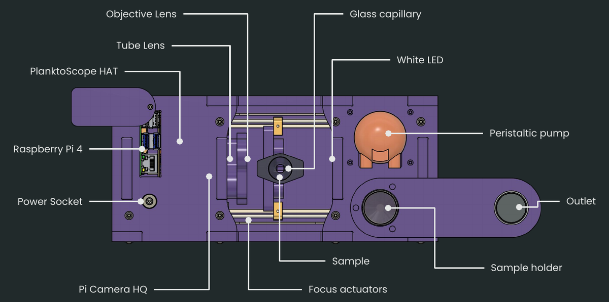

# Technical Reference

The PlanktoScope is a modular, open-source platform for high-throughput quantitative imaging of plankton samples. Its small size, ease of use, and low cost make it suitable for a variety of applications, including the monitoring of laboratory cultures or natural micro-plankton communities. It can be controlled from any WiFi-enabled device and can be easily reconfigured to meet the changing needs of the user.

## Key Features

Here are some key features of the PlanktoScope:

1. **Low cost**: The PlanktoScope is designed to be affordable, with parts costing under $1000.
2. **Modular**: The PlanktoScope is modular, meaning it can be easily reconfigured to meet the changing needs of users.
3. **Open-source**: The PlanktoScope is based on open-source hardware and software, making it accessible to a wide community of engineers, researchers, and citizens.
4. **Versatility**: The PlanktoScope is versatile, and can be used to study a variety of plankton types, including laboratory cultures and natural micro-plankton communities.
5. **High-throughput**: The PlanktoScope is capable of high-throughput quantitative imaging, allowing users to analyze large numbers of samples quickly and efficiently.
6. **WiFi-enabled**: The PlanktoScope can be controlled from any WiFi-enabled device, making it easy to use and deploy in a variety of settings.
7. **Portable**: The PlanktoScope is small and portable, making it easy to transport and use in the field.
8. **Ease of use**: The PlanktoScope is designed to be easy to use, with instructions for assembly and use available on the PlanktoScope website.

## Device specification

### Size

- height: 105 mm
- wide: 275 mm
- depth: 125 mm

### Hardware

- [4 Core ARM-Cortex-A72 Processor](https://www.raspberrypi.com/products/raspberry-pi-4-model-b/) with 1,50 GHz
- 4 GB Arbeitsspeicher (depending on the purchased version)
- 64 GB Flash memory (depending on the purchased version)
- [Sony IMX477R](https://www.raspberrypi.com/products/raspberry-pi-high-quality-camera/) Image sensor with 12.3MP
- M12 mount optics with 16 and 25 mm lenses
- Automatic focus via linear guide
- automatic sampling via peristaltic pump
- the case is made of wood fiberboard

### Software

- [Debian](https://www.raspberrypi.com/software/operating-systems/) based Embedded Linux operating
- [Node-Red](https://nodered.org/) based user interface
- [Python](https://www.python.org/) Image processing service and cloud connection

### Characteristic

- Focus stage control
- Pump control
- Automatic image capture
- Automatic segmentation, optimization and object detection
- 4,200 images, 41,000 objects, ~ 1 minute
- Control via smartphone or tablet

## Areas of Application

- Plankton analysis of small animals and algae living in water
- Mobile use via external power supply

## System Requirements

- a Web-Browser to control the device (like a Notebook, Smartphone or Tablet)
