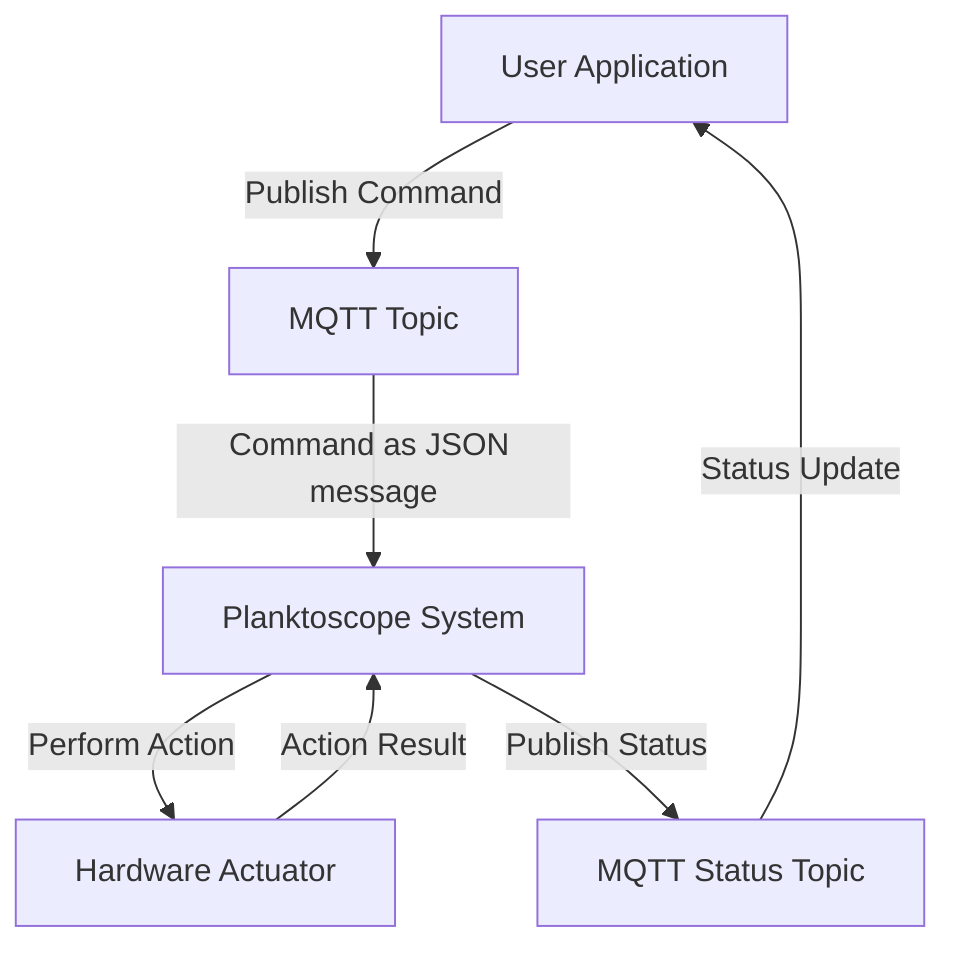

# MQTT API

Welcome to the MQTT API documentation for Planktoscope. This guide is designed to help you understand the messaging protocol for controlling the Planktoscope device and handling various functionalities effectively.

## MQTT architecture communication


### Explanation
- **User Application**: Initiates the interaction by publishing a command to a specific MQTT topic.
- **MQTT Topic**: Receives the command which is structured as a JSON message. This is the main communication channel where commands are sent.
- **Planktoscope System**: Interprets the JSON command and converts it into an action that will be performed by the hardware (like moving a pump or adjusting focus).
- **Hardware Actuator**: The component that actually performs the physical action as commanded by the system.
- **MQTT Status Topic**: After the action is executed, the system publishes the result or status update to a separate MQTT topic dedicated to status updates.
- **User or Client Application**: Receives the status update from the status topic, completing the feedback loop.


## MQTT Topics Overview

In Planktoscope, MQTT topics are categorized to control and monitor different components of the system:

- **Actuator Topics**: Manage movements of mechanical parts (pump, focus and light). Receive only.
- **Imager Topics**: Control imaging operations related to the camera.
- **Segmenter Topics**: Handle image segmentation processes.
- **Status Topics**: Provide updates on the status of various components and mqtt commands. Publish only.


## Topic details

In this section, we explore the different use cases associated with each MQTT topic. You'll find a detailed description of how JSON messages are filled in by the user and published by the MQTT server. This includes the specific scenarios in which data is sent or received, providing an in-depth understanding of the interactions between system components and the timing of communications.

### `Actuator Topics`
Control and manage actuator components such as pumps and focus mechanisms.
#### `actuator/pump`
- **Function**: Controls the pump to move fluid within the device.
- **JSON message to move the pump**:

```json
{
  "action": "move",
  "direction": "FORWARD",
  "volume": 10,
  "flowrate": 1
}
```
This messages make the pump move 10mL forward at 1mL/min.

- **JSON message to stop the pump**:

```json
{
  "action": "stop"
}
```
- **Authorized values for pump json messages**:

| Champ      | Type   | Accepted Values                                     |
|------------|--------|-----------------------------------------------------|
| `action`   | string | "move", "stop"                                      |
| `direction`| string | "FORWARD", "BACKWARD"                               |
| `volume`   | int    |  1 to 25 ml                                         |
| `flowrate` | int    |  1 to 50 ml/min                                     |


#### `actuator/focus`

- **Function**: Control of the focus stage.
- **JSON message to move the focus**:

```json
{
  "action": "move",
  "direction": "UP",
  "distance": 0.26,
  "speed": 1
}
```
Speed is optional.
This message makes the stage move up by 10mm.

- **JSON message to stop the focus**:

```json
{
  "action": "stop"
}
```
- **Authorized values for pump json messages**:

| Champ      | Type   | Accepted Values                                     |
|------------|--------|-----------------------------------------------------|
| `action`   | string | "move", "stop"                                      |
| `direction`| string | "UP", "DOWN"                                        |
| `volume`   | int    |  1 to 80000 μm                                      |
| `flowrate` | int    |  1 to 5000 μm/s                                     |


#### `actuator/light`

- **Function**: Control the intensity and state of the LED lighting system through the `i2c_led` and `pwm_led` controllers.

- **JSON message to set the light**:

```json
{
  "action": "set",
  "led": "1",
  "current": "20mA",
}
```
This json message sets the led 1 to 20mA

- **JSON message to on/off the light**:

```json
{
  "action": "on",
  "led": "1",
}
```
 This json message turns on the led 1.

- **Authorized values for led json messages**:

| Champ          | Type   | Accepted values                                        |
|----------------|--------|--------------------------------------------------------|
| `action`       | string | "on" , "off" , "set"                                   |
| `led`          | int    | 1 , 2                                                  |
| `current`      | int    | 1 to 20 (mA)                                           |


### `Imager Topic`

- **Function**: This topic controls the camera and capture.
- **JSON message to image**:
```json
{
  "action": "image",
  "pump_direction": "FORWARD",
  "volume": 1,
  "nb_frame": 200
}
```
This message allows 200 captures for 1 mL.

- **JSON configuration update message**: 
This topic can also receive a config update message

```json
{
  "action": "config",
  "config": {...}
}
```

- **JSON settings message**: 
A camera settings message can also be received here. The fields `iso`, `shutter_speed`, `white_balance_gain`, `white_balance` and `image_gain` are optionals:

```json
{
  "action": "settings",
  "settings": {
    "iso": 100,
    "shutter_speed": 40,
    "white_balance_gain": { "red": 100, "blue": 100 },
    "white_balance": "auto",
    "image_gain": { "analog": 100, "digital": 100 }
  }
}
```

| Champ      | Type   | Accepted Values                                     |
|------------|--------|-----------------------------------------------------|
| `action`   | string | "image", "config"                                      |
| `pump_direction`| string | "FORWARD", "BACKWARD"                               |
| `volume`   | int    |  1 to 25 ml                                         |
| `nb_frame` | int    |                                    |


### `segmenter Topic`

This topic controls the segmentation process. The message is a JSON object:

```json
{
  "action": "segment",
  "path": "/path/to/segment",
  "settings": {
    "force": False,
    "recursive": True,
    "ecotaxa": True,
    "keep": True
  }
}
```

`action` can also be `stop`.
The `action` element is the only element required. If no `path` is supplied, the whole images repository is segmented recursively (this is very long!).

`force` is going to overcome the presence of the file `done` that is here to prevent for resegmenting a folder already segmented.

`recursive` will force parsing all folders below `path`.

`ecotaxa` activates the export of an ecotaxa compatible archive.

`keep` allows to remove or keep the roi (when you do an ecotaxa export, no effects otherwise, the roi are kept).

| Champ      | Type   | Accepted Values                                     |
|------------|--------|-----------------------------------------------------|
| `action`   | string | "segment", "stop"                                      |
| `path`     | string | "path/to/segment"                               |
| `force`    | bool    |  "true" or "false"                                         |
| `recursive` | bool   |  "true" or "false"                                  |
| `ecotaxa`    | bool    |  "true" or "false"                                         |
| `keep` | bool   |  "true" or "false"                                  |


- Receive only

### `Status Topics`

This topic is used to send information to the Node-Red process. There is no publication or receive at this level.


#### `status/pump`

State of the pump. It's a JSON object with:

```json
{
  "status": "Started",
  "duration": 25
}
```

Duration is a best guess estimate. It should not be used to control the other events. If you want to wait for a movement to finish, the best thing to do is to wait for the message `Done`.

| Status Message                           | Description                                                                                           |
|------------------------------------------|-------------------------------------------------------------------------------------------------------|
| `"Started"`                              | Indicates that the pump has started moving.                                                           |
| `"Interrupted"`                          | Shows that the pump's movement was stopped prematurely, typically due to a stop command.              |
| `"Ready"`                  | indicates that the pump is ready to receive a command.                        |
| `"Done"`                                 | Indicates that the pump has completed its action, such as fully pumping the specified volume.         |


- Publish only

#### `status/focus`

State of the focus stage. It's a JSON object with:

```json
{
  "status": "Started",
  "duration": 25
}
```

Duration is a best guess estimate. It should not be used to control the other events. If you want to wait for a movement to finish, the best thing to do is to wait for the message `Done`.


| Status Message | Description                                                                                       |
|----------------|---------------------------------------------------------------------------------------------------|
| `"Started"`    | Indicates that the focusing motors have begun moving.                                             |
| `"Interrupted"`| Shows that the movement of the focusing motors was stopped before completion.                     |
| `"Ready"`      | Indicates that the focus is ready to receive a command.                                           |
| `"Done"`       | Indicates that the focusing motors have completed their movement as specified.                    |


- Publish only

#### `status/light`

 Status of the light provides updates on the current state of the lighting system. Status can be updated in response to changes made via commands or reflect errors or system warnings.

 It's a JSON object with:

```json
{
  "status": "Ready"
}
``` 

| Status Message | Description                                                                  |
|----------------|------------------------------------------------------------------------------|
| `"Ready"`      | The light system is operational and awaiting commands.                       |
| `"Updated"`    | Successful application of settings such as LED current or power state.       |
| `"Interrupted"`      | Issues detected with the command, including invalid inputs or failures.      |
| `"Dead"`       | The light system is shutting down, usually due to a commanded stop.          |

#### `status/imager`

State of the imager. It's a JSON object with:

```json
{
  "status": "Started",
  "time_left": 25
}
```

Started, Ready, Completed or 12_11_15_0.1.jpg has been imaged.

| Status Message           | Description                                                                |
|--------------------------|----------------------------------------------------------------------------|
| "Started"                | Image capture or dataset acquisition has begun.                            |
| "Ready"                  | Ready to receive a command.                                                |
| "Completed"              | Imager task, such as image capture, is complete.                           |
| "Image_id.jpg has been imaged"  | Image_id.jpg captured in the moment.                               |


- Publish only

#### `status/segmenter`

Status of the segmentation. It's a JSON object with:

```json
{
  "status": "Started"
}
```

`status` is one of `Started`, `Done`, `Interrupted`, `Busy`, `Ready` or `Dead`.

- Publish only

#### `status/segmenter/object_id`

```json
{
  "object_id": "13449"
}
```

Object number object_id has been detected.

#### `status/segmenter/metric`

```json
{
  "name": "01_13_28_232066_0",
  "metadata": {
      "label": 0, "width": 29, "height": 80, ....
}
```

Descriptive data for object number id_object.

| Status Message | Description                                                                  |
|----------------|------------------------------------------------------------------------------|
| `"Started"`    | Segmentation process has initiated.                                          |
| `"Done"`       | Segmentation has successfully completed all tasks.                           |
| `"Busy"`       | Segmenter is active and unable to take on new tasks.                         |
| `"Interrupted"`| Segmentation was prematurely halted.                                         |
| `"Error"`      | An error occurred during segmentation, such as file access or input issues.  |


## Common Log Errors

### MQTT Connection Errors
- **Error Log**: 

`"Error : Connection to the MQTT server is unexpectedly lost"`

- **Description**: This error occurs when the MQTT client cannot establish a connection with the broker within the expected timeframe.
- **Possible Causes**:
  - Network issues.
  - Incorrect broker address.
  - Broker unavailable.
- **Resolution Steps**:
  - Check network connectivity.
  - Verify broker address and availability.

### MQTT Publishing Errors
- **Error Log**: 

`"Failed to Publish Message: Broker Unresponsive"`

- **Description**: Indicates a failure in sending a message to the MQTT broker, typically due to broker issues.
- **Possible Causes**:
  - Broker overload.
  - Connectivity issues affecting the broker.
- **Resolution Steps**:
  - Retry publishing the message after a brief interval.

### Parameter Missing or Invalid
- **Error Log**: 

`"Error: The received message has the wrong argument"`

`"Error: Error, the message is missing an argument"`

- **Description**: This log entry is created when an expected parameter is missing from the JSON message or a parameter value is invalid.
- **Possible Causes**:
  - Omission of required data fields in the JSON message.
  - Incorrect data values that do not meet validation rules.
- **Resolution Steps**:
  - Review the JSON message to ensure all required fields are included.
  - Validate data values against the expected input requirements.