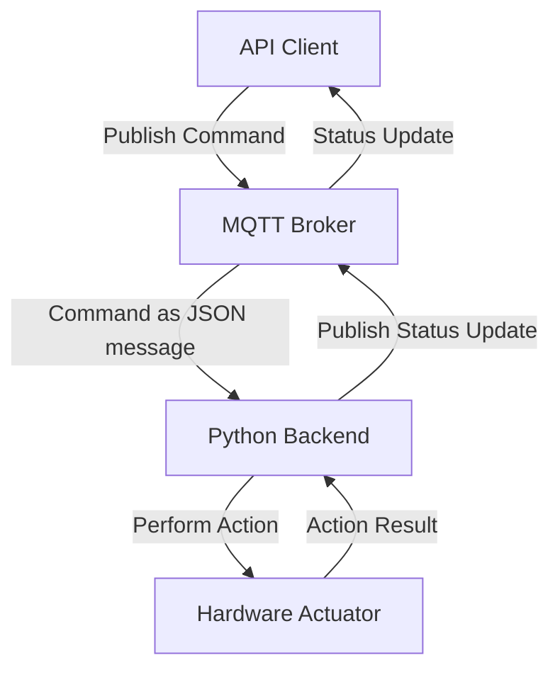

# Planktoscope MQTT API Reference

## Overview

This document provides a comprehensive reference for the Planktoscope MQTT API, detailing the topics, message formats, and possible status and error messages for controlling various actuators and receiving their statuses.

## MQTT architecture communication


### Explanation
- **API Client**: Initiates the interaction by publishing a command to a specific MQTT topic.
- **MQTT Broker**: Receives the command structured as a JSON message. This is the main communication channel where commands are sent.
- **Python Backend**: Interprets the JSON command and converts it into an action to be performed by the hardware (e.g., moving a pump or adjusting focus).
- **Hardware Actuator**: The component that performs the physical action as commanded by the Python backend.
- **MQTT Broker**: After the action is executed, the Python backend publishes the result or status update to a separate MQTT topic dedicated to status updates.
- **API Client**: Receives the status update from the status topic, completing the feedback loop.


## MQTT Topics Overview

In Planktoscope, MQTT topics are categorized to control and monitor different components of the system:

- **Actuator Topics**: Manage movements of mechanical parts (pump, focus and light). Receive only.
- **Imager Topics**: Control imaging operations related to the camera.
- **Segmenter Topics**: Handle image segmentation processes.
- **Status Topics**: Provide updates on the status of various components and mqtt commands. Publish only.


## Topic details

In this section, we explore the different use cases associated with each MQTT topic. You'll find a detailed description of how JSON messages are filled in by the user and published by the MQTT server. This includes the specific scenarios in which data is sent or received, providing an in-depth understanding of the interactions between system components and the timing of communications.

### `Pump`
- **MQTT Topic for Commands**: `actuator/pump`
- **MQTT Topic for Status/Errors**: `status/pump`
- **Function**: Controls the pump to move fluid within the device.

#### Move Command

**Description**: Moves the pump to control fluid within the device.

**JSON message to move the pump**:

```json
{
  "action": "move",
  "direction": "FORWARD",
  "volume": 10,
  "flowrate": 1
}
```
This message makes the pump move 10mL forward at 1mL/min.

**Authorized values for `move` action (on `actuator/pump` topic):**

| Field       | Description                                                                                     | Type   | Accepted Values                          |
|-------------|-------------------------------------------------------------------------------------------------|--------|------------------------------------------|
| `action`    | Must be `"move"`.                                                                               | string | `"move"`                                 |
| `direction` | Direction to run the pump.                                                                      | string | `"FORWARD"`, `"BACKWARD"`                |
| `volume`    | Total volume of sample to pump before stopping automatically (mL)| float  | From 1 to 25 mL |
| `flowrate`  | Speed of pumping (mL/min). Must be nonzero | float  |  From 1 to 50 mL/min   |

                       

**Possible status/error messages for `move` action (on `status/pump` topic):**

| Status/Error                             | Cause                                                                                              |
|------------------------------------------|----------------------------------------------------------------------------------------------------|
| `"Started"`                  | The pump has started moving in response to a valid `move` command.                                 |
| `"Error, the message is missing an argument"` | One or more required parameters (`direction`, `volume`, `flowrate`) are missing in the `move` command. |
| `"Error, invalid_direction"`               | Direction is not "FORWARD" or "BACKWARD".                                                                    |
| `"Error, invalid_volume"`                  | Volume is out of the valid range                                                           |
| `"Error, invalid_flowrate"`                | Flowrate is out of the valid range               |
| `"Done"`                     | The pump has successfully stopped after fully pumping the specified volume of sample.              |


#### Stop Command

**Description**: Stops the pump and cuts off power to the pump’s stepper motor.
**JSON message to stop the pump**:

```json
{
  "action": "stop"
}
```
This message updates the pump to stop moving, and cuts off power to the pump’s stepper motor.

**Authorized values for `stop` action (on `actuator/pump` topic):**

| Field    | Description                 | Type   | Accepted Values |
|----------|-----------------------------|--------|-----------------|
| `action` | Must be `"stop"`.           | string | `"stop"`        |

**Possible status/error messages for `stop` action (on `status/pump` topic):**

| Status/Error                 | Cause                                                                                          |
|------------------------------|------------------------------------------------------------------------------------------------|
| `"Interrupted"`  | The pump has stopped moving in response to a valid `stop` command, before the specified volume was fully pumped. Sent in response to any actuator/pump “stop” command, and any imager/image “stop” command. |
                             
#### General Status Messages (on `status/pump` topic):

| Status/Error | Description                                                                                                  |
|--------------|--------------------------------------------------------------------------------------------------------------|
| `"Ready"`      | Indicates that the backend’s StepperProcess module has started running and is ready to receive commands. Sent in response to the backend starting.   |
| `"Dead"`       | Indicates that the backend’s StepperProcess module is shutting down. Sent in response to the backend being stopped.                                     |


### `Focus`
- **MQTT Topic for Commands**: `actuator/focus`
- **MQTT Topic for Status/Errors**: `status/focus`
- **Function**: Updates the sample stage focusing motors to move a specified displacement at a specified speed.

#### Move Command

**Description**: Moves the focusing stage by a specified displacement.

**JSON message to move the focus**:

```json
{
  "action": "move",
  "direction": "UP",
  "distance": 0.26,
  "speed": 1
}
```

This message makes the stage move up by 0.26 mm. Speed is optional.

**Authorized values for `move` action (on `actuator/focus` topic):**

| Field       | Description                        | Type         | Accepted Values              |
|-------------|------------------------------------|--------------|------------------------------|
| `action`    | Must be `"move"`.                    | string | `"move"`                          |
| `direction` | Direction to move the sample stage | string enum  | "UP", "DOWN"                 |
| `distance`  | Total distance to try to move the stage before the stepper motors automatically stop | float   | 0.001 to 45.0 mm             |
| `speed`     | mooving speed | float   | 0.001 to 5.0 mm/s (optional) |

**Possible status/error messages for `move` action (on `status/focus` topic):**

| Status/Error                                      | Cause                                                                                                     |
|---------------------------------------------------|-----------------------------------------------------------------------------------------------------------|
| `"Started"`                          | The focusing motors have started moving in response to a valid `move` command.                             |
| `"Error, the message is missing an argument"` | One or more required parameters (`direction`, `distance`, `speed`) are missing in the `move` command.         |
| `"Error, invalid_direction"`         | The direction parameter is not "UP" or "DOWN".                                                             |
| `"Error, invalid_distance"`          | The distance parameter is out of the allowable range (0.001 to 45 mm).                                     |
| `"Error, invalid_speed"`             | The speed parameter is out of the allowable range (0.001 to 5.0 mm/s).                                     |
| `"Done"`                             | The focusing motors have successfully stopped after moving the specified distance.                         |


#### Stop Command

**Description**: Stops the focusing stage.
**JSON message to stop the focus**:

```json
{
  "action": "stop"
}
```

**Authorized values for `stop` action (on `actuator/focus` topic) :**

| Field    | Description | Type   | Accepted Values |
|----------|-------------|--------|-----------------|
| `action` | must be `stop`| string | "stop"          |

**Possible status/error messages for `stop` action (on `status/focus` topic):**

| Status/Error                     | Cause                                                                                                     |
|----------------------------------|-----------------------------------------------------------------------------------------------------------|
| `"Interrupted"`     | The focusing motors have stopped moving in response to a valid `stop` command, before the specified distance was completed. |

#### General Status Messages (on `status/focus` topic):

| Status/Error | Description                                                                                                  |
|--------------|--------------------------------------------------------------------------------------------------------------|
| `"Ready"`      | Indicates that the backend’s StepperProcess module has started running and is ready to receive commands. Sent in response to the backend starting.   |
| `"Dead"`       | Indicates that the backend’s StepperProcess module is shutting down. Sent in response to the backend being stopped.                                     |

### `Light`

- **MQTT Topic for Commands**: `actuator/light`
- **MQTT Topic for Status/Errors**: `status/light`
- **Function**: Controls the state of the LED lighting system through the `i2c_led`.

#### JSON Message to Turn On the Light

```json
{
  "action": "on"
}
```
This JSON message turns on the LED.

**Authorized values for `on` action (on `actuator/light` topic):**

| Field     | Description       | Type   | Accepted Values |
|-----------|-------------------|--------|-----------------|
| `action`  | Must be `"on"`.   | string | `"on"`          |

**Possible status/error messages for `on` action (on `status/light` topic):**

| Status/Error | Cause                               |
|--------------|-------------------------------------|
| `"Done"`     | LED turned on successfully.         |

#### JSON Message to Turn Off the LED

```json
{
  "action": "off"
}
```
This JSON message turns off the LED.

**Authorized values for `off` action (on `actuator/light` topic):**

| Field     | Description       | Type   | Accepted Values |
|-----------|-------------------|--------|-----------------|
| `action`  | Must be `"off"`.  | string | `"off"`         |

**Possible status/error messages for `off` action (on `status/light` topic):**

| Status/Error       | Cause                                 |
|--------------------|---------------------------------------|
| `"Interrupted"`    | LED turned off successfully.          |

### `Imager`

- **MQTT Topic for Commands**: `imager/image`
- **MQTT Topic for Status/Errors**: `status/imager`
- **Function**: This topic controls the camera and capture.

#### Command Sequence Requirements

1. **Settings**: Configure the camera settings using the `settings` command.
2. **Update Configuration**: Update the dataset metadata using the `update_config` command.
3. **Image**: Initiate image capture using the `image` command.
4. **Stop**: Stop any in-progress image capture using the `stop` command.

If the `update_config` command is not called before the `image` command, the `image` command will report a status of `"Started"` and then do nothing.

1. **JSON camera settings message**: 
A camera settings message can also be received here. The fields `iso`, `shutter_speed`, `white_balance_gain` and `white_balance` are optionals:

```json
{
  "action": "settings",
  "settings": {
    "iso": 100,
    "shutter_speed": 40,
    "white_balance_gain": { "red": 100, "blue": 100 },
    "white_balance": "auto",
      }
}
```

This message updates camera settings

- **Configuration and Settings Updates**: Configuration updates allow for comprehensive changes to the system setup, whereas settings updates are focused on camera-specific parameters such as ISO and shutter speed, and white balance.

**Authorized values for `setting` camera parameters action(on `imager/image` topic):**

| Parameter             | Type   | Accepted Values      | Description                                    |
|-----------------------|--------|----------------------|------------------------------------------------|
| `action`              | string | "settings"           | Specifies the action to update camera settings.|
| `iso`                 | int    |  100 to 800          | ISO sensitivity value.                         |
| `shutter_speed`       | int    |  125 to 1000  (in μs)           | Shutter speed value.                           |
| `white_balance_gain.red`  | object |      0.0 to 32.0    | White balance gain values for red.    |
| `white_balance_gain.blue`  | object |       0.0 to 64.0     | White balance gain values for blue.    |
| `white_balance`       | string | "auto", "off"            | White balance mode.                            |

**Status/Error Messages for `settings` action(on `status/imager` topic)::**

| Status/Error                                      | Cause                                                                                                     |
|---------------------------------------------------|-----------------------------------------------------------------------------------------------------------|
| `"Camera settings updated"`         | The camera settings have been successfully updated.                                                       |
| `"Camera settings error"`           | The settings command is missing required parameters.                                                      |
| `"Error: Resolution not valid"`     | The provided resolution parameter is invalid.                                                             |
| `"Error: Iso number not valid"`     | The provided ISO parameter is invalid.                                                                    |
| `"Error: Shutter speed not valid"`  | The provided shutter speed parameter is invalid.                                                          |
| `"Error: White balance gain not valid"` | The provided white balance gain parameters are invalid.                                                   |
| `"Error: White balance mode %s not valid"` | The provided white balance mode parameter is invalid.                                                      |
| `"Busy"`                            | The camera is currently busy and cannot update settings.                                         |

2. **JSON configuration update message**: 

```json
{
  "action": "update_config",
  "config": {
    "sample_project": "fairscope bzh",
    "sample_id": "fairscope_bzh_estacade",
    "sample_uuid": "uuid-1234",
    "sample_ship": "Fairscope",
    "sample_operator": "jeremy",
    "sample_sampling_gear": "net",
    "sample_concentrated_sample_volume": 70,
    "sample_total_volume": 100,
    "sample_dilution_factor": 10,
    "sample_speed_through_water": "5 knots",
    "sample_instrument": "PlanktoScope v2.6",
    "sample_bottom_depth": "N/A",
    "sample_depth_min": 0.1,
    "sample_depth_max": 0.5,
    "sample_temperature": "N/A",
    "sample_salinity": "N/A",
    "sample_date": "2024-05-15",
    "acq_id": "fairscope_bzh_estacade_2",
    "acq_instrument": "PlanktoScope v2.6",
    "acq_magnification": "1.2",
    "acq_camera_id": "deep-point-8125",
    "acq_camera_lens": "N/A",
    "acq_software": "PlanktoScope v2024.0.0-alpha.1",
    "acq_atlas_id": "N/A",
    "acq_resolution": "1080p",
    "acq_stacks_count": "N/A",
    "acq_time_between_frames": 0.3,
    "acq_brightness": "N/A",
    "acq_contrast": "N/A",
    "acq_sharpness": "N/A",
    "acq_saturation": "N/A",
    "acq_gamma": "N/A",
    "acq_uuid": "acq-uuid-5678",
    "acq_volume": 2.50,
    "acq_imaged_volume": 1.04,
    "acq_minimum_mesh": 300,
    "acq_maximum_mesh": 300,
    "acq_min_esd": 300,
    "acq_max_esd": 300,
    "acq_camera_name": "HQ Camera",
    "acq_nb_frame": 500,
    "acq_local_datetime": "2024-05-15T09:00:00Z",
    "acq_caamera_iso": 400,
    "acq_camera_shutter_speed": 500,
    "object_date": "2024-05-15",
    "object_time": "09:00:00Z",
    "object_lat": 48.7273,
    "object_lon": -3.9814,
    "object_depth_min": 0.1,
    "object_depth_max": 0.5,
    "process_pixel": 0.75,
    "process_datetime": "2024-05-15T09:00:00Z",
    "process_id": "Process01",
    "process_uuid": "proc-uuid-7890",
    "process_source": "https://www.github.com/PlanktonPlanet/PlanktoScope",
    "process_commit": "CommitHash",
    "sample_gear_net_opening": 300,
    "object_date_end": "2024-05-15",
    "object_time_end": "10:00:00Z",
    "object_lat_end": 48.7274,
    "object_lon_end": -3.9815
  }
}

```

The provided JSON message is used to update the metadata associated with a specific dataset. It contains comprehensive information about the sample, acquisition process, object details, and processing parameters to ensure accurate tracking and reproducibility of the dataset.

**Metadata Configuration Fields for `config` action (on `imager\image` topic):**

#### Sample Information
This table includes details about the sample being processed, such as project name, sample identifier, and sampling conditions.

| Field                            | Type    | Description                             |
|----------------------------------|---------|-----------------------------------------|
| `sample_project`                 | string  | Project name.                           |
| `sample_id`                      | integer | Sample identifier.                      |
| `sample_uuid`                    | string  | Sample UUID.                            |
| `sample_ship`                    | string  | Ship name.                              |
| `sample_operator`                | string  | Operator name.                          |
| `sample_sampling_gear`           | string  | Sampling gear description.              |
| `sample_concentrated_sample_volume` | float | Concentrated sample volume.             |
| `sample_total_volume`            | float   | Total volume.                           |
| `sample_dilution_factor`         | float   | Dilution factor.                        |
| `sample_speed_through_water`     | float   | Speed through water.                    |

#### Acquisition Information
This table contains information about the acquisition process, including the instruments used, imaging parameters, and acquisition settings.

| Field                            | Type    | Description                             |
|----------------------------------|---------|-----------------------------------------|
| `acq_id`                         | integer | Acquisition identifier.                 |
| `acq_instrument`                 | string  | Acquisition instrument.                 |
| `acq_magnification`              | string  | Magnification level.                    |
| `acq_camera_id`                  | integer | Camera identifier.                      |
| `acq_camera_lens`                | string  | Camera lens.                            |
| `acq_software`                   | string  | Acquisition software.                   |
| `acq_volume`                     | float   | Acquisition volume.                     |
| `acq_imaged_volume`              | float   | Imaged volume.                          |
| `acq_minimum_mesh`               | float   | Minimum mesh size.                      |
| `acq_maximum_mesh`               | float   | Maximum mesh size.                      |
| `acq_min_esd`                    | float   | Minimum equivalent spherical diameter.  |
| `acq_max_esd`                    | float   | Maximum equivalent spherical diameter.  |
| `acq_camera_name`                | string  | Camera name.                            |
| `acq_nb_frame`                   | integer | Number of frames captured.              |
| `acq_local_datetime`             | string  | Local date and time of acquisition.     |
| `acq_camera_resolution`          | string  | Camera resolution.                      |
| `acq_camera_iso`                 | float   | Camera ISO setting.                     |
| `acq_camera_shutter_speed`       | float   | Camera shutter speed.                   |

#### Object Information
This table provides specific details about the object of study, including geographic location, depth, and timing of the recording.

| Field                            | Type    | Description                             |
|----------------------------------|---------|-----------------------------------------|
| `object_date`                    | string  | Date of the object recording.           |
| `object_time`                    | string  | Time of the object recording.           |
| `object_lat`                     | float   | Latitude of the sample location.        |
| `object_lon`                     | float   | Longitude of the sample location.       |
| `object_depth_min`               | float   | Minimum depth of the sample location.   |
| `object_depth_max`               | float   | Maximum depth of the sample location.   |
| `object_date_end`                | string  | End date of the object recording.       |
| `object_time_end`                | string  | End time of the object recording.       |
| `object_lat_end`                 | float   | End latitude of the sample location.    |
| `object_lon_end`                 | float   | End longitude of the sample location.   |

#### Processing Information
This table lists the details regarding the data processing steps, including processing method, timing, and software used.

| Field                            | Type    | Description                             |
|----------------------------------|---------|-----------------------------------------|
| `process_pixel`                  | string  | Pixel processing method.                |
| `process_datetime`               | string  | Date and time of processing.            |
| `process_id`                     | integer | Processing identifier.                  |
| `process_uuid`                   | string  | Processing UUID.                        |
| `process_source`                 | string  | Source of processing software or method.|
| `process_commit`                 | string  | Commit hash of the software used.       |


**Status/Error Messages for `config` action(on `status/imager` topic):**

| Status/Error                                      | Description                                                                                                 |
|---------------------------------------------------|-------------------------------------------------------------------------------------------------------------|
| `"Config updated"`                  | The configuration has been successfully updated.                                                            |
| `"Configuration update error: object_data is missing!"` | The required `object_date` parameter is missing in the dataset metadata.                                      |
| `"Configuration update error: chosen id are already in use!"` | The specified `(object_date, sample_id, acq_id)` tuple is already in use.                                      |
| `"Configuration message error"`     | The config message is missing required parameters.                                                          |
| `"Busy"`                            | The camera is currently busy and cannot update the configuration.                                           |

3. **JSON message to image**:
```json
{
  "action": "image",
  "pump_direction": "FORWARD",
  "volume": 1,
  "nb_frame": 200
}
```
This  JSON message initiates image capture with the pump moving 1mL forward and captures 200 frames.
When capturing images, the system uses the specified volume and number of frames to manage the capture process, adjusting the pump's direction as required.
If the imager/image update_config command is not called beforehand, this command will report a status/imager “Started” status and then do nothing.


**Authorized values for `image` action(on `imager/image` topic):**

| Parameter        | Type   | Accepted Values      | Description                                    |
|------------------|--------|----------------------|------------------------------------------------|
| `pump_direction` | string | "FORWARD", "BACKWARD"| Direction of the pump during capture.          |
| `volume`         | int    | 1 to 25              | Volume in mL for the capture.                  |
| `nb_frame`       | int    |          as much as the sd card can contain            | Number of frames to capture.                   |


**Status/Error Messages for `image` action(on `status/imager` topic):**

| Status/Error                                              | Description                                                                                                 |
|-----------------------------------------------------------|-------------------------------------------------------------------------------------------------------------|
| `"Started"`                                               | The image capture process has started successfully.                                                         |
| `"Configuration update error: object_data is missing!"`   | The dataset acquisition routine was started without an object_date parameter.                               |
| `"Configuration update error: chosen id are already in use!"` | The dataset acquisition routine was started with an (object_date, sample_id, acq_id) tuple already in use. |
| `"Image %d/%d been imaged to %s"`                         | An image has been successfully captured and saved.                                                          |
| `"Image %d/%d was not captured due to this error: timeout during capture! Retrying once!"` | A timeout occurred during image capture; retrying the capture.                                                |
| `"Image %d/%d was not captured due to this error: %d was not found! Retrying once!"`   | A data integrity file was not found during image capture; retrying the capture.                               |
| `"Image %d/%d WAS NOT CAPTURED! STOPPING THE PROCESS!"`   | An error occurred during image capture after a retry, causing the process to stop.                           |
| `"Interrupted"`                                           | The image capture process was stopped before completion.                                                    |
| `"Done"`                                                  | The image capture process completed successfully.                                                           |
| `"Busy"`                                                  | The camera is currently busy with another operation.                                                        |


4. **JSON message to stop the imager**:

```json
{
  "action": "stop"
}
```
This message stops any in-progress stop-flow sample dataset acquisition routine.

**Authorized values for `stop` action(on `imager/image` topic):**

| Field    | Type   | Accepted Values |
|----------|--------|-----------------|
| `action` | string | "stop"          |


**Status/Error Messages for `stop` action(on `status/imager` topic):**

| Status/Error message                                 | Description                                                                                                  |
|---------------------------------------------------|-----------------------------------------------------------------------------------------------------------|
| `"Interrupted"`                     | The image capture process was stopped successfully.                                                       |
| `"Busy"`                            | The camera is currently busy and cannot stop the operation.                                               |


 #### General Status Messages (on `status/imager` topic)

| Status/Error                     | Description                                                                                                  |
|----------------------------------|--------------------------------------------------------------------------------------------------------------|
| `"Starting up"`                  | Indicates that the backend’s ImagerProcess module has started running. Sent in response to the backend starting. |
| `"Ready"`                        | Indicates that the camera image streaming server has been started. Sent in response to the streaming server thread being started. |
| `"Dead"`                         | Indicates that the backend’s ImagerProcess module is shutting down. Sent in response to the backend being stopped. |

### `segmenter`

This topic controls the segmentation process. 

- **JSON message to start `segmentation`**:

The segmentation process analyzes the images stored in the specified path, optionally exporting the results in an ecotaxa-compatible format. The `force`, `recursive`, `ecotaxa`, and `keep` options provide control over how segmentation is performed and managed. 

```json
{
  "action": "segment",
  "path": "/path/to/segment",
  "settings": {
    "force": False,
    "recursive": True,
    "ecotaxa": True,
    "keep": True
  }
}
```
The `action` element is the only element required. If no `path` is supplied, the whole images repository is segmented recursively (this is very long!).

**Required Parameters to `segment` action (on `segmenter/segment` topic)**:

| Parameter     | Type   | Accepted Values      | Description                                            |
|---------------|--------|----------------------|--------------------------------------------------------|
| `path`        | string | path/to/directory    | Path to the directory to segment.                      |
| `settings.force`       | bool   | true, false          | Force re-segmentation even if previously done. It will overcome the presence of the file `done` that prevents resegmenting a folder already segmented. |
| `settings.recursive`   | bool   | true, false          | Process directories recursively, forcing parsing all folders below `path`. |
| `settings.ecotaxa`     | bool   | true, false          | Export an ecotaxa compatible archive.                  |
| `settings.keep`        | bool   | true, false          | Keep ROI files during ecotaxa export. It has no effect if not exporting to ecotaxa; the ROI files are kept by default. |

 **Status/Error Messages related to the segment action (on `status/segmenter` topic)**

| Status/Error message | Description                                    |
|-------------------|------------------------------------------------|
| `Ready`              | The segmenter process has started and is ready. |
| `Started`            | The segmentation process has begun. |
| `Busy`               | The segmenter is currently running and cannot update configurations. |
| `Calculating flat`   | The frame background is being calculated. |
| `Segmenting image %s, image %d/%d` | Segmentation of a specific image is in progress. |
| `An exception was raised during the segmentation: %s.` | An error occurred during segmentation. |
| `Done`               | Indicates that all specified datasets have been successfully segmented.|


- **JSON message to `stop` segmentation**
        ```json
        {
          "action": "stop"
        }
        ```
**Required Parameters to `stop` segmentation (on `segmenter/segment` topic)**:

| Parameter     | Type   | Accepted Values      | Description                                            |
|---------------|--------|----------------------|--------------------------------------------------------|
| `action`      | string | "stop"               | Specifies the action to stop segmentation.             |
        
 **Status/Error Messages related to the segment action**

| Status/Error message | Description                                    |
|-------------------|------------------------------------------------|
| `Interrupted`        | The segmentation process was interrupted. |


#### General Status Messages (on `status/segmeter` topic):

| Status/Error | Description                                                                                                  |
|--------------|--------------------------------------------------------------------------------------------------------------|
| `"Ready"`      | Indicates that the backend’s SegmenterProcess module has started running and is ready to receive commands. Sent in response to the backend starting.   |
| `"Dead"`       | Indicates that the backend’s Segmenter module is shutting down. Sent in response to the backend being stopped.                                     |

#### `status/segmenter/object_id` topic

Sent repeatedly as part of the segmentation routine triggered by the `segmenter/segment` command, one for each object isolated by the segmenter.

**Payload:**

| Field      | Type    | Description                           |
|------------|---------|---------------------------------------|
| `object_id`| integer | A scikit-image region label.          |

#### `status/segmenter/metric` topic

Sent repeatedly as part of the segmentation routine triggered by the `segmenter/segment` command, one for each `status/segmenter/object_id` message (corresponding to the object specified by that message).

**Payload:**

| Field      | Type    | Description                                                                 |
|------------|---------|-----------------------------------------------------------------------------|
| `name`     | string  | An object ID, which might or might not correspond to the object ID reported by `status/segmenter/object_id`.  |
| `metadata` | struct  | Metadata for the object.                                                     |

**Metadata fields:**

| Field                   | Type    | Description                                                                                       |
|-------------------------|---------|---------------------------------------------------------------------------------------------------|
| `label`                 | int     | Label of the object.                                                                              |
| `width`                 | int     | Width of the smallest rectangle enclosing the object.                                             |
| `height`                | int     | Height of the smallest rectangle enclosing the object.                                            |
| `bx`                    | int     | X coordinate of the top left point of the smallest rectangle enclosing the object.                 |
| `by`                    | int     | Y coordinate of the top left point of the smallest rectangle enclosing the object.                 |
| `circ`                  | float   | Circularity: (4 ∗ π ∗ Area) / Perimeter^2. A value of 1 indicates a perfect circle, approaching 0 indicates an elongated polygon. |
| `area_exc`              | int     | Surface area of the object excluding holes, in square pixels.                                      |
| `area`                  | int     | Surface area of the object in square pixels.                                                       |
| `%area`                 | float   | Percentage of object’s surface area that is comprised of holes.                                    |
| `major`                 | float   | Primary axis of the best fitting ellipse for the object.                                           |
| `minor`                 | float   | Secondary axis of the best fitting ellipse for the object.                                         |
| `y`                     | float   | Y position of the center of gravity of the object.                                                 |
| `x`                     | float   | X position of the center of gravity of the object.                                                 |
| `convex_area`           | int     | The area of the smallest polygon within which all points in the object fit.                        |
| `perim`                 | float   | The length of the outside boundary of the object.                                                  |
| `elongation`            | float   | The result of dividing the `major` parameter by the `minor` parameter.                             |
| `perimareaexc`          | float   | The result of dividing the `perim` parameter by the `area_exc` parameter.                          |
| `perimmajor`            | float   | The result of dividing the `perim` parameter by the `major` parameter.                             |
| `circex`                | float   | (4 ∗ π ∗ area_exc) / perim^2.                                                                      |
| `angle`                 | float   | Angle between the primary axis and a line parallel to the x-axis of the image.                     |
| `bounding_box_area`     | int     | Area of the bounding box enclosing the object.                                                     |
| `eccentricity`          | float   | Eccentricity of the object.                                                                        |
| `equivalent_diameter`   | float   | Diameter of a circle with the same area as the object.                                             |
| `euler_number`          | int     | Euler number of the object.                                                                        |
| `extent`                | float   | Ratio of object area to bounding box area.                                                         |
| `local_centroid_col`    | float   | Column position of the local centroid.                                                             |
| `local_centroid_row`    | float   | Row position of the local centroid.                                                                |
| `solidity`              | float   | Ratio of object area to convex area.                                                               |
| `MeanHue`               | float   | Mean hue value of the object.                                                                      |
| `MeanSaturation`        | float   | Mean saturation value of the object.                                                               |
| `MeanValue`             | float   | Mean value (brightness) of the object.                                                             |
| `StdHue`                | float   | Standard deviation of the hue value of the object.                                                 |
| `StdSaturation`         | float   | Standard deviation of the saturation value of the object.                                          |
| `StdValue`              | float   | Standard deviation of the value (brightness) of the object.                                        |

