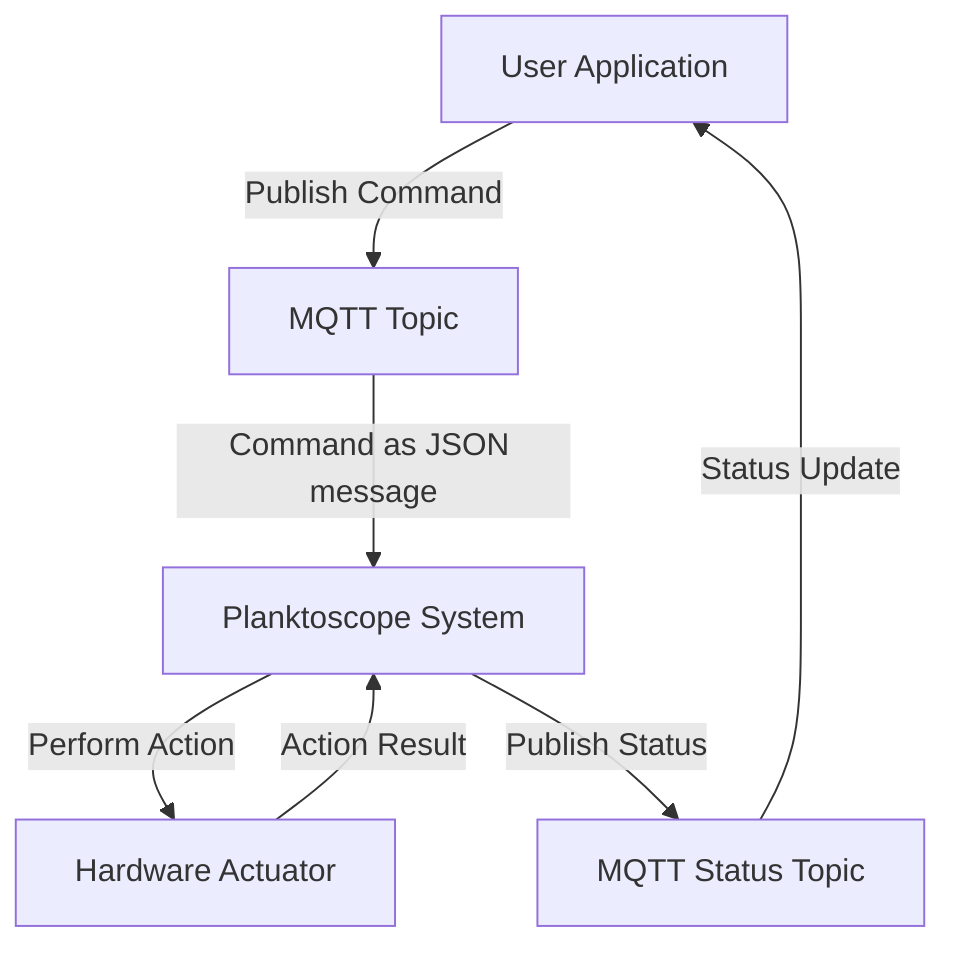

# MQTT API

Welcome to the MQTT API documentation for Planktoscope. This guide is designed to help you understand the messaging protocol for controlling the Planktoscope device and handling various functionalities effectively.

## MQTT architecture communication


### Explanation
- **User Application**: Initiates the interaction by publishing a command to a specific MQTT topic.
- **MQTT Topic**: Receives the command which is structured as a JSON message. This is the main communication channel where commands are sent.
- **Planktoscope System**: Interprets the JSON command and converts it into an action that will be performed by the hardware (like moving a pump or adjusting focus).
- **Hardware Actuator**: The component that actually performs the physical action as commanded by the system.
- **MQTT Status Topic**: After the action is executed, the system publishes the result or status update to a separate MQTT topic dedicated to status updates.
- **User or Client Application**: Receives the status update from the status topic, completing the feedback loop.


## MQTT Topics Overview

In Planktoscope, MQTT topics are categorized to control and monitor different components of the system:

- **Actuator Topics**: Manage movements of mechanical parts (pump, focus and light). Receive only.
- **Imager Topics**: Control imaging operations related to the camera.
- **Segmenter Topics**: Handle image segmentation processes.
- **Status Topics**: Provide updates on the status of various components and mqtt commands. Publish only.


## Topic details

In this section, we explore the different use cases associated with each MQTT topic. You'll find a detailed description of how JSON messages are filled in by the user and published by the MQTT server. This includes the specific scenarios in which data is sent or received, providing an in-depth understanding of the interactions between system components and the timing of communications.

### `Pump`
- **Function**: Controls the pump to move fluid within the device.

- **JSON message to move the pump**:

```json
{
  "action": "move",
  "direction": "FORWARD",
  "volume": 10,
  "flowrate": 1
}
```
This message makes the pump move 10mL forward at 1mL/min.

**Authorized values for `move` action:**

| Field       | Type   | Accepted Values                                     |
|-------------|--------|-----------------------------------------------------|
| `direction` | string | "FORWARD", "BACKWARD"                               |
| `volume`    | int    | 1 to 25 mL                                          |
| `flowrate`  | int    | 1 to 50 mL/min                                      |

**Possible status/error messages for `move` action:**

| Status/Error                             | Cause                                                                                              |
|------------------------------------------|----------------------------------------------------------------------------------------------------|
| `"Started"`                  | The pump has started moving in response to a valid `move` command.                                 |
| `"Error, the message is missing an argument"` | One or more required parameters (`direction`, `volume`, `flowrate`) are missing in the `move` command. |
| `Error, invalid_direction` | Direction is not "FORWARD" or "BACKWARD"            |
| `Error, invalid_volume`    | Volume is out of the 1 to 25 mL range               |
| `Error, invalid_flowrate`  | Flowrate is out of the 1 to 50 mL/min range         |
| `"Interrupted"`              | The pump has stopped moving before the specified volume of sample was fully pumped due to an external interruption. |
| `"Done"`                     | The pump has successfully stopped after fully pumping the specified volume of sample.              |
| `"Ready"`                    | Indicates that the backend’s StepperProcess module has started running and is ready to receive commands. |
| `"Dead"`                     | Indicates that the backend’s StepperProcess module is shutting down.                                |

- **JSON message to stop the pump**:

```json
{
  "action": "stop"
}
```

**Authorized values for `stop` action:**

| Field    | Type   | Accepted Values |
|----------|--------|-----------------|
| `action` | string | "stop"          |

**Possible status/error messages for `stop` action:**

| Status/Error                 | Cause                                                                                          |
|------------------------------|------------------------------------------------------------------------------------------------|
| `"Interrupted"`  | The pump has stopped moving in response to a valid `stop` command, before the specified volume was fully pumped. |
| `"Ready"`        | Indicates that the backend’s StepperProcess module has started running and is ready to receive commands. |
| `"Dead"`         | Indicates that the backend’s StepperProcess module is shutting down.                             |


### `Focus`

- **Function**: Control of the focus stage.
- **JSON message to move the focus**:

```json
{
  "action": "move",
  "direction": "UP",
  "distance": 0.26,
  "speed": 1
}
```
Speed is optional.
This message makes the stage move up by 0.26 mm.

**Authorized values for `move` action:**

| Field       | Type    | Accepted Values              |
|-------------|---------|------------------------------|
| `direction` | string  | "UP", "DOWN"                 |
| `distance`  | float   | 0.001 to 80.0 mm             |
| `speed`     | float   | 0.001 to 5.0 mm/s (optional) |

**Possible status/error messages for `move` action:**

| Status/Error                                      | Cause                                                                                                     |
|---------------------------------------------------|-----------------------------------------------------------------------------------------------------------|
| `"Started"`                          | The focusing motors have started moving in response to a valid `move` command.                             |
| `"Error, the message is missing an argument"` | One or more required parameters (`direction`, `distance`, `speed`) are missing in the `move` command.         |
| `"Error, invalid_direction"`         | The direction parameter is not "UP" or "DOWN".                                                             |
| `"Error, invalid_distance"`          | The distance parameter is out of the allowable range (0.001 to 45 mm).                                     |
| `"Error, invalid_speed"`             | The speed parameter is out of the allowable range (0.001 to 5.0 mm/s).                                     |
| `"Interrupted"`                      | The focusing motors have stopped moving before the specified displacement was completed due to an interruption. |
| `"Done"`                             | The focusing motors have successfully stopped after moving the specified distance.                         |
| `"Ready"`                            | Indicates that the backend’s StepperProcess module has started running and is ready to receive commands.   |
| `"Dead"`                             | Indicates that the backend’s StepperProcess module is shutting down. |

- **JSON message to stop the focus**:

```json
{
  "action": "stop"
}
```

**Authorized values for `stop` action:**

| Field    | Type   | Accepted Values |
|----------|--------|-----------------|
| `action` | string | "stop"          |

**Possible status/error messages for `stop` action:**

| Status/Error                     | Cause                                                                                                     |
|----------------------------------|-----------------------------------------------------------------------------------------------------------|
| `"Interrupted"`     | The focusing motors have stopped moving in response to a valid `stop` command, before the specified distance was completed. |
| `"Ready"`           | Indicates that the backend’s StepperProcess module has started running and is ready to receive commands.   |
| `"Dead"`            | Indicates that the backend’s StepperProcess module is shutting down.                                       |


### `Light`

- **Function**: Control the intensity and state of the LED lighting system through the `i2c_led` and `pwm_led` controllers.

- **JSON message to set the LED intensity**:

```json
{
  "action": "set",
  "led": "1",
  "current": "20mA",
}
```
This json message sets the led 1 to 20mA

**Authorized values for `set` action:**

| Field     | Type   | Accepted Values           |
|-----------|--------|---------------------------|
| `led`     | int    | 1, 2                      |
| `current` | string | "1mA" to "20mA"           |

**Possible status/error messages for `set` action:**

| Status/Error       | Cause                                |
|--------------------|--------------------------------------|
| `Done`          | LED intensity set successfully       |
| `invalid_current`  | The specified current value is invalid|
| `invalid_led`      | The specified LED ID is invalid      |
| `system_error`     | General system error during operation|


- **JSON message to turn on the light**:

```json
{
  "action": "on",
  "led": "1",
}
```
 This json message turns on the led 1.

 **Authorized values for `on` action:**

| Field     | Type   | Accepted Values           |
|-----------|--------|---------------------------|
| `led`     | int    | 1, 2                      |

**Possible status/error messages for `on` action:**

| Status/Error       | Cause                                |
|--------------------|--------------------------------------|
| `Done`          | LED turned on successfully           |
| `invalid_led`      | The specified LED ID is invalid      |
| `system_error`     | General system error during operation|

- **JSON message to turn off the LED**

```json
{
  "action": "off",
  "led": 1
}
```
This JSON message turns off LED 1.

**Authorized values for `off` action:**

| Field     | Type   | Accepted Values           |
|-----------|--------|---------------------------|
| `led`     | int    | 1, 2                      |

**Possible status/error messages for `off` action:**

| Status/Error       | Cause                                |
|--------------------|--------------------------------------|
| `Interrepted`          | LED turned off successfully          |
| `invalid_led`      | The specified LED ID is invalid      |
| `system_error`     | General system error during operation|


### `Imager`

- **Function**: This topic controls the camera and capture.
- **JSON message to image**:
```json
{
  "action": "image",
  "pump_direction": "FORWARD",
  "volume": 1,
  "nb_frame": 200
}
```
This JSON message initiates image capture with the pump moving 1mL forward and captures 200 frames.
When capturing images, the system uses the specified volume and number of frames to manage the capture process, adjusting the pump's direction as required.

**Authorized values for `image` action:**

| Parameter        | Type   | Accepted Values      | Description                                    |
|------------------|--------|----------------------|------------------------------------------------|
| `pump_direction` | string | "FORWARD", "BACKWARD"| Direction of the pump during capture.          |
| `volume`         | int    | 1 to 25              | Volume in mL for the capture.                  |
| `nb_frame`       | int    |          as much as the sd card can contain            | Number of frames to capture.                   |


**Status/Error Messages for `image` action:**

| Status/Error                                      | Description                                                                                                 |
|---------------------------------------------------|-------------------------------------------------------------------------------------------------------------|
| `"Started"`                         | The image capture process has started successfully.                                                         |
| `"Image %d/%d been imaged to %s"`   | An image has been successfully captured and saved.                                                          |
| `"Image %d/%d was not captured due to this error:timeout during capture! Retrying once!"` | A timeout occurred during image capture; retrying the capture.                                                |
| `"Image %d/%d was not captured due to this error:%d was not found! Retrying once!"` | A data integrity file was not found during image capture; retrying the capture.                               |
| `"Image %d/%d WAS NOT CAPTURED! STOPPING THE PROCESS!"` | An error occurred during image capture after a retry, causing the process to stop.                           |
| `"Interrupted"`                     | The image capture process was stopped before completion.                                                    |
| `"Done"`                            | The image capture process completed successfully.                                                           |
| `"Busy"`                            | The camera is currently busy with another operation.                                                        |

- **JSON configuration update message**: 
This topic updates metadata associated with the dataset.

```json
{
  "action": "config",
  "config": {...}
}
```
**Authorized values for `config` action:**

**Metadata Configuration Fields for `config` action:**

| Field                         | Type   | Description                                    |
|-------------------------------|--------|------------------------------------------------|
| `sample_project`              | string | Project name.                                  |
| `sample_id`                   | string | Sample identifier.                             |
| `sample_uuid`                 | string | Sample UUID.                                   |
| `sample_ship`                 | string | Ship name.                                     |
| `sample_operator`             | string | Operator name.                                 |
| `sample_sampling_gear`        | string | Sampling gear description.                     |
| `sample_concentrated_sample_volume` | string | Concentrated sample volume.                    |
| `sample_total_volume`         | string | Total volume.                                  |
| `sample_dilution_factor`      | string | Dilution factor.                               |
| `sample_speed_through_water`  |string | Speed through water.                           |
| `sample_instrument`           | string | Instrument name.                               |
| `sample_bottom_depth`         | string | Bottom depth.                                  |
| `sample_depth_min`            | string | Minimum depth.                                 |
| `sample_depth_max`            | string | Maximum depth.                                 |
| `sample_temperature`          | string | Temperature.                                   |
| `sample_salinity`             | string | Salinity.                                      |
| `sample_date`                 | string | Date of sampling.                              |
| `acq_id`                      | string | Acquisition identifier.                        |
| `acq_instrument`              | string | Acquisition instrument.                        |
| `acq_magnification`           | string | Magnification level.                           |
| `acq_camera_id`               | string | Camera identifier.                             |
| `acq_camera_lens`             | string | Camera lens.                                   |
| `acq_software`                | string | Acquisition software.                          |
| `acq_atlas_id`                | string | Atlas identifier.                              |
| `acq_resolution`              | string | Resolution.                                    |
| `acq_stacks_count`            | string | Number of stacks.                              |
| `acq_time_between_frames`     | string | Time between frames.                           |
| `acq_brightness`              | string | Brightness level.                              |
| `acq_contrast`                | string | Contrast level.                                |
| `acq_sharpness`               | string | Sharpness level.                               |
| `acq_saturation`              | string | Saturation level.                              |
| `acq_gamma`                   | string | Gamma level.                                   |


**Status/Error Messages for `config` action:**

| Status/Error                                      | Description                                                                                                 |
|---------------------------------------------------|-------------------------------------------------------------------------------------------------------------|
| `"Config updated"`                  | The configuration has been successfully updated.                                                            |
| `"Configuration update error: object_data is missing!"` | The required `object_date` parameter is missing in the dataset metadata.                                      |
| `"Configuration update error: chosen id are already in use!"` | The specified `(object_date, sample_id, acq_id)` tuple is already in use.                                      |
| `"Configuration message error"`     | The config message is missing required parameters.                                                          |
| `"Busy"`                            | The camera is currently busy and cannot update the configuration.                                           |


- **JSON camera settings message**: 
A camera settings message can also be received here. The fields `iso`, `shutter_speed`, `white_balance_gain`, `white_balance` and `image_gain` are optionals:

```json
{
  "action": "settings",
  "settings": {
    "iso": 100,
    "shutter_speed": 40,
    "white_balance_gain": { "red": 100, "blue": 100 },
    "white_balance": "auto",
    "image_gain": { "analog": 100, "digital": 100 }
  }
}
```

- **Configuration and Settings Updates**: Configuration updates allow for comprehensive changes to the system setup, whereas settings updates are focused on camera-specific parameters such as ISO, shutter speed, and white balance.

**Authorized values for `setting` camera parameters action:**

| Parameter             | Type   | Accepted Values      | Description                                    |
|-----------------------|--------|----------------------|------------------------------------------------|
| `action`              | string | "settings"           | Specifies the action to update camera settings.|
| `iso`                 | int    |  100 to 800          | ISO sensitivity value.                         |
| `shutter_speed`       | int    |  125 to 1000  (in μs)           | Shutter speed value.                           |
| `WB:red`  | object |      0.0 to 32.0    | White balance gain values for red.    |
| `WB:blue`  | object |       0.0 to 64.0     | White balance gain values for blue.    |
| `white_balance`       | string | "auto", "off"            | White balance mode.                            |
| `image_gain`          | object |                      | Image gain values for analog and digital.      |

**Status/Error Messages for `settings` action:**

| Status/Error                                      | Cause                                                                                                     |
|---------------------------------------------------|-----------------------------------------------------------------------------------------------------------|
| `"Camera settings updated"`         | The camera settings have been successfully updated.                                                       |
| `"Camera settings error"`           | The settings command is missing required parameters.                                                      |
| `"Error: Resolution not valid"`     | The provided resolution parameter is invalid.                                                             |
| `"Error: Iso number not valid"`     | The provided ISO parameter is invalid.                                                                    |
| `"Error: Shutter speed not valid"`  | The provided shutter speed parameter is invalid.                                                          |
| `"Error: White balance gain not valid"` | The provided white balance gain parameters are invalid.                                                   |
| `"Error: White balance mode %s not valid"` | The provided white balance mode parameter is invalid.                                                      |
| `"Error: Image gain not valid"`     | The provided image gain parameters are invalid.                                                           |
| `"Busy"`                            | The camera is currently busy and cannot update settings.                                                  |

- **JSON message to stop the imager**:

```json
{
  "action": "stop"
}
```

**Authorized values for `stop` action:**

| Field    | Type   | Accepted Values |
|----------|--------|-----------------|
| `action` | string | "stop"          |


**Status/Error Messages for `stop` action:**

| Status/Error message                                 | Description                                                                                                  |
|---------------------------------------------------|-----------------------------------------------------------------------------------------------------------|
| `"Interrupted"`                     | The image capture process was stopped successfully.                                                       |
| `"Busy"`                            | The camera is currently busy and cannot stop the operation.                                               |


### `segmenter`

This topic controls the segmentation process. 

- **JSON message to start `segmentation`**:

The segmentation process analyzes the images stored in the specified path, optionally exporting the results in an ecotaxa-compatible format. The `force`, `recursive`, `ecotaxa`, and `keep` options provide control over how segmentation is performed and managed. 

```json
{
  "action": "segment",
  "path": "/path/to/segment",
  "settings": {
    "force": False,
    "recursive": True,
    "ecotaxa": True,
    "keep": True
  }
}
```
The `action` element is the only element required. If no `path` is supplied, the whole images repository is segmented recursively (this is very long!).

| Parameter     | Type   | Accepted Values      | Description                                            |
|---------------|--------|----------------------|--------------------------------------------------------|
| `path`        | string | path/to/directory    | Path to the directory to segment.                      |
| `force`       | bool   | true, false          | Force re-segmentation even if previously done. It will overcome the presence of the file `done` that prevents resegmenting a folder already segmented. |
| `recursive`   | bool   | true, false          | Process directories recursively, forcing parsing all folders below `path`. |
| `ecotaxa`     | bool   | true, false          | Export an ecotaxa compatible archive.                  |
| `keep`        | bool   | true, false          | Keep ROI files during ecotaxa export. It has no effect if not exporting to ecotaxa; the ROI files are kept by default. |

 **Status/Error Messages related to the segment action**

| Status/Error message | Description                                    |
|-------------------|------------------------------------------------|
| `Ready`              | The segmenter process has started and is ready. |
| `Started`            | The segmentation process has begun. |
| `Calculating flat`   | The frame background is being calculated. |
| `Segmenting image %s, image %d/%d` | Segmentation of a specific image is in progress. |
| `An exception was raised during the segmentation: %s.` | An error occurred during segmentation. |
| `Done`               | The segmentation process is complete. |
| `ERROR_INVALID_ACTION` | The specified action is invalid.              |
| `ERROR_INVALID_PATH`   | The specified path is invalid or not found.    |
| `ERROR_SEGMENTATION_FAILURE` | The segmentation process failed. 


- **JSON message to `stop` segmentation**
        ```json
        {
          "action": "stop"
        }
        ```
**Required Parameters to `stop` segmentation**:

| Parameter     | Type   | Accepted Values      | Description                                            |
|---------------|--------|----------------------|--------------------------------------------------------|
| `action`      | string | "stop"               | Specifies the action to stop segmentation.             |
        
 **Status/Error Messages related to the segment action**

| Status/Error message | Description                                    |
|-------------------|------------------------------------------------|
| `Interrupted`        | The segmentation process was interrupted. |
| `Busy`               | The segmenter is currently running and cannot update configurations. |


## Common Log Errors

### MQTT Connection Errors
- **Error Log**: 

`"Error : Connection to the MQTT server is unexpectedly lost"`

- **Description**: This error occurs when the MQTT client cannot establish a connection with the broker within the expected timeframe.
- **Possible Causes**:
  - Network issues.
  - Incorrect broker address.
  - Broker unavailable.
- **Resolution Steps**:
  - Check network connectivity.
  - Verify broker address and availability.

### MQTT Publishing Errors
- **Error Log**: 

`"Failed to Publish Message: Broker Unresponsive"`

- **Description**: Indicates a failure in sending a message to the MQTT broker, typically due to broker issues.
- **Possible Causes**:
  - Broker overload.
  - Connectivity issues affecting the broker.
- **Resolution Steps**:
  - Retry publishing the message after a brief interval.

