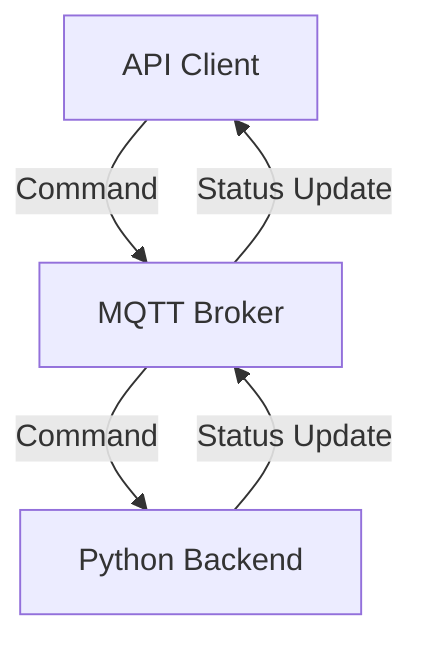

# Planktoscope MQTT API Reference

The MQTT API is the primary programming interface for controlling the PlanktoScope. The API is served by the PlanktoScope's Python backend, and data is sent across the API with the following architecture:



Most messages in the MQTT API are organized according to a request-response pattern in which the API client sends a *command* as a request to take some action, and then the Python backend sends one or more responses as *status updates* about how the Python backend's state has changed as a result of the command:

- **API clients** send commands to the Python backend (via the MQTT broker), and receive status updates from the Python backend (also via the MQTT broker). The PlanktoScope's Node-RED dashboard is an API client, but other programs are also allowed to act as API clients.
- The **MQTT broker** passes commands and status updates between the API client(s) and the Python backend. The MQTT broker runs on the PlanktoScope and accepts connections from API clients on port 1883.
- The **Python backend** handles commands, takes actions (e.g. changing the state of hardware actuators), and publishes status updates both in response to commands and in response to changes in internal state. Currently, parts of the Python backend also act as MQTT API clients to other parts of the Python backend.

Every MQTT message in the PlanktoScope's MQTT API is published on a specific *topic*, which is a slash-delimited path of strings (e.g. `actuator/pump`). Every MQTT message in the PlanktoScope's MQTT API carries a *payload*, which is a JSON object serialized as a string:

- Messages which are commands usually specify the type of command in an `action` field of the payload object; other fields of the payload object are parameters of the command.
- Messages which are status updates have a single field in the payload object, `status`, which is a string containing a status or error message.

In the rest of this reference document, we organize our description of the MQTT API into sections corresponding to distinct functionalities of the Python backend:


## Pump

The Pump API controls the movement of fluid through the PlanktoScope:

- **MQTT topic for commands**: `actuator/pump`
- **MQTT topics for status updates**: `status/pump`
- **Commands**: `move`, `stop`

### `move` command

The `move` command initiates movement of fluid through the PlanktoScope by driving the PlanktoScope pump's stepper motor. For example, this command makes the pump move 10 mL of fluid forwards through the PlanktoScope's fluidic path, at a rate of 1 mL/min:

```json
{
  "action": "move",
  "direction": "FORWARD",
  "volume": 10,
  "flowrate": 1
}
```

The `move` command has the following parameters:

| Field       | Description                                                        | Type   | Accepted Values            |
|-------------|--------------------------------------------------------------------|--------|----------------------------|
| `action`    | Specifies the `move` command.                                      | string | `move`                     |
| `direction` | Direction to run the pump.                                         | string | `FORWARD`, `BACKWARD`      |
| `volume`    | Total volume of sample to pump before stopping automatically (mL). | float  | 0 < `volume`               |
| `flowrate`  | Speed of pumping (mL/min).                                         | float  | 0 < `flowrate` ≤ 45 mL/min |

The Python backend can send status updates on the `status/pump` topic, in response to the `move` command. The `status` field of such status updates can have any of the following values:

| Status/Error                                | Cause                                                                                                  |
|---------------------------------------------|--------------------------------------------------------------------------------------------------------|
| `Started`                                   | The pump has started moving in response to a valid `move` command.                                     |
| `Error, the message is missing an argument` | One or more required parameters (`direction`, `volume`, `flowrate`) are missing in the `move` command. |
| `Error, The flowrate should not be == 0`    | An invalid value (0) was provided for the `flowrate` field.                                            |
| `Done`                                      | The pump has successfully stopped after fully pumping the specified volume of sample.                  |

Note: the MQTT API does not yet completely specify error messages in response to invalid values for the `direction`, `volume`, and `flowrate` parameters.

### `stop` command

The `stop` command interrupts any ongoing movement of fluid through the PlanktoScope and cuts off power to the PlanktoScope pump's stepper motor:

```json
{
  "action": "stop"
}
```

The `stop` command has the following parameters:

| Field    | Description                   | Type   | Accepted Values |
|----------|-------------------------------|--------|-----------------|
| `action` | Specifies the `stop` command. | string | `stop`        |

#### `stop` command responses

The Python backend can send status updates on the `status/pump` topic, in response to the `stop` command. The `status` field of such status updates can have any of the following values:

| Status/Error                 | Cause                                                                                                                                                                                        |
|------------------------------|----------------------------------------------------------------------------------------------------------------------------------------------------------------------------------------------|
| `"Interrupted"`              | The pump has stopped moving in response to a valid `stop` command, interrupting any ongoing `move` command.<br />Sent in response to any Pump `stop` command, and any Imager `stop` command. |

### Non-response status updates

The Python backend can send status updates on the `status/pump` topic which are not triggered by any command. The `status` field of such status updates can have any of the following values:

| Status/Error | Cause                                                     |
|--------------|-----------------------------------------------------------|
| `Ready`      | The backend has become ready to respond to Pump commands. |
| `Dead`       | The backend will no longer respond to Pump commands.      |


## Focus

The Focus API controls the movement of the sample stage focusing motors in the PlanktoScope:

- **MQTT Topic for Commands**: `actuator/focus`
- **MQTT Topic for Status/Errors**: `status/focus`
- **Commands**: `move`, `stop`

### `move` command

The `move` command initiates movement of the focusing stage by a specified displacement. For example, this command makes the stage move up by 0.26 mm at a speed of 1 mm/s:

```json
{
  "action": "move",
  "direction": "UP",
  "distance": 0.26,
  "speed": 1
}
```

The `move` command has the following parameters:

| Field       | Description                                                                 | Type   | Accepted Values     |
|-------------|-----------------------------------------------------------------------------|--------|---------------------|
| `action`    | Specifies the `move` command.                                               | string | `move`              |
| `direction` | Direction to move the sample stage.                                         | string | `UP`, `DOWN`        |
| `distance`  | Total distance to move the stage before stopping automatically (in mm).     | float  | 0.001 ≤ `distance` ≤ 45.0 |
| `speed`     | Speed of movement (in mm/s).                                                | float  | 0.001 ≤ `speed` ≤ 5.0    |

The Python backend can send status updates on the `status/focus` topic in response to the `move` command. The `status` field of such status updates can have any of the following values:

| Status/Error                                      | Cause                                                                                                     |
|---------------------------------------------------|-----------------------------------------------------------------------------------------------------------|
| `"Started"`                          | The focusing motors have started moving in response to a valid `move` command.                             |
| `"Error, the message is missing an argument"` | One or more required parameters (`direction`, `distance`, `speed`) are missing in the `move` command.         |
| `"Done"`                             | The focusing motors have successfully stopped after moving the specified distance.                         |

Note: the MQTT API does not yet completely specify error messages in response to invalid values for the `direction`, `distance`, and `speed` parameters.

### `stop` command

The `stop` command interrupts any ongoing movement of the focusing stage and cuts off power to the focusing motors:

```json
{
  "action": "stop"
}
```

The `stop` command has the following parameters:

| Field    | Description | Type   | Accepted Values |
|----------|-------------|--------|-----------------|
| `action` | must be `stop`| string | "stop"          |

#### `stop` command responses

The Python backend can send status updates on the `status/focus` topic, in response to the `stop` command. The `status` field of such status updates can have any of the following values:

| Status/Error                     | Cause                                                                                                     |
|----------------------------------|-----------------------------------------------------------------------------------------------------------|
| `"Interrupted"`     | The focusing motors have stopped moving in response to a valid `stop` command, before the specified distance was completed. |

### Non-response status updates

The Python backend can send status updates on the `status/focus` topic which are not triggered by any command. The `status` field of such status updates can have any of the following values:

| Status/Error | Description                                                                                                  |
|--------------|--------------------------------------------------------------------------------------------------------------|
| `Ready`      | The backend’s StepperProcess module has started running and is ready to receive commands.                    |
| `Dead`       | The backend’s StepperProcess module is shutting down and will no longer respond to commands.                 |

## Light

The Light API controls the state of the LED lighting system in the PlanktoScope:

- **MQTT Topic for Commands**: `actuator/light`
- **MQTT Topic for Status/Errors**: `status/light`
- **Commands**: `on`, `off`

### `on` command

The `on` command turns on the LED lighting system. For example, this command turns on the LED:

```json
{
  "action": "on"
}
```
The `on` command has the following parameters:

| Field     | Description       | Type   | Accepted Values |
|-----------|-------------------|--------|-----------------|
| `action`  | Must be `"on"`.   | string | `"on"`          |

The Python backend can send status updates on the `status/light` topic in response to the `on` command. The `status` field of such status updates can have any of the following values:

| Status/Error | Cause                               |
|--------------|-------------------------------------|
| `"Done"`     | LED turned on successfully.         |

### `off` command

The `off` command turns off the LED lighting system. For example, this command turns off the LED:

```json
{
  "action": "off"
}
```

The `off` command has the following parameters:

| Field     | Description       | Type   | Accepted Values |
|-----------|-------------------|--------|-----------------|
| `action`  | Must be `"off"`.  | string | `"off"`         |

The Python backend can send status updates on the `status/light` topic in response to the `off` command. The `status` field of such status updates can have any of the following values:


| Status/Error       | Cause                                 |
|--------------------|---------------------------------------|
| `"Interrupted"`    | LED turned off successfully.          |

### Non-response status updates

The Python backend can send status updates on the `status/light` topic which are not triggered by any command. The `status` field of such status updates can have any of the following values:

| Status/Error | Description                                                                                                  |
|--------------|--------------------------------------------------------------------------------------------------------------|
| `Ready`      | The backend has become ready to respond to Light commands.                                                   |
| `Dead`       | The backend will no longer respond to Light commands.                                                        |

## Imager

The Imager API controls image acquisition with the PlanktoScope's hardware, as well as the PlanktoScope's camera:

- **MQTT topic for commands**: `imager/image`
- **MQTT topic for status updates**: `status/imager`
- **Commands**: `settings`, `update_config`, `image`, `stop`

For details on how images are acquired, refer to our technical reference on [sample imaging](../functionalities/sample-imaging.md) in the PlanktoScope.

Generally, commands should be sent in the following order:

1. `settings` command: Configure the camera settings.
2. `update_config` command: Update the dataset metadata for the next image acquisition.
3. `image` command: Initiate image acquisition.
4. `stop` command: Stop any in-progress image acquisition.

### `settings` command

A camera settings message can also be received here. The fields `iso`, `shutter_speed`, `white_balance_gain` and `white_balance` are optionals:

```json
{
  "action": "settings",
  "settings": {
    "iso": 100,
    "shutter_speed": 40,
    "white_balance_gain": { "red": 100, "blue": 100 },
    "white_balance": "auto",
      }
}
```

This message updates camera settings

- **Configuration and Settings Updates**: Configuration updates allow for comprehensive changes to the system setup, whereas settings updates are focused on camera-specific parameters such as ISO and shutter speed, and white balance.

**Authorized values for `setting` camera parameters action(on `imager/image` topic):**

| Parameter             | Type   | Accepted Values      | Description                                    |
|-----------------------|--------|----------------------|------------------------------------------------|
| `action`              | string | "settings"           | Specifies the action to update camera settings.|
| `iso`                 | int    |  100 to 800          | ISO sensitivity value.                         |
| `shutter_speed`       | int    |  125 to 1000  (in μs)           | Shutter speed value.                           |
| `white_balance_gain.red`  | object |      0.0 to 32.0    | White balance gain values for red.    |
| `white_balance_gain.blue`  | object |       0.0 to 64.0     | White balance gain values for blue.    |
| `white_balance`       | string | "auto", "off"            | White balance mode.                            |

**Status/Error Messages for `settings` action(on `status/imager` topic)::**

| Status/Error                                      | Cause                                                                                                     |
|---------------------------------------------------|-----------------------------------------------------------------------------------------------------------|
| `"Camera settings updated"`         | The camera settings have been successfully updated.                                                       |
| `"Camera settings error"`           | The settings command is missing required parameters.                                                      |
| `"Error: Resolution not valid"`     | The provided resolution parameter is invalid.                                                             |
| `"Error: Iso number not valid"`     | The provided ISO parameter is invalid.                                                                    |
| `"Error: Shutter speed not valid"`  | The provided shutter speed parameter is invalid.                                                          |
| `"Error: White balance gain not valid"` | The provided white balance gain parameters are invalid.                                                   |
| `"Error: White balance mode %s not valid"` | The provided white balance mode parameter is invalid.                                                      |
| `"Busy"`                            | The camera is currently busy and cannot update settings.                                         |

### `update_config` command

```json
{
  "action": "update_config",
  "config": {
    "sample_project": "fairscope bzh",
    "sample_id": "fairscope_bzh_estacade",
    "sample_uuid": "uuid-1234",
    "sample_ship": "Fairscope",
    "sample_operator": "jeremy",
    "sample_sampling_gear": "net",
    "sample_concentrated_sample_volume": 70,
    "sample_total_volume": 100,
    "sample_dilution_factor": 10,
    "sample_speed_through_water": "5 knots",
    "sample_instrument": "PlanktoScope v2.6",
    "sample_bottom_depth": "N/A",
    "sample_depth_min": 0.1,
    "sample_depth_max": 0.5,
    "sample_temperature": "N/A",
    "sample_salinity": "N/A",
    "sample_date": "2024-05-15",
    "acq_id": "fairscope_bzh_estacade_2",
    "acq_instrument": "PlanktoScope v2.6",
    "acq_magnification": "1.2",
    "acq_camera_id": "deep-point-8125",
    "acq_camera_lens": "N/A",
    "acq_software": "PlanktoScope v2024.0.0-alpha.1",
    "acq_atlas_id": "N/A",
    "acq_resolution": "1080p",
    "acq_stacks_count": "N/A",
    "acq_time_between_frames": 0.3,
    "acq_brightness": "N/A",
    "acq_contrast": "N/A",
    "acq_sharpness": "N/A",
    "acq_saturation": "N/A",
    "acq_gamma": "N/A",
    "acq_uuid": "acq-uuid-5678",
    "acq_volume": 2.50,
    "acq_imaged_volume": 1.04,
    "acq_minimum_mesh": 300,
    "acq_maximum_mesh": 300,
    "acq_min_esd": 300,
    "acq_max_esd": 300,
    "acq_camera_name": "HQ Camera",
    "acq_nb_frame": 500,
    "acq_local_datetime": "2024-05-15T09:00:00Z",
    "acq_caamera_iso": 400,
    "acq_camera_shutter_speed": 500,
    "object_date": "2024-05-15",
    "object_time": "09:00:00Z",
    "object_lat": 48.7273,
    "object_lon": -3.9814,
    "object_depth_min": 0.1,
    "object_depth_max": 0.5,
    "process_pixel": 0.75,
    "process_datetime": "2024-05-15T09:00:00Z",
    "process_id": "Process01",
    "process_uuid": "proc-uuid-7890",
    "process_source": "https://www.github.com/PlanktonPlanet/PlanktoScope",
    "process_commit": "CommitHash",
    "sample_gear_net_opening": 300,
    "object_date_end": "2024-05-15",
    "object_time_end": "10:00:00Z",
    "object_lat_end": 48.7274,
    "object_lon_end": -3.9815
  }
}

```

The provided JSON message is used to update the metadata associated with a specific dataset. It contains comprehensive information about the sample, acquisition process, object details, and processing parameters to ensure accurate tracking and reproducibility of the dataset. The following tables describe the various fields in the `config` struct:

Sample information:

| Field                            | Type    | Description                             |
|----------------------------------|---------|-----------------------------------------|
| `sample_project`                 | string  | Project name.                           |
| `sample_id`                      | integer | Sample identifier.                      |
| `sample_uuid`                    | string  | Sample UUID.                            |
| `sample_ship`                    | string  | Ship name.                              |
| `sample_operator`                | string  | Operator name.                          |
| `sample_sampling_gear`           | string  | Sampling gear description.              |
| `sample_concentrated_sample_volume` | float | Concentrated sample volume.             |
| `sample_total_volume`            | float   | Total volume.                           |
| `sample_dilution_factor`         | float   | Dilution factor.                        |
| `sample_speed_through_water`     | float   | Speed through water.                    |

Acquisition information:

| Field                            | Type    | Description                             |
|----------------------------------|---------|-----------------------------------------|
| `acq_id`                         | integer | Acquisition identifier.                 |
| `acq_instrument`                 | string  | Acquisition instrument.                 |
| `acq_magnification`              | string  | Magnification level.                    |
| `acq_camera_id`                  | integer | Camera identifier.                      |
| `acq_camera_lens`                | string  | Camera lens.                            |
| `acq_software`                   | string  | Acquisition software.                   |
| `acq_volume`                     | float   | Acquisition volume.                     |
| `acq_imaged_volume`              | float   | Imaged volume.                          |
| `acq_minimum_mesh`               | float   | Minimum mesh size.                      |
| `acq_maximum_mesh`               | float   | Maximum mesh size.                      |
| `acq_min_esd`                    | float   | Minimum equivalent spherical diameter.  |
| `acq_max_esd`                    | float   | Maximum equivalent spherical diameter.  |
| `acq_camera_name`                | string  | Camera name.                            |
| `acq_nb_frame`                   | integer | Number of frames captured.              |
| `acq_local_datetime`             | string  | Local date and time of acquisition.     |
| `acq_camera_resolution`          | string  | Camera resolution.                      |
| `acq_camera_iso`                 | float   | Camera ISO setting.                     |
| `acq_camera_shutter_speed`       | float   | Camera shutter speed.                   |

Object information:

| Field                            | Type    | Description                             |
|----------------------------------|---------|-----------------------------------------|
| `object_date`                    | string  | Date of the object recording.           |
| `object_time`                    | string  | Time of the object recording.           |
| `object_lat`                     | float   | Latitude of the sample location.        |
| `object_lon`                     | float   | Longitude of the sample location.       |
| `object_depth_min`               | float   | Minimum depth of the sample location.   |
| `object_depth_max`               | float   | Maximum depth of the sample location.   |
| `object_date_end`                | string  | End date of the object recording.       |
| `object_time_end`                | string  | End time of the object recording.       |
| `object_lat_end`                 | float   | End latitude of the sample location.    |
| `object_lon_end`                 | float   | End longitude of the sample location.   |

Processing information:

| Field                            | Type    | Description                             |
|----------------------------------|---------|-----------------------------------------|
| `process_pixel`                  | string  | Pixel processing method.                |
| `process_datetime`               | string  | Date and time of processing.            |
| `process_id`                     | integer | Processing identifier.                  |
| `process_uuid`                   | string  | Processing UUID.                        |
| `process_source`                 | string  | Source of processing software or method.|
| `process_commit`                 | string  | Commit hash of the software used.       |


**Status/Error Messages for `config` action(on `status/imager` topic):**

| Status/Error                                      | Description                                                                                                 |
|---------------------------------------------------|-------------------------------------------------------------------------------------------------------------|
| `"Config updated"`                  | The configuration has been successfully updated.                                                            |
| `"Configuration update error: object_data is missing!"` | The required `object_date` parameter is missing in the dataset metadata.                                      |
| `"Configuration update error: chosen id are already in use!"` | The specified `(object_date, sample_id, acq_id)` tuple is already in use.                                      |
| `"Configuration message error"`     | The config message is missing required parameters.                                                          |
| `"Busy"`                            | The camera is currently busy and cannot update the configuration.                                           |

### `image` command
```json
{
  "action": "image",
  "pump_direction": "FORWARD",
  "volume": 1,
  "nb_frame": 200
}
```
This  JSON message initiates image capture with the pump moving 1mL forward and captures 200 frames.
When capturing images, the system uses the specified volume and number of frames to manage the capture process, adjusting the pump's direction as required.

Currently, if a `update_config` command is sent before the `image` command, the `image` command will report a status/imager “Started” status and then do nothing (this is a software bug).


**Authorized values for `image` action(on `imager/image` topic):**

| Parameter        | Type   | Accepted Values      | Description                                    |
|------------------|--------|----------------------|------------------------------------------------|
| `pump_direction` | string | "FORWARD", "BACKWARD"| Direction of the pump during capture.          |
| `volume`         | int    | 1 to 25              | Volume in mL for the capture.                  |
| `nb_frame`       | int    |          as much as the sd card can contain            | Number of frames to capture.                   |


**Status/Error Messages for `image` action(on `status/imager` topic):**

| Status/Error                                              | Description                                                                                                 |
|-----------------------------------------------------------|-------------------------------------------------------------------------------------------------------------|
| `"Started"`                                               | The image capture process has started successfully.                                                         |
| `"Configuration update error: object_data is missing!"`   | The dataset acquisition routine was started without an object_date parameter.                               |
| `"Configuration update error: chosen id are already in use!"` | The dataset acquisition routine was started with an (object_date, sample_id, acq_id) tuple already in use. |
| `"Image %d/%d been imaged to %s"`                         | An image has been successfully captured and saved.                                                          |
| `"Image %d/%d was not captured due to this error: timeout during capture! Retrying once!"` | A timeout occurred during image capture; retrying the capture.                                                |
| `"Image %d/%d was not captured due to this error: %d was not found! Retrying once!"`   | A data integrity file was not found during image capture; retrying the capture.                               |
| `"Image %d/%d WAS NOT CAPTURED! STOPPING THE PROCESS!"`   | An error occurred during image capture after a retry, causing the process to stop.                           |
| `"Interrupted"`                                           | The image capture process was stopped before completion.                                                    |
| `"Done"`                                                  | The image capture process completed successfully.                                                           |
| `"Busy"`                                                  | The camera is currently busy with another operation.                                                        |


4. **JSON message to stop the imager**:

```json
{
  "action": "stop"
}
```
This message stops any in-progress stop-flow sample dataset acquisition routine.

**Authorized values for `stop` action(on `imager/image` topic):**

| Field    | Type   | Accepted Values |
|----------|--------|-----------------|
| `action` | string | "stop"          |


**Status/Error Messages for `stop` action(on `status/imager` topic):**

| Status/Error message                                 | Description                                                                                                  |
|---------------------------------------------------|-----------------------------------------------------------------------------------------------------------|
| `"Interrupted"`                     | The image capture process was stopped successfully.                                                       |
| `"Busy"`                            | The camera is currently busy and cannot stop the operation.                                               |


### Other status updates

| Status/Error                     | Description                                                                                                  |
|----------------------------------|--------------------------------------------------------------------------------------------------------------|
| `"Starting up"`                  | Indicates that the backend’s ImagerProcess module has started running. Sent in response to the backend starting. |
| `"Ready"`                        | Indicates that the camera image streaming server has been started. Sent in response to the streaming server thread being started. |
| `"Dead"`                         | Indicates that the backend’s ImagerProcess module is shutting down. Sent in response to the backend being stopped. |

## Segmenter

The Segmenter API controls the processing of acquired images:

- **MQTT topic for commands**: `segmenter/segment`
- **MQTT topics for status updates**: `status/segmenter`, `status/segmenter/object_id`, `status/segmenter/metric`
- **Commands**: `segment`

For details on how images are processed, refer to our technical reference on [image segmentation](../functionalities/segmentation.md) in the PlanktoScope.

### `segment` command

The `segment` command initiates processing of images stored in the specified path, optionally exporting the results to an EcoTaxa-compatible archive. The various `settings` parameters of this command provide control over the behavior of image processing. For example, this command initiates processing of all images in the `/path/to/segment` directory:

```json
{
  "action": "segment",
  "path": "/path/to/segment",
  "settings": {
    "force": false,
    "recursive": true,
    "ecotaxa": true,
    "keep": true
  }
}
```

The `segment` command has the following parameters:

| Parameter     | Type   | Accepted Values      | Description                                            |
|---------------|--------|----------------------|--------------------------------------------------------|
| `path`        | file path (string) | any directory within `/home/pi/data/img` (optional) | Path to the directory of images to process.<br />Defaults to `/home/pi/data/img`. |
| `settings`.`force`       | boolean   | `true`, `false` (optional)          | Force re-segmentation even if previously done. It will overcome the presence of the file `done` that prevents resegmenting a folder already segmented.<br />Defaults to TODO. |
| `settings`.`recursive`   | boolean   | `true`, `false` (optional)          | Process directories recursively, forcing parsing all folders below `path`.<br />Defaults to TODO. |
| `settings`.`ecotaxa`     | boolean   | `true`, `false` (optional)          | Export an ecotaxa compatible archive.<br />Defaults to TODO.                  |
| `settings.keep`        | boolean   | `true`, `false` (optional)          | Keep ROI files during ecotaxa export. It has no effect if not exporting to ecotaxa.<br />Defaults to `true`. |

The Python backend can send status updates on the `status/pump` topic, in response to the `segment` command. The `status` field of such status updates can have any of the following values:

| Status/Error message | Description                                    |
|-------------------|------------------------------------------------|
| `Ready`              | The segmenter process has started and is ready. |
| `Started`            | The segmentation process has begun. |
| `Busy`               | The segmenter is currently running and cannot update configurations. |
| `Calculating flat`   | The frame background is being calculated. |
| `Segmenting image %s, image %d/%d` | Segmentation of a specific image is in progress. |
| `An exception was raised during the segmentation: %s.` | An error occurred during segmentation. |
| `Done`               | Indicates that all specified datasets have been successfully segmented.|

As the Python backend performs segmentation, it will repeatedly send additional status updates on the `status/segmenter/object_id` topic, once for each object isolated by the segmenter. Each status update is a JSON object with the following fields:

| Field      | Type    | Description                           |
|------------|---------|---------------------------------------|
| `object_id`| integer | A scikit-image region label.          |

As the Python backend performs segmentation, it will repeatedly send additional status updates on the `status/segmenter/metric` topic, once for each object isolated by the segmenter. Each status update is a JSON object with the following fields:


| Field      | Type    | Description                                                                 |
|------------|---------|-----------------------------------------------------------------------------|
| `name`     | string  | An object ID, which might or might not correspond to the object ID reported by `status/segmenter/object_id`.  |
| `metadata` | struct  | Metadata for the object.                                                     |

The `metadata` field of status updates sent on the `status/segmenter/metric` topic has the following schema:

| Field                   | Type    | Description                                                                                       |
|-------------------------|---------|---------------------------------------------------------------------------------------------------|
| `label`                 | int     | Label of the object.                                                                              |
| `width`                 | int     | Width of the smallest rectangle enclosing the object.                                             |
| `height`                | int     | Height of the smallest rectangle enclosing the object.                                            |
| `bx`                    | int     | X coordinate of the top left point of the smallest rectangle enclosing the object.                 |
| `by`                    | int     | Y coordinate of the top left point of the smallest rectangle enclosing the object.                 |
| `circ`                  | float   | Circularity: (4 ∗ π ∗ Area) / Perimeter^2. A value of 1 indicates a perfect circle, approaching 0 indicates an elongated polygon. |
| `area_exc`              | int     | Surface area of the object excluding holes, in square pixels.                                      |
| `area`                  | int     | Surface area of the object in square pixels.                                                       |
| `%area`                 | float   | Percentage of object’s surface area that is comprised of holes.                                    |
| `major`                 | float   | Primary axis of the best fitting ellipse for the object.                                           |
| `minor`                 | float   | Secondary axis of the best fitting ellipse for the object.                                         |
| `y`                     | float   | Y position of the center of gravity of the object.                                                 |
| `x`                     | float   | X position of the center of gravity of the object.                                                 |
| `convex_area`           | int     | The area of the smallest polygon within which all points in the object fit.                        |
| `perim`                 | float   | The length of the outside boundary of the object.                                                  |
| `elongation`            | float   | The result of dividing the `major` parameter by the `minor` parameter.                             |
| `perimareaexc`          | float   | The result of dividing the `perim` parameter by the `area_exc` parameter.                          |
| `perimmajor`            | float   | The result of dividing the `perim` parameter by the `major` parameter.                             |
| `circex`                | float   | (4 ∗ π ∗ area_exc) / perim^2.                                                                      |
| `angle`                 | float   | Angle between the primary axis and a line parallel to the x-axis of the image.                     |
| `bounding_box_area`     | int     | Area of the bounding box enclosing the object.                                                     |
| `eccentricity`          | float   | Eccentricity of the object.                                                                        |
| `equivalent_diameter`   | float   | Diameter of a circle with the same area as the object.                                             |
| `euler_number`          | int     | Euler number of the object.                                                                        |
| `extent`                | float   | Ratio of object area to bounding box area.                                                         |
| `local_centroid_col`    | float   | Column position of the local centroid.                                                             |
| `local_centroid_row`    | float   | Row position of the local centroid.                                                                |
| `solidity`              | float   | Ratio of object area to convex area.                                                               |
| `MeanHue`               | float   | Mean hue value of the object.                                                                      |
| `MeanSaturation`        | float   | Mean saturation value of the object.                                                               |
| `MeanValue`             | float   | Mean value (brightness) of the object.                                                             |
| `StdHue`                | float   | Standard deviation of the hue value of the object.                                                 |
| `StdSaturation`         | float   | Standard deviation of the saturation value of the object.                                          |
| `StdValue`              | float   | Standard deviation of the value (brightness) of the object.                                        |


### `stop` command

The `stop` command interrupts any ongoing image processing:

```json
{
  "action": "stop"
}
```

The `stop` command has the following parameters:

| Parameter     | Type   | Accepted Values      | Description                                            |
|---------------|--------|----------------------|--------------------------------------------------------|
| `action`      | string | "stop"               | Specifies the action to stop segmentation.             |

The Python backend can send status updates on the `segmenter/segment` topic, in response to the `stop` command. The `status` field of such status updates can have any of the following values:

| Status/Error message | Description                                    |
|-------------------|------------------------------------------------|
| `Interrupted`        | The segmentation process was interrupted. |


### Non-response status updates

The Python backend can send status updates on the `status/segmenter` topic which are not triggered by any command. The `status` field of such status updates can have any of the following values:

| Status/Error | Description                                                                                                  |
|--------------|--------------------------------------------------------------------------------------------------------------|
| `"Ready"`      | Indicates that the backend’s SegmenterProcess module has started running and is ready to receive commands. Sent in response to the backend starting.   |
| `"Dead"`       | Indicates that the backend’s Segmenter module is shutting down. Sent in response to the backend being stopped.                                     |
