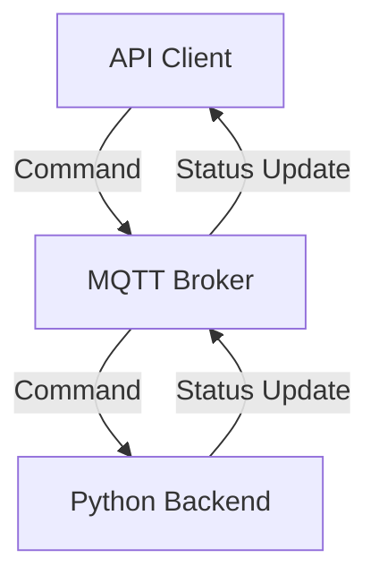

# Planktoscope MQTT API Reference

The MQTT API is the primary programming interface for controlling the PlanktoScope. The API is served by the PlanktoScope's Python backend, and data is sent across the API with the following architecture:



Most messages in the MQTT API are organized according to a request-response pattern in which the API client sends a *command* as a request to take some action, and then the Python backend sends one or more responses as *status updates* about how the Python backend's state has changed as a result of the command:

- **API clients** send commands to the Python backend (via the MQTT broker), and receive status updates from the Python backend (also via the MQTT broker). The PlanktoScope's Node-RED dashboard is an API client, but other programs are also allowed to act as API clients.
- The **MQTT broker** passes commands and status updates between the API client(s) and the Python backend. The MQTT broker runs on the PlanktoScope and accepts connections from API clients on port 1883.
- The **Python backend** handles commands, takes actions (e.g. changing the state of hardware actuators), and publishes status updates both in response to commands and in response to changes in internal state. Currently, parts of the Python backend also act as MQTT API clients to other parts of the Python backend.

Every MQTT message in the PlanktoScope's MQTT API is published on a specific *topic*, which is a slash-delimited path of strings (e.g. `actuator/pump`). Every MQTT message in the PlanktoScope's MQTT API carries a *payload*, which is a JSON object serialized as a string:

- Messages which are commands usually specify the type of command in an `action` field of the payload object; other fields of the payload object are parameters of the command.
- Messages which are status updates have a single field in the payload object, `status`, which is a string containing a status or error message.

In the rest of this reference document, we organize our description of the MQTT API into sections corresponding to distinct functionalities of the Python backend:

## Pump

The Pump API controls the movement of fluid through the PlanktoScope:

- **MQTT topics for commands**: `actuator/pump`
- **MQTT topics for status updates**: `status/pump`
- **Commands**: `move`, `stop`

### `move` command

The `move` command initiates movement of fluid through the PlanktoScope by driving the PlanktoScope pump's stepper motor. For example, this command makes the pump move 10 mL of fluid forwards through the PlanktoScope's fluidic path, at a rate of 1 mL/min:

```json
{
  "action": "move",
  "direction": "FORWARD",
  "volume": 10,
  "flowrate": 1
}
```

The `move` command has the following parameters:

| Field       | Description                                                        | Type   | Accepted Values            |
| ----------- | ------------------------------------------------------------------ | ------ | -------------------------- |
| `action`    | Specifies the `move` command.                                      | string | `move`                     |
| `direction` | Direction to run the pump.                                         | string | `FORWARD`, `BACKWARD`      |
| `volume`    | Total volume of sample to pump before stopping automatically (mL). | float  | 0 < `volume`               |
| `flowrate`  | Speed of pumping (mL/min).                                         | float  | 0 < `flowrate` ≤ 45 mL/min |

#### `move` command responses

The Python backend can send status updates on the `status/pump` topic, in response to the `move` command. The `status` field of such status updates can have any of the following values:

| Status/Error                                | Cause                                                                                                  |
| ------------------------------------------- | ------------------------------------------------------------------------------------------------------ |
| `Started`                                   | The pump has started moving in response to a valid `move` command.                                     |
| `Error, the message is missing an argument` | One or more required parameters (`direction`, `volume`, `flowrate`) are missing in the `move` command. |
| `Error, The flowrate should not be == 0`    | An invalid value (0) was provided for the `flowrate` field.                                            |
| `Done`                                      | The pump has successfully stopped after fully pumping the specified volume of sample.                  |

Note: the MQTT API does not yet completely specify error messages in response to invalid values for the `direction`, `volume`, and `flowrate` parameters.

### `stop` command

The `stop` command interrupts any ongoing movement of fluid through the PlanktoScope and cuts off power to the PlanktoScope pump's stepper motor:

```json
{
  "action": "stop"
}
```

The `stop` command has the following parameters:

| Field    | Description                   | Type   | Accepted Values |
| -------- | ----------------------------- | ------ | --------------- |
| `action` | Specifies the `stop` command. | string | `stop`          |

#### `stop` command responses

The Python backend can send status updates on the `status/pump` topic, in response to the `stop` command. The `status` field of such status updates can have any of the following values:

| Status/Error  | Cause                                                                                                                                                                                        |
| ------------- | -------------------------------------------------------------------------------------------------------------------------------------------------------------------------------------------- |
| `Interrupted` | The pump has stopped moving in response to a valid `stop` command, interrupting any ongoing `move` command.<br />Sent in response to any Pump `stop` command, and any Imager `stop` command. |

### Non-response status updates

The Python backend can send status updates on the `status/pump` topic which are not triggered by any command. The `status` field of such status updates can have any of the following values:

| Status/Error | Cause                                                     |
| ------------ | --------------------------------------------------------- |
| `Ready`      | The backend has become ready to respond to Pump commands. |
| `Dead`       | The backend will no longer respond to Pump commands.      |

## Focus

The Focus API controls the movement of the sample stage focusing motors in the PlanktoScope:

- **MQTT topics for commands**: `actuator/focus`
- **MQTT topics for status updates**: `status/focus`
- **Commands**: `move`, `stop`

### `move` command

The `move` command initiates movement of the focusing stage by a specified displacement. For example, this command makes the stage move up by 0.26 mm at a speed of 1 mm/s:

```json
{
  "action": "move",
  "direction": "UP",
  "distance": 0.26,
  "speed": 1
}
```

The `move` command has the following parameters:

| Field       | Description                                                             | Type   | Accepted Values              |
| ----------- | ----------------------------------------------------------------------- | ------ | ---------------------------- |
| `action`    | Specifies the `move` command.                                           | string | `move`                       |
| `direction` | Direction to move the sample stage.                                     | string | `UP`, `DOWN`                 |
| `distance`  | Total distance to move the stage before stopping automatically (in mm). | float  | 0 < `distance` ≤ 45.0        |
| `speed`     | Speed of movement (in mm/s).<br />Defaults to 5.                        | float  | 0 < `speed` ≤ 5.0 (optional) |

#### `move` command responses

The Python backend can send status updates on the `status/focus` topic in response to the `move` command. The `status` field of such status updates can have any of the following values:

| Status/Error | Cause                                                                              |
| ------------ | ---------------------------------------------------------------------------------- |
| `Started`    | The focusing motors have started moving in response to a valid `move` command.     |
| `Error`      | The `move` command is missing the `distance` and/or `direction` fields.            |
| `Done`       | The focusing motors have successfully stopped after moving the specified distance. |

### `stop` command

The `stop` command interrupts any ongoing movement of the focusing stage and cuts off power to the focusing motors:

```json
{
  "action": "stop"
}
```

The `stop` command has the following parameters:

| Field    | Description                   | Type   | Accepted Values |
| -------- | ----------------------------- | ------ | --------------- |
| `action` | Specifies the `stop` command. | string | `stop`          |

#### `stop` command responses

The Python backend can send status updates on the `status/focus` topic, in response to the `stop` command. The `status` field of such status updates can have any of the following values:

| Status/Error  | Cause                                                                                                                   |
| ------------- | ----------------------------------------------------------------------------------------------------------------------- |
| `Interrupted` | The focusing motors have stopped moving in response to a valid `stop` command, interrupting any ongoing `stop` command. |

### Non-response status updates

The Python backend can send status updates on the `status/focus` topic which are not triggered by any command. The `status` field of such status updates can have any of the following values:

| Status/Error | Description                                                |
| ------------ | ---------------------------------------------------------- |
| `Ready`      | The backend has become ready to respond to Focus commands. |
| `Dead`       | The backend will no longer respond to Focus commands.      |

## Light

The Light API controls the state of the LED lighting system in the PlanktoScope:

- **MQTT topics for commands**: `actuator/light`
- **MQTT topics for status updates**: `status/light`
- **Commands**: `on`, `off`, `status`

### `on` command

The `on` command turns on the sample illumination LED. For example:

```json
{
  "action": "on",
}
```

The `on` command has the following parameters:

| Field    | Description                                        | Type    | Accepted Values |
| -------- | -------------------------------------------------- | ------- | --------------- |
| `action` | Specifies the `on` command.                        | string  | `on`            |

#### `on` command responses

The Python backend can send status updates on the `status/light` topic in response to the `on` command. The `status` field of such status updates can have any of the following values:

| Status/Error            | Cause                                                             |
| ----------------------- | ----------------------------------------------------------------- |
| `On`                    | The LED turned on successfully.                                   |

### `off` command

The `off` command turns off the sample illumination LED. For example:

```json
{
  "action": "off"
}
```

The `off` command has the following parameters:

| Field    | Description                                       | Type    | Accepted Values |
| -------- | ------------------------------------------------- | ------- | --------------- |
| `action` | Specifies the `off` command.                      | string  | `off`           |

#### `off` command responses

The Python backend can send status updates on the `status/light` topic in response to the `off` command. The `status` field of such status updates can have any of the following values:

| Status/Error            | Cause                                                             |
| ----------------------- | ----------------------------------------------------------------- |
| `Off`                   | The LED turned off successfully.                                  |

### `status` command

The `status` command requests the backend to publish the status of the led. For example:

```json
{
  "action": "status"
}
```

The `status` command has the following parameters:

| Field    | Description                                       | Type    | Accepted Values |
| -------- | ------------------------------------------------- | ------- | --------------- |
| `action` | Specifies the `status` command.                   | string  | `status`        |

#### `status` command responses

The Python backend can send status updates on the `status/light` topic in response to the `status` command. The `status` field of such status updates can have any of the following values:

| Status/Error            | Cause                                                             |
| ----------------------- | ----------------------------------------------------------------- |
| `On`                    | The LED turned on successfully.                                   |
| `Off`                   | The LED turned off successfully.                                  |


### Non-response status updates

The Python backend can send status updates on the `status/light` topic which are not triggered by any command. The `status` field of such status updates can have any of the following values:

| Status/Error | Description                                                |
| ------------ | ---------------------------------------------------------- |
| `Ready`      | The backend has become ready to respond to Light commands. |
| `Dead`       | The backend will no longer respond to Light commands.      |

## Imager

The Imager API controls image acquisition with the PlanktoScope's hardware, as well as the PlanktoScope's camera:

- **MQTT topics for commands**: `imager/image`
- **MQTT topics for status updates**: `status/imager`
- **Commands**: `settings`, `update_config`, `image`, `stop`

For details on how images are acquired, refer to our technical reference on [sample imaging](../functionalities/sample-imaging.md) in the PlanktoScope.

Generally, commands should be sent in the following order:

1. `settings` command: Configure the camera settings.
2. `update_config` command: Update the dataset metadata for the next image acquisition.
3. `image` command: Initiate image acquisition.
4. `stop` command: Stop any in-progress image acquisition.

### `settings` command

The `settings` command changes the camera settings. The fields `iso`, `shutter_speed`, `white_balance_gain` and `white_balance` are optional - if a field is omitted, its setting will not be changed. Here's an example of a command with values specified for all fields:

```json
{
  "action": "settings",
  "settings": {
    "iso": 100,
    "shutter_speed": 40,
    "white_balance_gain": { "red": 100, "blue": 100 },
    "white_balance": "auto",
  }
}
```

The `settings` command has the following parameters:

| Parameter                 | Description                                                                 | Type   | Accepted Values                                                                |
| ------------------------- | --------------------------------------------------------------------------- | ------ | ------------------------------------------------------------------------------ |
| `action`                  | Specifies the `settings` command.                                           | string | `settings`                                                                     |
| `iso`                     | Simulated ISO image sensitivity.                                            | int    | 0 < `iso` ≤ 650 (higher values may be accepted for certain cameras) (optional) |
| `shutter_speed`           | Exposure time (in μs).                                                      | int    | 125 ≤ `shutter_speed` (optional)                                               |
| `white_balance_gain.red`  | White balance red gain.                                                     | float  | 0.0 ≤ `white_balance_gain.red` ≤ 32.0 (optional)                               |
| `white_balance_gain.blue` | White balance blue gain.                                                    | float  | 0.0 ≤ `white_balance_gain.blue` ≤ 32.0 (optional)                              |
| `white_balance`           | White balance mode. (`off` specifies the use of manual white balance gains) | string | `auto`, `off` (optional)                                                       |

#### `settings` command responses

The Python backend can send status updates on the `status/imager` topic in response to the `settings` command. The `status` field of such status updates can have any of the following values:

| Status/Error                                   | Cause                                                                          |
| ---------------------------------------------- | ------------------------------------------------------------------------------ |
| `Camera settings updated`                      | The camera settings have been successfully updated.                            |
| `Camera settings error`                        | The settings command is missing required parameters.                           |
| `Iso number not valid`                         | The provided `iso` value is not allowed.                                       |
| `Shutter speed not valid`                      | The provided `shutter_speed` value is not allowed.                             |
| `White balance gain not valid`                 | The provided `white_balance_gain` object is not valid or has an invalid value. |
| `White balance mode {white_balance} not valid` | The provided `white_balance` value is not allowed.                             |

### `update_config` command

The `update_config` command sets/changes the metadata which will be saved with the dataset which to be acquired by the next `image` command. For example:

```json
{
  "action": "update_config",
  "config": {
    "sample_project": "fairscope bzh",
    "sample_id": "fairscope_bzh_estacade",
    "sample_uuid": "uuid-1234",
    "sample_ship": "Fairscope",
    "sample_operator": "jeremy",
    "sample_sampling_gear": "net",
    "sample_concentrated_sample_volume": 70,
    "sample_total_volume": 100,
    "sample_dilution_factor": 10,
    "sample_speed_through_water": "5 knots",
    "sample_instrument": "PlanktoScope v2.6",
    "sample_bottom_depth": "N/A",
    "sample_depth_min": 0.1,
    "sample_depth_max": 0.5,
    "sample_temperature": "N/A",
    "sample_salinity": "N/A",
    "sample_date": "2024-05-15",
    "acq_id": "fairscope_bzh_estacade_2",
    "acq_instrument": "PlanktoScope v2.6",
    "acq_magnification": "1.2",
    "acq_camera_id": "deep-point-8125",
    "acq_camera_lens": "N/A",
    "acq_software": "PlanktoScope v2024.0.0-alpha.1",
    "acq_atlas_id": "N/A",
    "acq_resolution": "1080p",
    "acq_stacks_count": "N/A",
    "acq_time_between_frames": 0.3,
    "acq_brightness": "N/A",
    "acq_contrast": "N/A",
    "acq_sharpness": "N/A",
    "acq_saturation": "N/A",
    "acq_gamma": "N/A",
    "acq_uuid": "acq-uuid-5678",
    "acq_volume": 2.50,
    "acq_imaged_volume": 1.04,
    "acq_minimum_mesh": 300,
    "acq_maximum_mesh": 300,
    "acq_min_esd": 300,
    "acq_max_esd": 300,
    "acq_nb_frame": 500,
    "acq_local_datetime": "2024-05-15T09:00:00Z",
    "acq_caamera_iso": 400,
    "acq_camera_shutter_speed": 500,
    "object_date": "2024-05-15",
    "object_time": "09:00:00Z",
    "object_lat": 48.7273,
    "object_lon": -3.9814,
    "object_depth_min": 0.1,
    "object_depth_max": 0.5,
    "process_pixel": 0.75,
    "process_datetime": "2024-05-15T09:00:00Z",
    "process_id": "Process01",
    "process_uuid": "proc-uuid-7890",
    "process_source": "https://www.github.com/PlanktonPlanet/PlanktoScope",
    "process_commit": "CommitHash",
    "sample_gear_net_opening": 300,
    "object_date_end": "2024-05-15",
    "object_time_end": "10:00:00Z",
    "object_lat_end": 48.7274,
    "object_lon_end": -3.9815
  }
}
```

The metadata should contain comprehensive information about the sample, acquisition process, object details, and processing parameters to ensure accurate tracking and reproducibility of the dataset. The `update_config` command has the following parameters:

Sample information:

| Field                               | Description                 | Type    |
| ----------------------------------- | --------------------------- | ------- |
| `sample_project`                    | Project name.               | string  |
| `sample_id`                         | Sample identifier.          | integer |
| `sample_uuid`                       | Sample UUID.                | string  |
| `sample_ship`                       | Ship name.                  | string  |
| `sample_operator`                   | Operator name.              | string  |
| `sample_sampling_gear`              | Sampling gear description.  | string  |
| `sample_concentrated_sample_volume` | Concentrated sample volume. | float   |
| `sample_total_volume`               | Total volume.               | float   |
| `sample_dilution_factor`            | Dilution factor.            | float   |
| `sample_speed_through_water`        | Speed through water.        | float   |

Acquisition information:

| Field                      | Description                            | Type    |
| -------------------------- | -------------------------------------- | ------- |
| `acq_id`                   | Acquisition identifier.                | integer |
| `acq_instrument`           | Acquisition instrument.                | string  |
| `acq_magnification`        | Magnification level.                   | string  |
| `acq_camera_id`            | Camera identifier.                     | integer |
| `acq_camera_lens`          | Camera lens.                           | string  |
| `acq_software`             | Acquisition software.                  | string  |
| `acq_volume`               | Acquisition volume.                    | float   |
| `acq_imaged_volume`        | Imaged volume.                         | float   |
| `acq_minimum_mesh`         | Minimum mesh size.                     | float   |
| `acq_maximum_mesh`         | Maximum mesh size.                     | float   |
| `acq_min_esd`              | Minimum equivalent spherical diameter. | float   |
| `acq_max_esd`              | Maximum equivalent spherical diameter. | float   |
| `acq_nb_frame`             | Number of frames captured.             | integer |
| `acq_local_datetime`       | Local date and time of acquisition.    | string  |
| `acq_camera_resolution`    | Camera resolution.                     | string  |
| `acq_camera_iso`           | Camera ISO setting.                    | float   |
| `acq_camera_shutter_speed` | Camera shutter speed.                  | float   |

Object information:

| Field              | Description                           | Type   |
| ------------------ | ------------------------------------- | ------ |
| `object_date`      | Date of the object recording.         | string |
| `object_time`      | Time of the object recording.         | string |
| `object_lat`       | Latitude of the sample location.      | float  |
| `object_lon`       | Longitude of the sample location.     | float  |
| `object_depth_min` | Minimum depth of the sample location. | float  |
| `object_depth_max` | Maximum depth of the sample location. | float  |
| `object_date_end`  | End date of the object recording.     | string |
| `object_time_end`  | End time of the object recording.     | string |
| `object_lat_end`   | End latitude of the sample location.  | float  |
| `object_lon_end`   | End longitude of the sample location. | float  |

Processing information:

| Field              | Description                              | Type    |
| ------------------ | ---------------------------------------- | ------- |
| `process_pixel`    | Pixel processing method.                 | string  |
| `process_datetime` | Date and time of processing.             | string  |
| `process_id`       | Processing identifier.                   | integer |
| `process_uuid`     | Processing UUID.                         | string  |
| `process_source`   | Source of processing software or method. | string  |
| `process_commit`   | Commit hash of the software used.        | string  |

#### `update_config` command responses

The Python backend can send status updates on the `status/imager` topic in response to the `update_config` command. The `status` field of such status updates can have any of the following values:

| Status/Error                  | Description                                                                      |
| ----------------------------- | -------------------------------------------------------------------------------- |
| `Config updated`              | The metadata has been successfully updated.                                      |
| `Configuration message error` | The command is missing the required `config` field.                              |
| `Busy`                        | Image acquisition is already in progress, so dataset metadata cannot be changed. |

### `image` command

The `image` command initiates acquisition of one raw image dataset consisting of a specified number of images, via [stop-flow imaging](../functionalities/sample-imaging.md). For example, this command initiates acquisition of 200 images, with 1 mL of sample pumped between each image and an image stabilization period of 0.1 seconds between the end of pumping and the triggering of the image capture for each acquired image:

```json
{
  "action": "image",
  "pump_direction": "FORWARD",
  "volume": 1,
  "nb_frame": 200,
  "sleep": 0.1
}
```

A valid `update_config` command with a unique `(object_date, sample_id, acq_id)` combination must be sent some time before each `image` command. If an `update_config` command has not been sent before the `image` command, the `image` command will trigger a “Started” response status and then do nothing (this is a software bug which needs to be fixed so that an error status is reported instead).

The `image` command has the following parameters:

| Parameter        | Description                                                                                                                      | Type    | Accepted Values        |
| ---------------- | -------------------------------------------------------------------------------------------------------------------------------- | ------- | ---------------------- |
| `pump_direction` | Direction of sample pumping.                                                                                                     | string  | `FORWARD`, `BACKWARD`. |
| `volume`         | Volume (in mL) of sample to pump between each captured image.                                                                    | float   | 0 < `volume`           |
| `nb_frame`       | Number of frames to capture.                                                                                                     | integer | 0 < `nb_frame`         |
| `sleep`          | Duration (in s) to wait after pumping has stopped before saving an image, to allow the sample objects to stabilize in the image. | float   | 0 < `sleep`            |

#### `image` command responses

The Python backend can send status updates on the `status/imager` topic, in response to the `image` command. The `status` field of such status updates can have any of the following values:

| Status/Error                                                       | Description                                                                                                                                         |
| ------------------------------------------------------------------ | --------------------------------------------------------------------------------------------------------------------------------------------------- |
| `Started`                                                          | The image capture process has started successfully.                                                                                                 |
| `Error`                                                            | At least one field of the `image` command is missing or has an invalid value.                                                                       |
| `Error: missing camera`                                            | No camera is available to use for image acquisition.                                                                                                |
| `Configuration update error: object_date is missing!`              | The last time the `update_config` command was sent, it did not have an `object_date` parameter.                                                     |
| `Configuration update error: Chosen id are already in use!`        | The `(object_date, sample_id, acq_id)` combination for the dataset (set by the last `update_config` command) is already used by a previous dataset. |
| `Image {index}/{nb_frame} saved to {filename}`                     | An image has been successfully captured and saved.                                                                                                  |
| `Image {index}/{nb_frame} WAS NOT CAPTURED! STOPPING THE PROCESS!` | An error occurred during image capture; the ongoing image acquisition has finished with failure, resulting in an incomplete dataset.                |
| `Done`                                                             | The image acquisition finished successfully, resulting in a complete dataset.                                                                       |

### `stop` command

This message interrupts any in-progress image acquisition routine and stops any ongoing sample pumping.

```json
{
  "action": "stop"
}
```

The `stop` command has the following parameters:

| Field    | **Description**               | Type   | Accepted Values |
| -------- | ----------------------------- | ------ | --------------- |
| `action` | Specifies the `stop` command. | string | `stop`          |

#### `stop` command responses

The Python backend can send status updates on the `status/imager` topic, in response to the `stop` command. The `status` field of such status updates can have any of the following values:

| Status/Error message | Description                                         |
| -------------------- | --------------------------------------------------- |
| `Interrupted`        | The image capture process was stopped successfully. |

### Non-response status updates

The Python backend can send status updates on the `status/imager` topic which are not triggered by any command. The `status` field of such status updates can have any of the following values:

| Status/Error            | Description                                                                                    |
| ----------------------- | ---------------------------------------------------------------------------------------------- |
| `Starting up`           | The backend will soon attempt to initialize the camera.                                        |
| `Error: missing camera` | A camera was not detected.                                                                     |
| `Ready`                 | The camera is now operational, and the backend has become ready to respond to Imager commands. |
| `Dead`                  | The backend will no longer respond to Imager commands.                                         |

## Segmenter

The Segmenter API controls the processing of acquired images:

- **MQTT topics for commands**: `segmenter/segment`
- **MQTT topics for status updates**: `status/segmenter`, `status/segmenter/object_id`, `status/segmenter/metric`
- **Commands**: `segment`

For details on how images are processed, refer to our technical reference on [image segmentation](../functionalities/segmentation.md) in the PlanktoScope.

### `segment` command

The `segment` command initiates processing of images stored in the specified path, optionally exporting the results to an EcoTaxa-compatible archive. The various `settings` parameters of this command provide control over the behavior of image processing. For example, this command initiates processing of all images in the `/path/to/segment` directory:

```json
{
  "action": "segment",
  "path": "/path/to/segment",
  "settings": {
    "force": false,
    "recursive": true,
    "ecotaxa": true,
    "keep": true
  }
}
```

The `segment` command has the following parameters:

| Parameter              | Description                                                                                                                                                                                                | Type               | **Accepted Values**                                |
| ---------------------- | ---------------------------------------------------------------------------------------------------------------------------------------------------------------------------------------------------------- | ------------------ | -------------------------------------------------- |
| `path`                 | Path to the directory of images to process.<br />Defaults to `/home/pi/data/img`.                                                                                                                          | file path (string) | any subdirectory of `/home/pi/data/img` (optional) |
| `settings`.`force`     | Force re-segmentation of already-processed directories, ignoring the existence of `done` files which otherwise prevent already-segmented directories from being processed again.<br />Defaults to `false`. | boolean            | `true`, `false` (optional)                         |
| `settings`.`recursive` | Process datasets in all subdirectories of `path`.<br />Defaults to `true`.                                                                                                                                 | boolean            | `true`, `false` (optional)                         |
| `settings`.`ecotaxa`   | Export an EcoTaxa-compatible archive.<br />Defaults to `true`.                                                                                                                                             | boolean            | `true`, `false` (optional)                         |
| `settings.keep`        | Keep ROI files generated when exporting an EcoTaxa-compatible archive. It has no effect if `settings.ecotaxa` is `false`.<br />Defaults to `true`.                                                         | boolean            | `true`, `false` (optional)                         |

#### `segment` command responses

The Python backend can send status updates on the `status/segmenter` topic, in response to the `segment` command. The `status` field of such status updates can have any of the following values:

| Status/Error message                                   | Description                                                          |
| ------------------------------------------------------ | -------------------------------------------------------------------- |
| `Started`                                              | The segmentation process has begun.                                  |
| `Busy`                                                 | The segmenter is currently running and cannot update configurations. |
| `Calculating flat`                                     | The frame background is being calculated.                            |
| `Segmenting image %s, image %d/%d`                     | Segmentation of a specific image is in progress.                     |
| `An exception was raised during the segmentation: %s.` | An error occurred during segmentation.                               |
| `Done`                                                 | Processing has finished for the specified datasets.                  |

As the Python backend performs segmentation, it will repeatedly send additional status updates on the `status/segmenter/object_id` topic, once for each object isolated by the segmenter. Each status update is a JSON object with the following fields:

| Field       | Description                  | **Type** |
| ----------- | ---------------------------- | -------- |
| `object_id` | A scikit-image region label. | integer  |

As the Python backend performs segmentation, it will repeatedly send additional status updates on the `status/segmenter/metric` topic, once for each object isolated by the segmenter. Each status update is a JSON object with the following fields:

| Field      | Description                                                                                                                                                               | **Type** |
| ---------- | ------------------------------------------------------------------------------------------------------------------------------------------------------------------------- | -------- |
| `name`     | An object ID, which is a undersctore-delimited concatenation of the name of the raw image which was processed and the object ID reported by `status/segmenter/object_id`. | string   |
| `metadata` | Metadata for the object.                                                                                                                                                  | struct   |

The `metadata` field of status updates sent on the `status/segmenter/metric` topic is an object with the following fields:

| Field                 | Description                                                                                                                       | Type    |
| --------------------- | --------------------------------------------------------------------------------------------------------------------------------- | ------- |
| `label`               | Label of the object.                                                                                                              | integer |
| `width`               | Width of the smallest rectangle enclosing the object.                                                                             | integer |
| `height`              | Height of the smallest rectangle enclosing the object.                                                                            | integer |
| `bx`                  | X coordinate of the top left point of the smallest rectangle enclosing the object.                                                | integer |
| `by`                  | Y coordinate of the top left point of the smallest rectangle enclosing the object.                                                | integer |
| `circ`                | Circularity: (4 ∗ π ∗ Area) / Perimeter^2. A value of 1 indicates a perfect circle, approaching 0 indicates an elongated polygon. | float   |
| `area_exc`            | Surface area of the object excluding holes, in square pixels.                                                                     | integer |
| `area`                | Surface area of the object in square pixels.                                                                                      | integer |
| `%area`               | Percentage of object’s surface area that is comprised of holes.                                                                   | float   |
| `major`               | Primary axis of the best fitting ellipse for the object.                                                                          | float   |
| `minor`               | Secondary axis of the best fitting ellipse for the object.                                                                        | float   |
| `y`                   | Y position of the center of gravity of the object.                                                                                | float   |
| `x`                   | X position of the center of gravity of the object.                                                                                | float   |
| `convex_area`         | The area of the smallest polygon within which all points in the object fit.                                                       | integer |
| `perim`               | The length of the outside boundary of the object.                                                                                 | float   |
| `elongation`          | The result of dividing the `major` parameter by the `minor` parameter.                                                            | float   |
| `perimareaexc`        | The result of dividing the `perim` parameter by the `area_exc` parameter.                                                         | float   |
| `perimmajor`          | The result of dividing the `perim` parameter by the `major` parameter.                                                            | float   |
| `circex`              | (4 ∗ π ∗ area_exc) / perim^2.                                                                                                     | float   |
| `angle`               | Angle between the primary axis and a line parallel to the x-axis of the image.                                                    | float   |
| `bounding_box_area`   | Area of the bounding box enclosing the object.                                                                                    | integer |
| `eccentricity`        | Eccentricity of the object.                                                                                                       | float   |
| `equivalent_diameter` | Diameter of a circle with the same area as the object.                                                                            | float   |
| `euler_number`        | Euler number of the object.                                                                                                       | integer |
| `extent`              | Ratio of object area to bounding box area.                                                                                        | float   |
| `local_centroid_col`  | Column position of the local centroid.                                                                                            | float   |
| `local_centroid_row`  | Row position of the local centroid.                                                                                               | float   |
| `solidity`            | Ratio of object area to convex area.                                                                                              | float   |
| `MeanHue`             | Mean hue value of the object.                                                                                                     | float   |
| `MeanSaturation`      | Mean saturation value of the object.                                                                                              | float   |
| `MeanValue`           | Mean value (brightness) of the object.                                                                                            | float   |
| `StdHue`              | Standard deviation of the hue value of the object.                                                                                | float   |
| `StdSaturation`       | Standard deviation of the saturation value of the object.                                                                         | float   |
| `StdValue`            | Standard deviation of the value (brightness) of the object.                                                                       | float   |

### `stop` command

The `stop` command interrupts any ongoing image processing. For example:

```json
{
  "action": "stop"
}
```

The `stop` command has the following parameters:

| Parameter | Type   | Accepted Values | Description                                |
| --------- | ------ | --------------- | ------------------------------------------ |
| `action`  | string | "stop"          | Specifies the action to stop segmentation. |

!!! warning
    The functionality for this command has not yet been implemented. Currently an `Interrupted` status is sent as a response on the `segmenter/segment` topic even though no interruption will actual happen.

#### `stop` command responses

The Python backend can send status updates on the `segmenter/segment` topic, in response to the `stop` command. The `status` field of such status updates can have any of the following values:

| Status/Error message | Description                               |
| -------------------- | ----------------------------------------- |
| `Interrupted`        | The segmentation process was interrupted. |

### Non-response status updates

The Python backend can send status updates on the `status/segmenter` topic which are not triggered by any command. The `status` field of such status updates can have any of the following values:

| Status/Error | Description                                                    |
| ------------ | -------------------------------------------------------------- |
| `Ready`      | The backend has become ready to respond to Segmenter commands. |
| `Dead`       | The backend will no longer respond to Segmenter commands.      |
