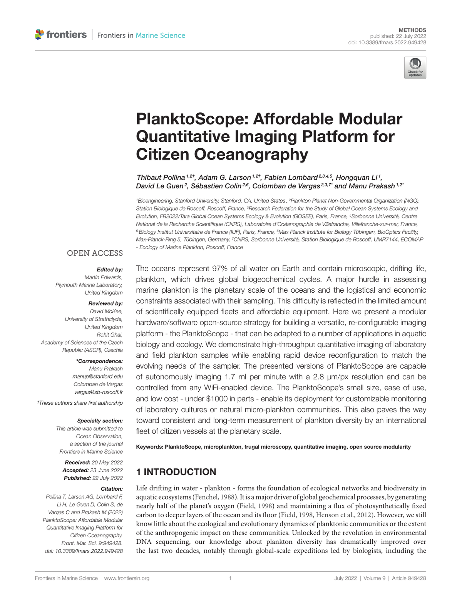

# Research

## PlanktonScope: Affordable modular imaging platform for citizen oceanography

|            |                                                                                                                 |
| ---------- | --------------------------------------------------------------------------------------------------------------- |
| **Author** | Thibaut Pollina, Adam G. Larson, Fabien Lombard, Hongquan Li, Sebastien Colin, Colomban de Vargas, Manu Prakash |
| **Date**   | 23 April 2020                                                                                                   |
| **DOI**    | <https://doi.org/10.1101/2020.04.23.056978>                                                                     |

## Plankton Planet: ‘seatizen’ oceanography to assess open ocean life at the planetary scale

|            |                                                                                                                                                                                                                                                                                                                                                                                                                                                                                   |
| ---------- | --------------------------------------------------------------------------------------------------------------------------------------------------------------------------------------------------------------------------------------------------------------------------------------------------------------------------------------------------------------------------------------------------------------------------------------------------------------------------------- |
| **Author** | Colomban de Vargas, Thibaut Pollina, Sarah Romac, Noan Le Bescot, Nicolas Henry, Calixte Berger, Sébastien Colin, Nils Haëntjens, Margaux Carmichael, David Le Guen, Johan Decelle, Frédéric Mahé, Emmanuel Malpot, Carole Beaumont, Michel Hardy, the planktonauts, the Plankton Planet team, Damien Guiffant,Ian Probert, David F. Gruber, Andy Allen, Gabriel, Gorsky, Mick Follows, Barry B. Cael, Xavier Pochon, Romain Troublé, Fabien Lombard, Emmanuel Boss, Manu Prakash |
| **Date**   | 01 September 2020                                                                                                                                                                                                                                                                                                                                                                                                                                                                 |
| **DOI**    | <https://doi.org/10.1101/2020.08.31.263442>                                                                                                                                                                                                                                                                                                                                                                                                                                       |

## PlanktoScope: Affordable Modular Quantitative Imaging Platform for Citizen Oceanography

|            |                                                                                                                              |
| ---------- | ---------------------------------------------------------------------------------------------------------------------------- |
| **Author** | Thibaut Pollina, Adam G. Larson, Fabien Lombard, Hongquan Li,David Le Guen, Sébastien Colin, Colomban de Vargas,Manu Prakash |
| **Date**   | 22 July 2022                                                                                                                 |
| **DOI**    | <https://doi.org/10.3389/fmars.2022.949428>                                                                                  |

