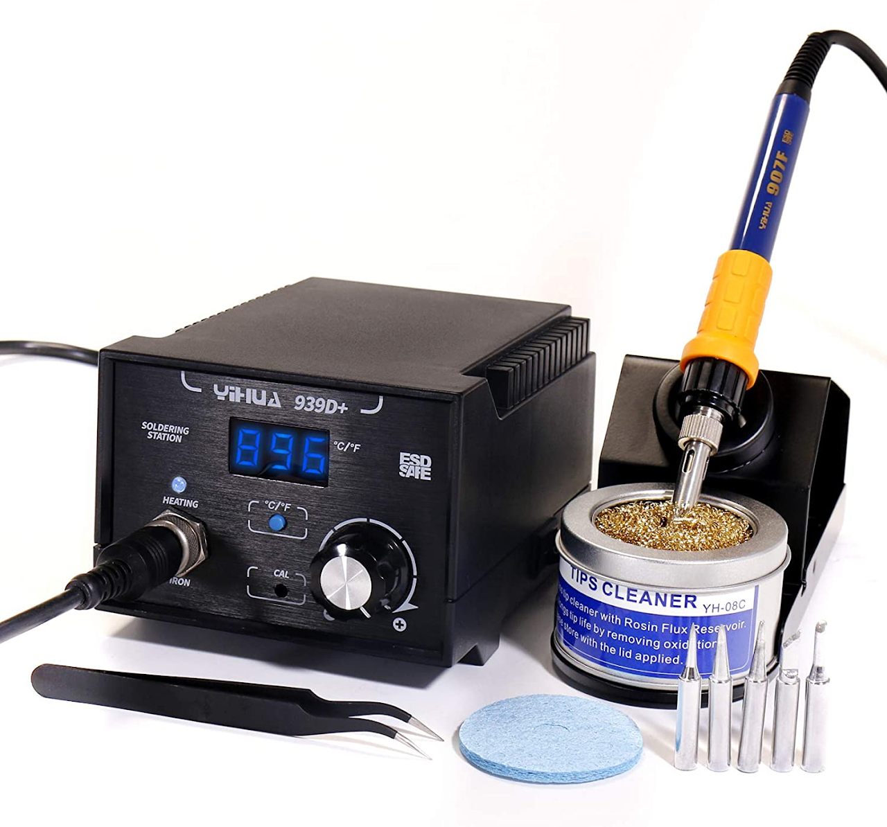
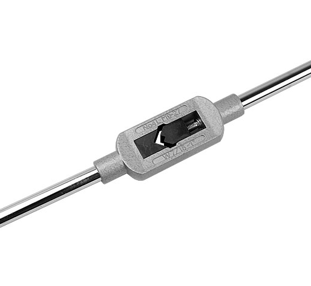
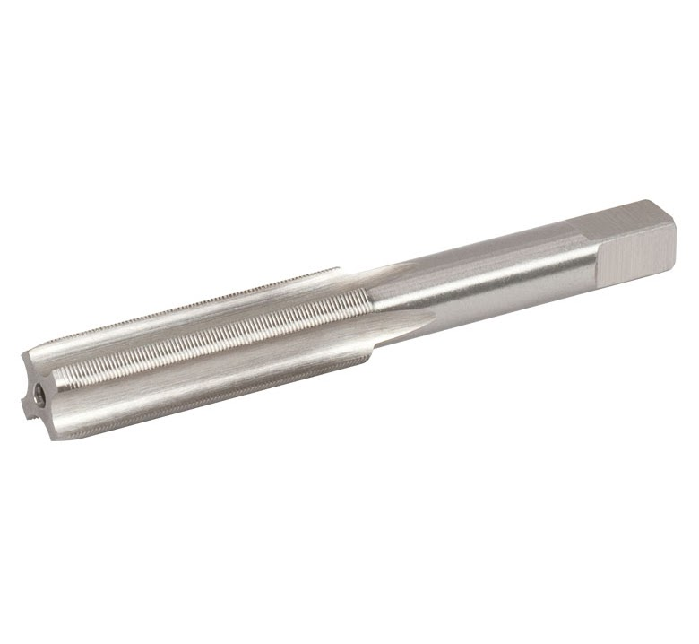
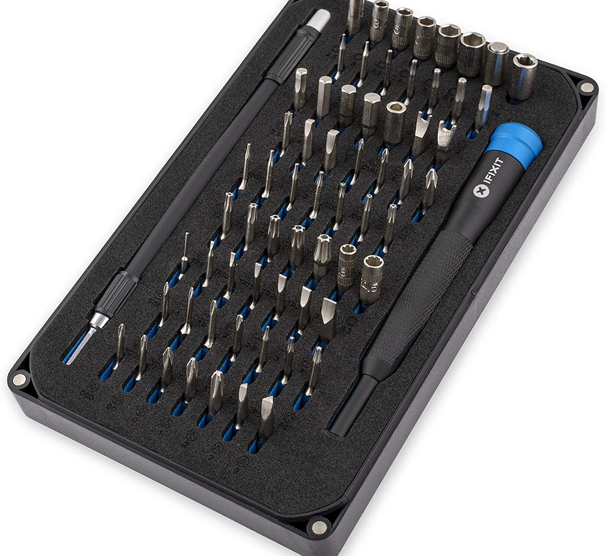

# Kit Manufacturing

## Needed tools

The components of the PlanktoScope are available from many vendors, online and otherwise. You will need a few tools, but the construction is straightforward and should take a few hours to complete. We have detailed guides on the website for both hardware and software assembly. The PlanktoScope community is also here to help in any way we can.

### Soldering station

|  |  |  |  |
| --------------------- | -------------------------------------------------------- | ------------------------------------------------------------------------------------------------------------------------------------------------------------------------------------------------------------------------------- | ------------------------------------------------------------------------------------------------------------------------------------------------------------------------------------------------------------------------------ |
| **Soldering station** | **Tap wrench**                                           | **M12 x 0.5 Tap**                                                                                                                                                                                                               | **Screwdriver kit**                                                                                                                                                                                                            |
| Soldering station with flux, or flux core solder, will be used to make a few electrical connections. | Any tap wrench compatible with the M12x0.5 tap will work | A M12x0.5 tap will be used to secure the objective and tube lenses                                                                                                                                                              | A screwdriver kit with multiple drivers will make many of the operations straightforward                                                                                                                                       |

## Kit composition

Now divide all the components for the kit, and pack it in the hard case. You can find the full list of components for the kit in the v2.5 hardware [BOM (Bill of Materials)](../../../../assets/hardware/v2.5/bom.csv). However, this BOM does not include ordering links, since such links will need to be different for each country. If you've customized the v2.5 hardware BOM for your own v2.5 PlanktoScope kit (e.g. by finding and adding part ordering links from suppliers in your country for each component), please share your custom BOM to our GitHub Discussions thread for [v2.5 Localized Hardware BOMs](https://github.com/PlanktoScope/PlanktoScope/discussions/297), so that other members of our community can learn from your work!
