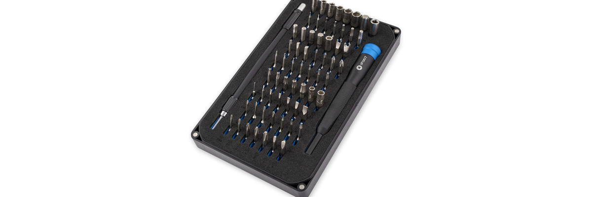
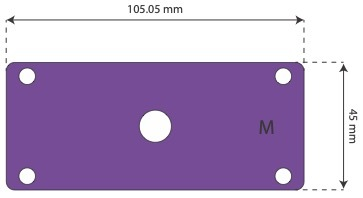

# Kit Production

## Required Tools

Building the PlanktoScope involves components that can be sourced from various vendors, both online and locally. The assembly process is straightforward and can be completed within a few hours. Our website offers detailed guides for both hardware and software assembly, and the PlanktoScope community is ready to assist you with any questions or issues.

### Soldering Station

A soldering station with flux, or flux core solder, is necessary for making a few electrical connections. [Purchase here](https://www.amazon.com/YIHUA-Professional-Digital-Soldering-Station/dp/B07RVMZNYR/ref=sr_1_2_sspa?dchild=1&keywords=soldering+station&qid=1586915432&sr=8-2-spons&psc=1&spLa=ZW5jcnlwdGVkUXVhbGlmaWVyPUFMTFRXTTFZU1pLVyZlbmNyeXB0ZWRJZD1BMDY0MzQ2NzhESkM0Rkw1V1RHUCZlbmNyeXB0ZWRBZElkPUEwOTc3MzExMUw2VDJQS01DTDE4SiZ3aWRnZXROYW1lPXNwX2F0ZiZhY3Rpb249Y2xpY2tSZWRpcmVjdCZkb05vdExvZ0NsaWNrPXRydWU=).

### Tap Wrench

Any tap wrench compatible with the M12x0.5 tap will work. [Purchase here](https://www.fine-tools.com/windeisen.html).

### M12 x 0.5 Tap

An M12x0.5 tap is required to secure the objective and tube lenses. [Purchase here](https://www.thorlabs.com/thorproduct.cfm?partnumber=TAPM1205).

### Screwdriver Kit

A screwdriver kit with multiple drivers simplifies many assembly operations. [Purchase here](https://www.ifixit.com/Store/Tools/Mako-Driver-Kit--64-Precision-Bits/IF145-299?o=4).

## Required Components

Below is a comprehensive list of components required to build the PlanktoScope V2.1, along with links to purchase them in both the US and France.

### Electronic Components
| Quantity | Name | Details | US Link | FR Link |
|----------|------|---------|---------|---------|
| 1 | Raspberry Pi 4 B (4GB) | The single board computer from Raspberry Pi with 4GB of memory | [Amazon US](https://www.amazon.com/gp/product/B07TC2BK1X/ref=ppx_yo_dt_b_asin_title_o01_s03?ie=UTF8&psc=1) | [DigiKey FR](https://www.digikey.fr/product-detail/fr/raspberry-pi/RASPBERRY-PI-4B-4GB/1690-RASPBERRYPI4B-4GB-ND/10258781) |
| 1 | Adafruit Stepper Motor HAT | Controls 2 steppers: focus and pump stepper motors | [Amazon US](https://www.amazon.com/Adafruit-Stepper-Motor-HAT-Raspberry/dp/B00TIY5JM8/ref=sr_1_5?dchild=1&keywords=Adafruit+Stepper+Motor+HAT&qid=1587251009&sr=8-5) | [Amazon FR](https://www.amazon.fr/Adafruit-Stepper-Motor-HAT-Raspberry/dp/B00TIY5JM8/ref=sr_1_1_sspa?__mk_fr_FR=%C3%85M%C3%85%C5%BD%C3%95%C3%91&keywords=Adafruit+DC+%26+Stepper+Motor+HAT&qid=1576835640&sr=8-1-spons&psc=1&spLa=ZW5jcnlwdGVkUXVhbGlmaWVyPUExSlAwNVpCT0s3QzA5JmVuY3J5cHRlZElkPUEwNDMxNDcxMTM5S0NZTUUyMDNRNiZlbmNyeXB0ZWRBZElkPUEwOTA4NDE2MzVSWFdENFJGTTBQJndpZGdldE5hbWU9c3BfYXRmJmFjdGlvbj1jbGlja1JlZGlyZWN0JmRvTm90TG9nQ2xpY2s9dHJ1ZQ==) |
| 1 | Adafruit Ultimate GPS HAT | Stores date & time and logs GPS coordinates | [Amazon US](https://www.amazon.com/Adafruit-Ultimate-GPS-Raspberry-Mini/dp/B00S7FAJC4/ref=sr_1_3?dchild=1&keywords=Adafruit+Ultimate+GPS+HAT&qid=1586918850&s=electronics&sr=1-3) | [DigiKey FR](https://www.digikey.fr/product-detail/fr/adafruit-industries-llc/1272/1528-1045-ND/5011061) |
| 1 | Yahboom Cooling Fan HAT | Cools and provides visual feedback with LEDs | [Amazon US](https://www.amazon.com/Yahboom-Intelligent-Temperature-Programmable-Light%EF%BC%88Quiet%EF%BC%89/dp/B085RMLFCL/ref=sr_1_1?dchild=1&keywords=Yahboom+Cooling+Fan+Hat&qid=1586919054&s=electronics&sr=1-1) | [Kubii FR](https://www.kubii.fr/cartes-extension-cameras-raspberry-pi/2935-hat-de-refroidissement-raspberry-pi-avec-ventilateur-et-ecran-oled-3272496301313.html) |
| 1 | Hammer Header Male 2x20 | Only one needed | [Amazon US](https://www.amazon.com/Adafruit-Break-away-2x20-pin-Header-ADA2822/dp/B01BT4MZ8U/ref=sr_1_1?dchild=1&keywords=Adafruit+Hammer+Header+Male&qid=1586922098&s=electronics&sr=1-1) | [Mouser FR](https://www.mouser.fr/ProductDetail/TE-Connectivity/7-146256-0?qs=%2FDIRsAb2rQVdgdelqxc%2FCQ%3D%3D) |
| 1 | Stacking Header 2x20 | Only one needed | [Amazon US](https://www.amazon.com/ELEDIY-20%EF%BC%8840-Stacking-Header-Raspberry/dp/B071XCHZNB/ref=sr_1_4?dchild=1&keywords=Adafruit+GPIO+Stacking+Header&qid=1586921849&s=electronics&sr=1-4) | [Mouser FR](https://www.mouser.fr/ProductDetail/485-1979) |
| 2 | Pitch IDC Sockets 2x20 | Two needed | [Amazon US](https://www.amazon.com/gp/product/B00K2NTSJE/ref=ppx_yo_dt_b_asin_title_o09_s00?ie=UTF8&psc=1) | [Mouser FR](https://www.mouser.fr/ProductDetail/710-61204023021) |
| 10cm | GPIO Ribbon IDC 40P | Only 10 cm needed | [Amazon US](https://www.amazon.com/dp/B0762XXV62/ref=sspa_dk_detail_1?pd_rd_i=B07B8M59QS&pd_rd_w=yO5Oq&pf_rd_p=48d372c1-f7e1-4b8b-9d02-4bd86f5158c5&pd_rd_wg=AanvW&pf_rd_r=2XEDJQ84BXEEVR48SS74&pd_rd_r=3f9634ba-f40a-47d2-a350-91901b378c81&spLa=ZW5jcnlwdGVkUXVhbGlmaWVyPUFDWjFIWDJIM1VWOVQmZW5jcnlwdGVkSWQ9QTA5OTg2MjUxWUlOTktZWk9XN0ZIJmVuY3J5cHRlZEFkSWQ9QTA3MDA2NTQxUkI5NzdISUVETkk2JndpZGdldE5hbWU9c3BfZGV0YWlsJmFjdGlvbj1jbGlja1JlZGlyZWN0JmRvTm90TG9nQ2xpY2s9dHJ1ZQ&th=1) | [Amazon FR](https://www.amazon.fr/sourcingmap%C2%AE-long-broche-conducteurs-c%C3%A2ble/dp/B0197X1XH4/ref=sr_1_11?__mk_fr_FR=%C3%85M%C3%85%C5%BD%C3%95%C3%91&dchild=1&keywords=nappe+IDC+40&qid=1617702029&s=electronics&sr=1-11) |
| 1 | Flex Cable for Pi Camera | Longer flex cable needed | [Amazon US](https://www.amazon.com/A1-FFCs-Black-Raspberry-Camera/dp/B07J68TJ7L/ref=sr_1_3?dchild=1&keywords=pi+camera+cable&qid=1586918364&sr=8-3) | [Amazon FR](https://www.amazon.fr/AZDelivery-Remplacement-cam%C3%A9ra-Raspberry-arduino/dp/B01N5RS4R2/ref=sr_1_3_sspa?__mk_fr_FR=%C3%85M%C3%85%C5%BD%C3%95%C3%91&dchild=1&keywords=pi+camera+cable&qid=1617703909&sr=8-3-spons&psc=1&smid=A1X7QLRQH87QA3&spLa=ZW5jcnlwdGVkUXVhbGlmaWVyPUEySlVFWlJVOUU5SEJNJmVuY3J5cHRlZElkPUEwOTY1OTYyMjY0MTc2SkpQNktWTCZlbmNyeXB0ZWRBZElkPUEwMTk1NDI1WjI1NE9HWkdYVjlEJndpZGdldE5hbWU9c3BfYXRmJmFjdGlvbj1jbGlja1JlZGlyZWN0JmRvTm90TG9nQ2xpY2s9dHJ1ZQ==) |
| 1 | DC Power Jack Socket | Only one needed | [Amazon US](https://www.amazon.com/gp/product/B07XMG27K3/ref=ppx_yo_dt_b_asin_title_o05_s01?ie=UTF8&psc=1) | [Amazon FR](https://www.amazon.fr/HSeaMall-connecteur-dalimentation-capuchon-antipoussi%C3%A8re/dp/B07D4F15Y4/ref=sr_1_9_sspa?__mk_fr_FR=%C3%85M%C3%85%C5%BD%C3%95%C3%91&dchild=1&keywords=DC+POWER+JACK+SOCKET+5.5x2.1MM&qid=1617702158&s=computers&sr=1-9-spons&psc=1&spLa=ZW5jcnlwdGVkUXVhbGlmaWVyPUFLWjdVMlVVNUpTTUEmZW5jcnlwdGVkSWQ9QTA0MDc0MjIyTlc0Q0RaRUJKTUI2JmVuY3J5cHRlZEFkSWQ9QTA0NjY3NDQzNEg1WFJJU0lKQzQ3JndpZGdldE5hbWU9c3BfbXRmJmFjdGlvbj1jbGlja1JlZGlyZWN0JmRvTm90TG9nQ2xpY2s9dHJ1ZQ==) |
| 1 | GPS Active Antenna | Includes uPF to SMA adapter | [Amazon US](https://www.amazon.com/Waterproof-Active-Antenna-28dB-3-5VDC/dp/B00LXRQY9A/ref=sr_1_1_sspa?dchild=1&keywords=GPS+Antenna&qid=1586918954&s=electronics&sr=1-1-spons&psc=1&spLa=ZW5jcnlwdGVkUXVhbGlmaWVyPUFQQkM0ODVQMEczNE8mZW5jcnlwdGVkSWQ9QTA1ODI4NjQxRDgxQTZROTVSTlZJJmVuY3J5cHRlZEFkSWQ9QTAzMzEyNDMySUNJT0FEU1FXTUdBJndpZGdldE5hbWU9c3BfYXRmJmFjdGlvbj1jbGlja1JlZGlyZWN0JmRvTm90TG9nQ2xpY2s9dHJ1ZQ==) | [Amazon FR](https://www.amazon.fr/Antenne-GPS-connecteur-Automatique-Navigation/dp/B08XW713NQ/ref=sr_1_7?__mk_fr_FR=%C3%85M%C3%85%C5%BD%C3%95%C3%91&dchild=1&keywords=gps+antenna&qid=1617701701&s=electronics&sr=1-7) |
| 1 | Micro HDMI Cable | Optional, for development purposes | [Amazon US](https://www.amazon.com/gp/product/B07TTKD38N/ref=ppx_yo_dt_b_asin_title_o04_s00?ie=UTF8&psc=1) | [Amazon FR](https://www.amazon.fr/ANNNWZZD-Extended-Support-Ethernet-Compatible/dp/B08VGFY1KD/ref=sr_1_1_sspa?__mk_fr_FR=%C3%85M%C3%85%C5%BD%C3%95%C3%91&crid=1FS0UQ7NLP4ZC&dchild=1&keywords=micro+hdmi+cable&qid=1617703947&s=electronics&sprefix=Micro+HDMI+Cable%2Celectronics%2C254&sr=1-1-spons&psc=1&spLa=ZW5jcnlwdGVkUXVhbGlmaWVyPUExMUwxWjQzRFVQNzFXJmVuY3J5cHRlZElkPUEwNTE0ODUyQjlXM0VKTlc4NkZUJmVuY3J5cHRlZEFkSWQ9QTA0Mzk5NTJCVzRKNzQzU1IyVjQmd2lkZ2V0TmFtZT1zcF9hdGYmYWN0aW9uPWNsaWNrUmVkaXJlY3QmZG9Ob3RMb2dDbGljaz10cnVl) |
| 1 | Power Supply 3A (USB) | Needs to provide 3A 5V | [Amazon US](https://www.amazon.com/Anker-PowerPort-Compatible-Qualcomm-Certified/dp/B077HFFLMS/ref=sr_1_5?dchild=1&keywords=usb+adapter+3a&qid=1587249672&sr=8-5) | [Amazon FR](https://www.amazon.fr/gp/product/B082VWY43H/ref=ppx_yo_dt_b_asin_title_o01_s00?ie=UTF8&psc=1) |
| 1 | Power Supply 1A (USB) | Needs to provide 1A 5V | [Amazon US](https://www.amazon.com/Certified-Charger-Universal-Portable-Adapter/dp/B017TXGM4I/ref=sr_1_3?dchild=1&keywords=usb+adapter+1a&qid=1587250077&sr=8-3) | [Mouser FR](https://www.mouser.fr/ProductDetail/490-SWI5-5-E-I38) |
| 1 | USB Type-C to USB-A 2.0 | To power the Raspberry Pi | [Amazon US](https://www.amazon.com/AmazonBasics-Type-C-USB-Male-Cable/dp/B01GGKYN0A/ref=sr_1_8?dchild=1&keywords=usb+c+cable&qid=1587249955&sr=8-8) | [Amazon FR](https://www.amazon.fr/gp/product/B082VWY43H/ref=ppx_yo_dt_b_asin_title_o01_s00?ie=UTF8&psc=1) |
| 1 | USB 5v to DC 12v Step Up | Make sure this USB 5V / DC 12V step up converter limits the current at 0.8A | [Amazon US](https://www.amazon.com/gp/product/B01ID90K4A/ref=ppx_yo_dt_b_asin_title_o03_s01?ie=UTF8&psc=1) | [Amazon FR](https://www.amazon.fr/gp/product/B075D845XT/ref=ppx_yo_dt_b_asin_title_o06_s00?ie=UTF8&psc=1) |
| 1 | Maschinenreich peristaltic pump 12V XP88-ST01 | This pump can be replaced by others depending on its availability | [Amazon US](https://www.amazon.com/Peristaltic-Metering-Stepper-Motor-0-88mL/dp/B01LY35CKH/ref=sr_1_2?keywords=Peristaltic+Metering+Pump+with+Stepper+Motor&qid=1576836929&sr=8-2) | |
| 2 | Linear Stepper Motor | Make sure to select two linear stepper | [Amazon US](https://www.amazon.com/Stepper-D8-MOTOR80-Moving-Engraving-Machine/dp/B07VHRQV22/ref=sr_1_1?keywords=dc+12v+driver+stepper+motor+screw+with+linear+nut+slider&qid=1575514331&sr=8-1) | |
| 1 | MicroSD Card + Adapter | Minimum size is 32GB | [Amazon US](https://www.amazon.com/Kingston-32GB-microSDHC-Class10-SDCS2/dp/B07YGZ7FY7/ref=sr_1_13?dchild=1&keywords=micro+SD&qid=1586918665&sr=8-13) | [Amazon FR](https://www.amazon.fr/gp/product/B07FCMKK5X/ref=ppx_yo_dt_b_asin_title_o07_s00?ie=UTF8&psc=1) |
| 1 kit | Heat sink kit for Raspberry Pi | Only one kit needed | [Amazon US](https://www.amazon.com/Raspberry-Heatsink-Conductive-Adhesive-Aluminum/dp/B07YR6M6F6/ref=sr_1_2_sspa?keywords=HeatSink+Raspberry+Pi+4&qid=1584566386&s=industrial&sr=1-2-spons&swrs=82AED37946BDCA54A5AB5A0FD5F631BA&psc=1&spLa=ZW5jcnlwdGVkUXVhbGlmaWVyPUExWUw5OUlaUEI2Q1ZaJmVuY3J5cHRlZElkPUEwMzcxMjM4MTE0TTM5MTVIVzIxMCZlbmNyeXB0ZWRBZElkPUEwNzA4MDUwMkpDVlY2SVlWUlVUSyZ3aWRnZXROYW1lPXNwX2F0ZiZhY3Rpb249Y2xpY2tSZWRpcmVjdCZkb05vdExvZ0NsaWNrPXRydWU=) | [Mouser FR](https://www.mouser.fr/ProductDetail/713-110991327) |

### Fluidic Components
| Quantity | Name | Details | US Link | FR Link |
|----------|------|---------|---------|---------|
| 1 kit | µ-Slide I Luer Variety Pack | Make sure to select uncoated | [Ibidi US](https://ibidi.com/channel-slides/51--slide-i-luer-variety-pack.html#/26-surface_modification-uncoated_15_polymer_coverslip_hydrophobic_sterilized/60-channel_height-variety_pack_4_times_each_channel_height_02_04_06_08_mm/61-pcs_box-16) | [Ibidi FR](https://ibidi.com/channel-slides/50--slide-i-luer.html#/26-surface_modification-uncoated_15_polymer_coverslip_hydrophobic_sterilized/33-pcs_box-15/56-channel_height-02_mm) |
| 2 | HSW 20ml Syringe | Two syringes needed | [Grainger US](https://www.grainger.com/product/NORM-JECT-All-Plastic-Syringe-19G343) | [Darwin Microfluidics FR](https://darwin-microfluidics.com/products/bd-plastipak-luer-syringes?variant=32556663865480) |
| 1 kit | ÜberStrainer Set 3 | Optional strainer kit to filter the samples | [Pluriselect US](https://www.pluriselect.com/us/products/cell-strainer/uberstrainer/uberstrainer-set-3.html) | |
| 1m | Silicone Tubing ID 1.6mm | Ibidi website provides good but expensive tubing | [Ibidi US](https://ibidi.com/flow-accessories/76-silicone-tubing.html#/73-inner_diameter-16_mm) | [Darwin Microfluidics FR](https://darwin-microfluidics.com/collections/silicone-tygon-tubing/products/tygon-s3-e-3603-tubing?variant=37064132952228) |
| 2 | Luer Lock Connector Female 1.6 mm | Make sure to select the proper diameter | [Ibidi US](https://ibidi.com/flow-accessories/71-luer-lock-connector-female.html) | [Darwin Microfluidics FR](https://darwin-microfluidics.com/collections/luer-fittings/products/barbed-to-female-luer-adapter-for-1-16-1-8-and-3-32-id-soft-walled-tubing-pack-of-10?variant=32430390018184) |
| 2 | Luer Connector Male 1.6 mm | Make sure to select the proper diameter | [Ibidi US](https://ibidi.com/flow-accessories/69-luer-connector-male.html) | [Darwin Microfluidics FR](https://darwin-microfluidics.com/collections/barbed-fittings/products/barbed-to-male-luer-slip-adapter-pack-of-10) |

### Optic Components
| Quantity | Name | Details | US Link | FR Link |
|----------|------|---------|---------|---------|
| 1 | LED white 5mm | Intensity: 23,000 mcd, Forward Voltage: 3.5V, Current: 20mA, Beam Angle: 15° | [DigiKey US](https://www.digikey.com/en/products/detail/lite-on-inc/LTW-2S3D8/2666499) | [Gotronic FR](https://www.gotronic.fr/art-led-5-mm-ltw2s-25985.htm) |
| 1 kit | Arducam M12 Lens Kit | Includes 10 M12 Lenses for various angles of view | [Amazon US](https://www.amazon.com/Arducam-Distortion-Lenses-Arduino-Raspberry/dp/B07L92S9MT/ref=sr_1_4?dchild=1&keywords=arducam%2Bm12&qid=1586921063&sr=8-4&th=1) | |
| 1 | M12 Lens 25mm IR 1/2" 5MP | Additional essential 25mm M12 lens | [Amazon US](https://www.amazon.com/Zerone-Million-Security-Firefly-Cameras/dp/B07MNT1ZK2/ref=sr_1_2?dchild=1&keywords=m12+25mm&qid=1586921129&s=electronics&sr=1-2) | [AliExpress](https://aliexpress.com/item/5Megapixel-M12-Fixed-1-2-inch-25mm-CCTV-Lens-Long-Distance-View-For-1080P-4MP-5MP/32463065187.html?spm=a2g0s.9042311.0.0.3c246c37P1OzlZ) |
| 1 | Pi Camera v2.1 | | [Amazon US](https://www.amazon.com/Raspberry-Pi-Camera-Module-Megapixel/dp/B01ER2SKFS/ref=sr_1_4?dchild=1&keywords=pi+camera&qid=1586918212&sr=8-4) | |

### Hardware Components
| Quantity | Name | Details | US Link | FR Link |
|----------|------|---------|---------|---------|
| 1 | M2.5 Standoff Assortment Kit | 6mm and 15mm standoffs | [Amazon US](https://www.amazon.com/gp/product/B07MW5P8JH/ref=ppx_yo_dt_b_asin_title_o03_s00?ie=UTF8&psc=1) | |
| 1 | M2 M3 M4 Screw Assortment Kit | M2x8mm and M3x12mm screws and M3 nuts | [Amazon US](https://www.amazon.com/Washers-1200PCS-Sutemribor-Assortment-Wrenches/dp/B07H4MG7TC/ref=sr_1_2?dchild=1&keywords=M2+M3+M4+Screw+Assortment+Kit&qid=1587252379&s=industrial&sr=1-2) | |
| 1 | CR1220 Battery | For the Adafruit Ultimate GPS HAT | [Amazon US](https://www.amazon.com/Maxell-Lithium-Batteries-hologram-packaging/dp/B00N203RN2/ref=sr_1_15?dchild=1&keywords=CR1220&qid=1586923220&sr=8-15) | [Amazon FR](https://www.amazon.fr/gp/product/B06XQ1C5TN/ref=ppx_yo_dt_b_asin_title_o07_s01?ie=UTF8&psc=1) |
| 16 | Magnets 6 x 2 mm | Neodynium magnets to connect functional layers | [Amazon US](https://www.amazon.com/Refrigerator-Projects-Whiteboards-Strongest-Available/dp/B07CVPC3YJ/ref=sr_1_1?dchild=1&keywords=magnet+6mm+diameter&qid=1586922860&sr=8-1) | |

## Machine Your Structure

To complete your PlanktoScope kit, you'll need to fabricate the structure. This can be done using laser cutting or CNC machining from a sheet of material. You can machine the structure locally at a FabLab or through a company specializing in laser cutting or CNC machining. The cost will vary depending on the material chosen and whether you machine it yourself or use a company.

### Suggested Materials

| Material                  | Easy to Machine | Robustness | Water Resistance | Price | Recyclable | Ideal For                              |
|---------------------------|-----------------|------------|------------------|-------|------------|---------------------------------------|
| **Transparent Acrylic**   | ★★★★★           | ★☆☆☆☆      | ★★★★★            | ★★☆☆☆ | ☆☆☆☆☆      | Seeing internal electronics            |
| **Black Acrylic**         | ★★★★★           | ★★☆☆☆      | ★★★★★            | ★★★☆☆ | ☆☆☆☆☆      | Removing surrounding light             |
| **Marine Plywood**        | ★★★★☆           | ★★★★☆      | ★★★★☆            | ★★★★☆ | ★☆☆☆☆      | Deploying at sea                       |
| **Basic Plywood**         | ★★★☆☆           | ★★☆☆☆      | ★★☆☆☆            | ★☆☆☆☆ | ★★☆☆☆      | Cheap prototyping                      |
| **HDF Forescolor**        | ★★★★★           | ★★★★☆      | ★★★☆☆            | ★★★☆☆ | ★★★★★      | Feeling good about recycling           |
| **PP Waste, 100% Recycled** | ☆☆☆☆☆          | ☆☆☆☆☆      | ☆☆☆☆☆            | ★★★★☆ | ★★★★★      | Feeling good about recycling           |
| **Aluminum**              | ★★★★★           | ★★★★★      | ★★★★★            | ★★★★★ | ★★★★★      | Robust professional setup              |

### Get the Plan and Machine It

You can download the necessary fabrication patterns for the structure here; two versions are available, one for material with 5 mm thickness, and the other for material with 1/4 inch thickness:

- 5 mm thickness: [SVG file](../../../../assets/hardware/v2.1/case/PlanktoScope-Case-5mm.svg) (recommended), [DXF file](../../../../assets/hardware/v2.1/case/PlanktoScope-Case-5mm.dxf)
- 1/4 inch thickness: [DXF file](../../../../assets/hardware/v2.1/case/PlanktoScope-Case-0.25in.dxf)

Since DXF files don't include unit information, when you open or import one of these DXF files you may need to rescale all dimensions to achieve the correct sizes. You can check whether dimensions are correct by checking the length and width of part M against the actual dimensions shown below:

You can also compare the approximate dimensions of parts in the SVG file (for 5 mm thickness material) with the sizes of parts in your imported DXF file to check whether the rescaling result looks approximately correct.
