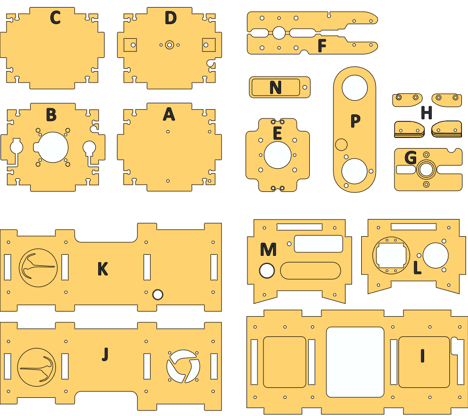
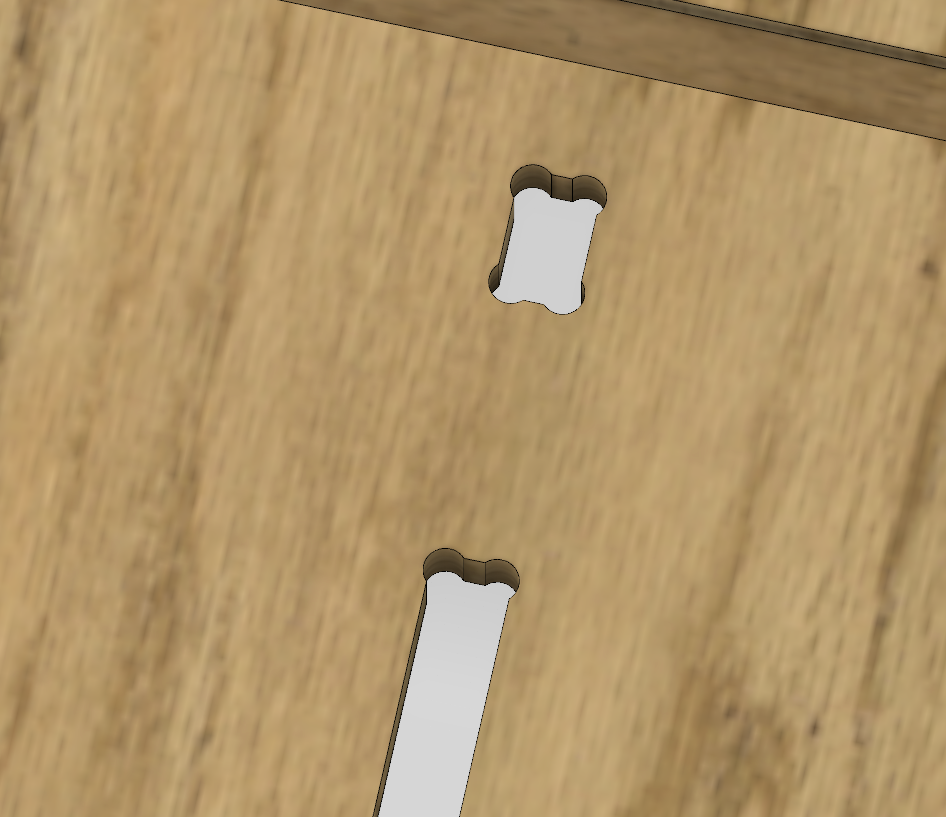
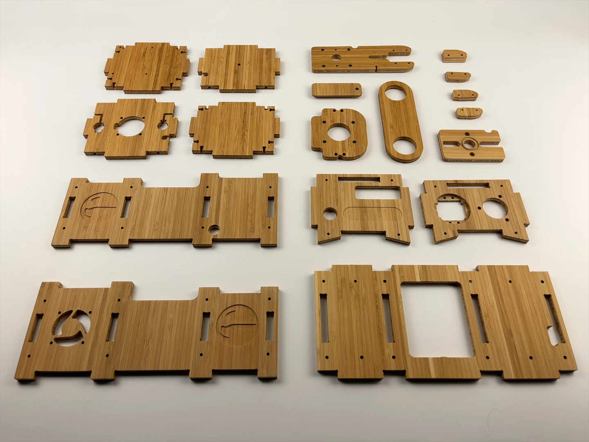

# Kit Production
## Kit Composition
In this section you will go through all the steps to supply and create your PlanktoScope kit.
You can find a list of the components needed in the [Planktoscope V2.6 BOM](../../../../assets/hardware/v2.6/Planktoscope V2.6 BOM.xlsx).

| Files                                                                                | Description                       |
|--------------------------------------------------------------------------------------|-----------------------------------|
| [Planktoscope V2.6 BOM](../../../../assets/hardware/v2.6/Planktoscope V2.6 BOM.xlsx) | Bill Of Material for PlanktoScope |

We tried to have the most easy-to-supply components, you still may have to adapt and research for new suppliers according to product availability and your location.
If you find some local alternative please share your custom BOM to our GitHub Discussions thread for [v2.6 Localized Hardware BOMs](https://github.com/PlanktoScope/PlanktoScope/discussions/297), so that other members of our community can learn from your work!

In the following sections we will go more in detail:

- on the possibility to machined on your own the Mechanical Structure
- on the documentations and assembly steps to manufacture the PlanktoScope HAT V1.3

## Mechanical Structure

In order to create the PlanktoScope case, parts were designed to be machined with a CNC milling machine. 
The configuration of the CNC milling machine plays a crucial role in the machining process and can significantly affect the quality and efficiency of the production of a workpiece. You will have to adapt the file to your machine as every CNC milling machine gets its characteristics: feed rate and diameter adjustment according to your machine and selected end mill. 
And don't forget safety, use your nicest protective glasses! :-)

### Manufacturing file

Here you can find the .dxf file to create the program on a CNC milling machine. If you do not have the equipment and/or the knowledge do not hesitate to contact local suppliers and fablabs. 

[!NOTE]
   Depending on stock availability, FairScope can also be considered as a supplier.
    

| Files                     | Description                              |
|---------------------------|------------------------------------------|
| PlanktoScope_CaseV2.6.dxf | PlanktoScope Case export for CNC Milling |

This .dxf file has been designed for a **thickness of the material at 7.6mm (3 inches)**. 

For a different thickness you’ll need to adapt it.

!!! warning

	For a better assembly and if your software does not add it automaticaly use "dog bone" filet on every corner. 

Photo d’usinage

#### Reference Plate

In order to calibrate correctly your CNC machine you'll find here the .dxf file and the expected dimensions of a reference plate. If your parameters allowed you to reach these dimensions, you can report the adaptation on the [PlanktoScope_CaseV2.6.dxf] and launch the milling with more insurance.

| Files           | Description                    |
|-----------------|--------------------------------|
| Plate_F_Ref.dxf | Plate F export for CNC milling |

Drawing with quotation

### Material
A great variety of material can be used to create the PlanktoScope case. You need to be sure that it can be machined easily and has great durability in harsh conditions. Here you can find 2 examples of used material: Bamboo Plywood & Valchromat.

1. Bamboo Plywood

Bamboo plywood is a renewable, eco-friendly material made from layers of bamboo strips pressed together. It is known for its strength, durability, and resistance to warping, making it ideal for furniture. Bamboo plywood is lightweight, versatile, and more sustainable than traditional hardwoods, as bamboo grows quickly and requires fewer resources to cultivate.
FairScope is using Bamboo Plywood for V2.6.

2. Valchromat

Valchromat is a wood-based composite material made from recycled wood fibers and colored with natural dyes. It is known for its durability, resistance to moisture and decay, and ability to be machined and finished in a similar way to solid wood.

### Finnish of the plates

After your wonderful milling process, remove all dust and remain of the milling and machining.

Here you can use your favorite finishing according to the selected material. Be sure that it remains as environmentally friendly as possible.

!!! note:

	For example, FairScope uses Rubio Monocoat Plus. It is a wood finishing product that is designed to provide a durable, natural-looking finish to wood surfaces. It is made from plant-based oils and pigments, which give it a transparent finish that enhances the natural beauty of the wood.

Dry all parts and store them for the assembly process.

## PlanktoScope Hat 1.3 PCB

Welcome to the PCB production manual for the PlanktoScope Hat 1.3!

Photo du Hat recto verso

A **Printed Circuit Board (PCB)** is a vital component of electronic devices, providing physical support and electrical connections for components. The PCB production process involves three main stages:

1. Design: Engineers use software (e.g., Altium, KiCad) to create the schematic and layout, optimizing component placement, trace paths, and layers.

2. Fabrication: Copper and fiberglass sheets are processed via etching, plating, drilling, and layer stacking to form the circuit structure.

3. Assembly: Components are placed and soldered either manually or with automated systems.

Components used on PCBs are either **Thru-Hole** (leads pass through the board, ideal for durability) or **Surface Mount** (soldered directly on the surface, suited for compact designs). The choice depends on the device’s requirements.

You will find on the following files the full documentation to ask for a quotation to your electronic prototypist.

!!! note
	
    Depending on stock availability, FairScope can also be considered as a supplier.

### Manufacturing Information

#### Manufacturing Files

| Files                                                               | Description                                   |
|---------------------------------------------------------------------|-----------------------------------------------|
| Planktoscope-Hat-V1.3-gerbers.zip                                   | The exported Gerber files for PCB fabrication |
| BOM Planktoscope HAT V1.3                                           | The list of used SMD components               |
| PlanktoscopeHat-v1.3-fab.pdf                                        | The SMD assembly footprints                   |
| PnP_PlanktoscopeHat-v1.3-fab_front.txt                              | Pick-and-place machine instructions           |
| PlanktoscopeHat-v1.3-fab_thru-hole component (missing from PnP).jpg | Additional data for ThruHole components       |

Some components are missing from the Pick and Place file. Please refer to the document titled "[PlanktoscopeHat-v1.3-fab\_thru-hole component (missing from PnP).jpg](https://drive.google.com/file/d/1_4COxhZdL6mLXmLuc3Mpb77Xwj2Vl10f/view?usp=drive_link)" for further details.

We recommend asking your prototypist to assemble all the thru-hole components. In order to reduce costs and if you feel like doing it, you can assemble them manually, be really cautious of the correct solderings.

The assembly of the Drivers TMC 5160 and the Axial Fan assembly are here proposed in parallel and DIY. No worries, everything is explain in [Assembly of the Drivers TMC 5160](#assembly-of-the-drivers-tmc-5160) & [Assembly of the Axial Fan](#assembly-of-the-axial-fan). 
They are not included as Thru-Hole components list for the prototypiste.

#### Configuration

The following configuration parameters can be used for the production of the PCB.

!!! info

    Please note that the naming may vary depending on the manufacturing company you used and are only intended to provide you with support. You can, of course, adjust the parameters as you see fit.

##### Board dimensions

65 mm x 100 mm

##### Circuit specifications

| Property                               | Value      |
| -------------------------------------- | ---------- |
| Material                               | FR4        |
| Thickness                              | 1.6 mm     |
| Finish                                 | Chem. gold |
| Number of layers                       | 2          |
| Specific stackup                       | sans       |
| SMD sides                              | top        |
| Finished external copper thickness (µ) | 35 µm      |
| Internal copper thickness (µ)          | without    |
| IPC Class                              | Class 2    |

##### Solder mask

| Property      | Value     |
| ------------- | --------- |
| Solder mask   | TOP + BOT |
| Mask colour   | green     |
| Peelable mask | without   |

##### Marking

| Property         | Value     |
| ---------------- | --------- |
| Silkscreen (ink) | TOP + BOT |
| Ink colour       | white     |
| ROHS marking     | without   |
| UL marking       | without   |
| Date marking     | without   |

##### Specific options

| Property                   | Value     |
| -------------------------- | --------- |
| Space between tracks       | > 0.15 mm |
| Min. drill hole size       | > 0.20 mm |
| Blind via                  | with out  |
| Cross blind                | no        |
| Burried via                | na        |
| Impedance control          | no        |
| Edge plating               | no        |
| Press-fit                  | no        |
| Carbon                     | without   |
| Via Fill                   | without   |
| Beveled edge               | without   |
| Contersunk holes           | without   |
| Contersunk holes (qty/PCB) | without   |
| Metallographic section     | without   |
| Gold fingers (thickness)   | without   |
| Gold fingers (qty/PCB)     | without   |

#### Thru-Hole Components
We recommend you to ask the prototypist to assemble all the 
Thru-Hole components.

As explain earlier on and in order to let you dive into a fun DIY project or pick up a new skill, why not try some soldering? In the following steps, we’ll guide you through assembling the Drivers TMC 5160 (used to control the peristaltic pump and the linear stepper motors) and the Axial Fan. Let’s get started!

### Assembly of the Drivers TMC 5160

#### Equipment
photo du materiel nécessaire

- Professional Soldering Iron
- Solder
- Breadboard
- Utility knife
- Mutlimeter

!!! warning 
	
    When you solder this for the first time, take special care not to damage the board.

#### Assembly Steps

1. Prepare the components

| Component                            | Example of reference | Qty |
|--------------------------------------|----------------------|-----|
| Driver TMC 5160 SilentStepStick      | 700-TMC5160SILENTSTE | 2   |
| Connector Header Vertical 2POS .54MM | 732-5315-ND          | 2   |

photo des drivers, connector

!!! note

	Usually 2 Connectors Header of 8 position comme alongside each Driver. If it is not the case you can also buy one with many position and cut it in order to gets 4*8 and 2*2 connectors.

Unpack the Drivers TMC 5160 and the Connector Header strips of 8 pins (x2) and 2 pins(x1), take the breadboard and warm your soldering iron.

2. Cut the via bridge

Bridge Cut: use a razor blade or a utility knife to unable conductivity between 2 of the 4 slots as shown in the following visual:

1 photo carte non coupée 1 photo carte coupée.

Check if the two slots are correctly isolated from one another with a multimeter in conductivity mode.

!!! warning

	This step might not follow traditional methods, but be careful to cut this bridge only to keep the PCB integrity.

3.  Set in position the Connector Header strips

Plug the connectors with the appropriate distance to the breadboard.

photo connector sur une breadboard

The breadboard supports you during soldering to ensure the spacing and angle of the Connectors.

4.  Set in position the Drivers TMC 5160 PCB

Positioned the Drivers TMC 5160 PCB on the connectors set on the breadboard.

photo position drvier sur connector

!!! warning

	Make sure that the larger chip labeled trimatik is positioned on the bottom of the board and the four smaller chips are positioned on the top of the board as shown in the picture.

photo de pres d'un driver non soudé

5.  Soldering

Now solder all pins of the connectors strip.

photo en traind e souder

!!! note

	You can also solder one pin on one side and then the opposite pin on the other side to secure your workpiece, ensuring it stays in place without shifting accidentally.

#### Finalisation & Installation

Re do the operation for the second Driver TMC 5160. 

Install it on your PlanktoScope Hat 1.3 on the designated connectors.

Photo montage driver sur HAT

### Assembly of the Axial Fan

These steps will show you how to install the axial fan on the PlanktoScope Hat 1.3 and how to create soldering bridges at the bottom of the board.

#### Equipment

- Professional Soldering Iron
- Solder
- Classic Pliers
- Screwdriver Hex 2
- Wires Stripper pliers

#### Assembly Steps

1. Prepare the components

| Component                             | Example of reference | Qty |
|---------------------------------------|----------------------|-----|
| PlanktoScope HAT 1.3 PCB              |                      | 1   |
| Axial Fan RS PRO 5 V - 40 x 40 x 10mm | 789-7858             | 1   |
| Screw TBHC EMBASE M3X14 INOX A2       | TBHCEMB03/014A2      | 4   |
| Square nuts M3x5.5x1.8                | ECRCAR03/05/05A2     | 4   |

Photo des composants

2. Install the Axial Fan

Install the fan with the four screws and nuts on the top side of the PlanktoScope HAT 1.3 PCB. 
_Equipment: use the Scredriver Hex2 and the Pliers._

Pay attention to the **running direction** with the arrow marking on the side of the Axial Fan. The Axial Fan should **blow on the cooler** of the Raspberry Pi (from Top to Bottom of the PlanktoScope HAT 1.3 PCB).

Photo du positionnement du hat

Cut off the wires of the Axial Fan in order to leave about 6 cm.
Strip the wires on 5mm.
_Equipment: use the wire stripper pliers_

Photo des fils dénudés

3. Solder the wires

Engage the wire through the hole in the PlanktoScope HAT 1.3 PCB to reach the bottom of the board.
Solder the fan cables according to the marking and color codes ⚫ GND, 🔴 VCC.

Photo cables soudés

4. Solder bridges

Create soldering bridges between:

- The 2 slots of J3
- The middle slot and )D
- The middle slot and +5V

   Photo des ponts de soudure

### You have finished soldering and assembling the components!

Congratulation! You have finished to assemble the PlanktoScope HAT 1.3 PCB components, it should look like on the following pictures:

photo hat terminé

## To be continued...

Now you succeed to supply and manufacture the entire BOM for the PlanktoScope V2.6.
Please continue your trip with us on the next doucmentation in the [assembly](../assembly/index.md) section.