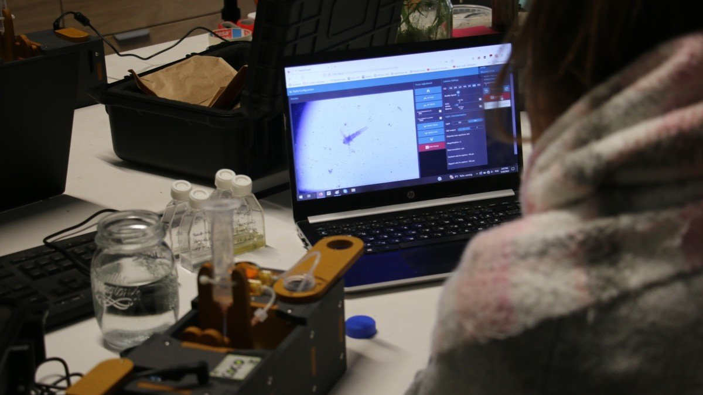

# PlanktoScope Simple Setup Guide

This page provides instructions for setting up the standard version of the PlanktoScope software distribution on a PlanktoScope.

## Download the PlanktoScope software SD card image

For ease of setup, we provide an SD card image file with the PlanktoScope software distribution. You can download it from the [releases page](https://github.com/PlanktoScope/PlanktoScope/releases) for the PlanktoScope project on GitHub. Each released version of the PlanktoScope software distribution has downloadable SD card images under the "Assets" dropdown. Depending on whether your PlanktoScope uses an Adafruit Stepper HAT or the PlanktoScope HAT, you should download the corresponding `.img.gz` file.

## Write the image to the SD card

To write the image file to your microSD card, you can install balenaEtcher or the Raspberry Pi imager. We provide instructions for using balenaEtcher:

1. Download and install [balenaEtcher](https://www.balena.io/etcher/).
2. Plug your microSD card into your computer; you may need to use a microSD-to-SD-card adapter, and/or an SD-card-to-USB adapter.
3. Open balenaEtcher
4. Select the SD card image file which you had download in the previous section.
5. Select the SD card you wish to write your image to.
6. Review your selections and click 'Flash!' to begin writing data to the SD card.

## Insert the SD card into the PlanktoScope

Once flashing is over, you can unmount the SD card from the computer. Then insert the microSD card into the Raspberry Pi computer installed in your PlanktoScope.

## Connect to the PlanktoScope

Power on your PlanktoScope and the Raspberry Pi inside it, and wait for it to start up. Note that it may take a few minutes to start up on the first boot.

If you connect another device (e.g. a phone or computer) to the PlanktoScope's Raspberry Pi over its local isolated wifi network or over an Ethernet cable, then you can open a web browser on the device to access the PlanktoScope's dashboard at one of the following URLs (try them in the following order, and just use the first one which works):

- <http://home.pkscope> (this should work unless your web browser is configured to use a Private DNS provider)
- <http://pkscope.local> (this should work unless you're on a device and web browser without mDNS support; notably, older versions of Android do not have mDNS support)
- <http://192.168.4.1> (this should always work)
- <http://192.168.5.1> (this should always work)
