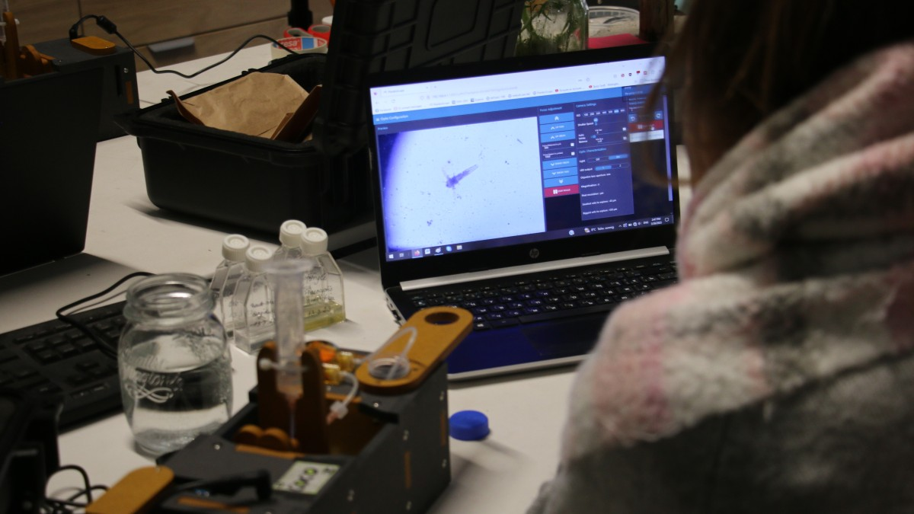

# Standard Software Installation Guide

This page provides instructions for setting up the standard version of the PlanktoScope software distribution on a PlanktoScope.

## Download the PlanktoScope software SD card image

For ease of setup, we provide an SD card image file with the PlanktoScope software distribution. You can download it from the [releases page](https://github.com/PlanktoScope/PlanktoScope/releases) for the PlanktoScope project on GitHub. We strongly recommend ignoring releases labeled with a yellow "Pre-release badge", as those releases may be broken in various ways; instead, look for the release labeled with a green "Latest" badge.

Each released version of the PlanktoScope software distribution has downloadable SD card images under the "Assets" dropdown. Depending on whether your PlanktoScope uses an Adafruit Stepper HAT or the custom PlanktoScope HAT, you should download the corresponding `.img.gz` file. If you purchased a PlanktoScope or PlanktoScope kit from FairScope, it probably uses the custom PlanktoScope HAT.

## Write the image to the SD card

To write the image file to your microSD card, you can install balenaEtcher or the Raspberry Pi imager.

Here are instructions for using the Raspberry Pi Imager:

1. Download, install, and start the latest version of the [Raspberry Pi Imager](https://www.raspberrypi.com/software/).
2. Plug your microSD card into your computer; you may need to use a microSD-to-SD-card adapter, and/or an SD-card-to-USB adapter.
3. Press the "Choose Device" button. Select "No filtering" from the menu. It actually doesn't matter what you select here.
4. Press the "Choose OS" button. Select "Use custom" from the menu (this is why it doesn't matter what you selected in the "Choose Device" menu). In the file dialog, open the PlanktoScope SD card image file you downloaded in the previous section of this setup guide.
5. Press the "Choose Storage" button. Select your SD card from the menu.
6. Press the "Next" button. A pop-up dialog should appear asking if you would like to customize the OS. You should probably press the "No" button unless you are already experienced with the PlanktoScope software, because most of the settings inside don't matter to typical users of the PlanktoScope software, and because it's possible to break the software with incorrect settings.
7. A pop-up dialog should appear asking you to confirm whether you selected the correct SD card and want to wipe all data on the SD card in order to write the PlanktoScope SD card image to your SD card. If you are ready, press the "Yes" button.
8. The Raspberry Pi Imager will begin overwriting your SD card with the PlanktoScope SD card image. This will take a while to finish.

Here are instructions for using balenaEtcher:

1. Download, install, and start [balenaEtcher](https://www.balena.io/etcher/).
2. Plug your microSD card into your computer; you may need to use a microSD-to-SD-card adapter, and/or an SD-card-to-USB adapter.
3. Open balenaEtcher
4. Select the SD card image file which you had download in the previous section.
5. Select the SD card you wish to write your image to.
6. Review your selections and click 'Flash!' to begin writing data to the SD card.

## Insert the SD card into the PlanktoScope

Once flashing is over, you can unmount the SD card from the computer. Then insert the microSD card into the Raspberry Pi computer installed in your PlanktoScope.

## Connect to the PlanktoScope

Power on your PlanktoScope, and wait for it to start up. Note that it may take a few minutes to start up. Once it has finished starting up, it should create a new isolated Wi-Fi network whose name starts with the word `pkscope` followed by the unique randomly-generated name of your PlanktoScope.

If you connect another device (e.g. a phone or computer) directly to the PlanktoScope's Raspberry Pi over its isolated Wi-Fi network or over an Ethernet cable, then you can open a web browser on the device to access the PlanktoScope's graphical user interface at one of the following URLs (try them in the following order, and just use the first one which works):

- <http://home.pkscope> (this should work unless your web browser is configured to use a Private DNS provider)
- <http://pkscope.local> (this should work unless you're on a device and web browser without mDNS support; notably, older versions of Android do not have mDNS support)
- <http://192.168.4.1> (this should always work)
- <http://192.168.5.1> (this should always work)

Note that you will not be able to access the PlanktoScope's graphical user interface by plugging in a monitor and keyboard and mouse to the Raspberry Pi. This is because the SD card image we provide does not include a graphical desktop or web browser, in order to keep the SD card image file smaller and to keep the PlanktoScope's Raspberry Pi running more efficiently.
