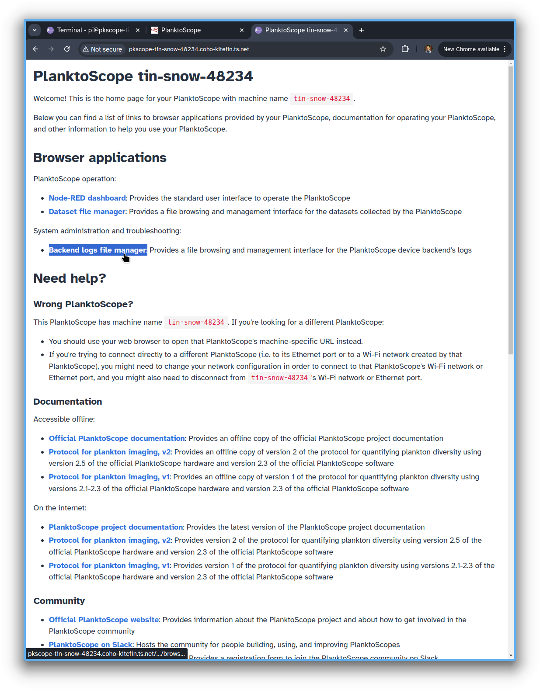
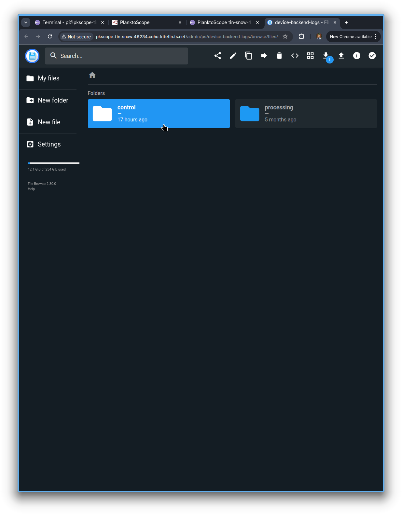
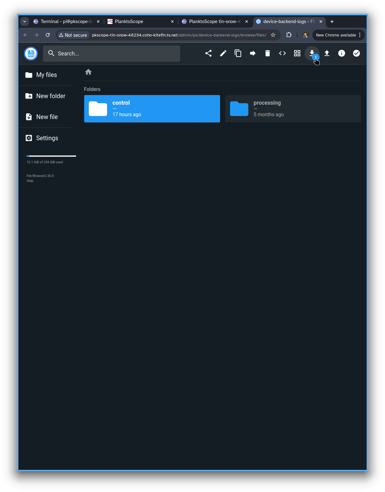
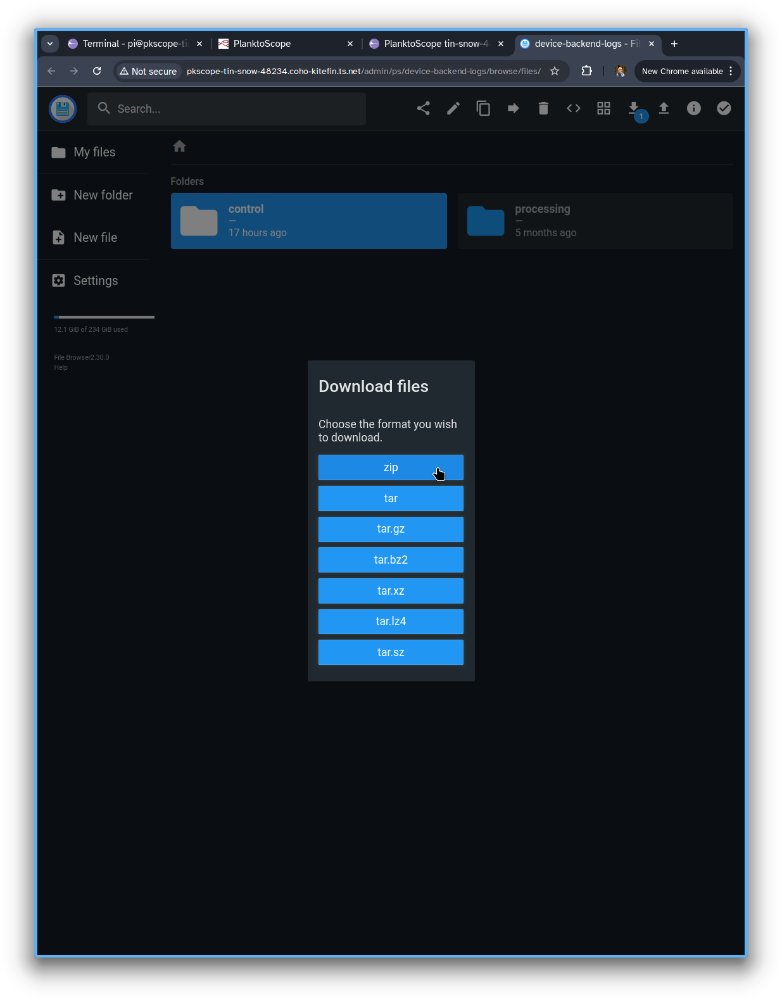

# Troubleshooting

We don't yet have complete documentation to help you troubleshoot problems with your PlanktoScope! For now, you should [sign up](https://www.planktoscope.org/join) to join the PlanktoScope community on Slack, and ask for help in the `#3-start-testing` channel on Slack; or, if you have a GitHub account, you can start a new discussion in the PlanktoScope GitHub repository's ["Help/Support" forum](https://github.com/PlanktoScope/PlanktoScope/discussions/categories/help-support). Below, we provide some guides for troubleshooting particular situations:

## Hostname/DHCP issue with Orange Livebox router

If you connected your PlanktoScope to a Orange Livebox, its hostname may be incorrect and change often. For example if your PlanktoScope name is `pretty-flower-123` the router may assign the hostname `pkscope-pretty-flower` instead of `pkscope-pretty-flower-123`.

You can workaround this issue by:

Assign the static hostname `pkscope-pretty-flower-123` to the PlanktoScope in the Livebox

or

[Change the PlanktoScope machine name](../operation/networking.md/#change-your-planktoscopes-name) to `pretty-flower`

See also [#603](https://github.com/PlanktoScope/PlanktoScope/issues/603)

## No internet after connecting LAN to the PlanktoScope

If your laptop is connected to the PlanktoScope with a LAN cable and to the Internet with WiFi, it's possible your system will prefer LAN and try to use it for Internet.

Find the LAN setting to only use it for resources on its network.

For example on Fedora / Ubuntu, the setting is called

> Use this connection only for resources on its network

and is present on the IPv4 and IPv6 tabs of the LAN network options.

## Error with camera or Python backend

A common (and very broad) category of problems results in an error message like `If you see this, there probably is an error either with your camera or with the python service. Please try restarting your machine.` being displayed instead of a camera preview in the Node-RED dashboard. This error message can be caused by a variety of potential failure modes such as a disconnected camera or a crash in the Python hardware controller program (which controls the PlanktoScope's camera as well as the pump, focusing motors, etc.). If you see this problem, we recommend first checking whether the Python hardware controller is responsive to button-presses in the Node-RED dashboard for moving the pump and/or the focusing stepper motors; if so, then there is likely a problem specifically with the camera hardware or the camera preview. Otherwise, it is very possible that the Python hardware controller has crashed for other reasons. Troubleshooting this situation will require you to download the Python hardware controller's error logs so that you can attach the logs with a request for help on the PlanktoScope Slack community.

To download the Python hardware controller's logs, please use your web browser to [navigate to your PlanktoScope's landing page](../operation/index.md#access-your-planktoscopes-software) and then click on the "Backend logs file manager" link:

This will open a new tab with a file browser; please click on the "control" folder, which collects the log files of the Python hardware controller:

Then click on the download button in the upper-right toolbar:

This will open a dialogue to select the archive format for downloading the logs. You can click the ".zip" button:

This will open a file saving dialogue to download a ZIP archive of the Python hardware controller's logs. Then you can upload this as an attachment to a message on Slack or GitHub asking for help with troubleshooting your problem.
